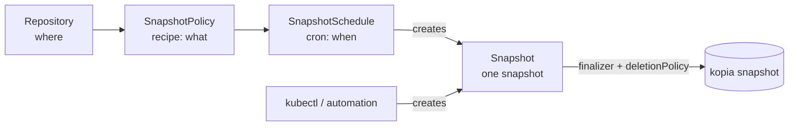

# Backups & schedules

Backing up is three resources, not one, and keeping them separate is the whole point. This page explains what each does, then walks the handful of fields you'll actually change.

/// tip | Recipe / invocation / schedule

- **`SnapshotPolicy`** is the **recipe**. It says _what_ to back up, how long to keep it, and how to capture it. It is **idempotent and runs nothing on its own**; applying it just records intent.
- **`Snapshot`** is one **invocation**. It is a single kopia snapshot represented as a Kubernetes object, and it is the **universal trigger**. A schedule creates one, or you `kubectl create` one, or Argo Events, Tekton or a Helm hook does.
- **`SnapshotSchedule`** is the **cron**. It says _when_ the recipe runs, and it creates `Snapshot` CRs for you on a cadence.

Why split them? So you can re-run a recipe on demand without touching the schedule, pause a schedule without losing the recipe, and trigger backups from anything that can create a Kubernetes object, all without three slightly-different copies of "what to back up".

///

All three are namespaced and live in the same namespace as the PVCs they back up. That's where the mover Job runs; see [Movers, RBAC & credentials](movers.md).

## Try it end-to-end

Want to watch a real backup move real data before reading the field reference? This one bundle is self-contained: a namespace, a PVC for the kopia repository, a `KOPIA_PASSWORD` Secret, an `app-data` PVC, a busybox **seed Job** that writes files into it, a filesystem `Repository`, a `SnapshotPolicy`, and a manual `Snapshot`. No cloud credentials are needed, because the repository lives on a PVC, so the only thing to fill in is the password.

The **recipe**, the `SnapshotPolicy`, ties the seeded PVC to the repository and sets retention. This is the heart of what you're applying:

```yaml
--8<-- "deploy/examples/tryit/backups.yaml:policy"
```

The **seed Job** writes 20 files into `app-data` so the snapshot has real data to upload. Without it, `status.stats` would report zeros:

```yaml
--8<-- "deploy/examples/tryit/backups.yaml:seed"
```

/// note | One bundle, applied once

Fill in the single `REPLACE_ME` (`KOPIA_PASSWORD`) in [`deploy/examples/tryit/backups.yaml`](https://github.com/home-operations/kopiur/blob/main/deploy/examples/tryit/backups.yaml), then apply everything except the `generateName` Snapshot:

```console
$ kubectl apply -f deploy/examples/tryit/backups.yaml
```

`apply` skips the `generateName` Snapshot, because `apply` can't track a server-named object. You `create` that one in the last step.

///

**1. Wait for the seed Job and the Repository.** The seed Job writes 20 files into `app-data` so the backup has something to upload, and the `Repository` initializes a fresh kopia repository on its PVC:

```console
$ kubectl -n kopiur-tryit wait --for=condition=complete job/seed-data --timeout=2m
$ kubectl -n kopiur-tryit wait --for=condition=Ready repository/primary --timeout=2m
```

**2. Take the backup.** This is the one resource you `create` rather than `apply`. It uses `generateName`, so each create mints a fresh name:

```console
$ kubectl create -f deploy/examples/tryit/backups.yaml
snapshot.kopiur.home-operations.com/app-data-manual-abc12 created

$ kubectl -n kopiur-tryit get snapshots -w
NAME                    PHASE       ORIGIN   SNAPSHOT    AGE
app-data-manual-abc12   Pending     manual               2s
app-data-manual-abc12   Running     manual               7s
app-data-manual-abc12   Succeeded   manual   k8f3c1a90   44s
```

**3. Prove it backed up real data (deep).** `status.stats` must show non-zero `filesNew` and `bytesNew`. An empty backup would report zeros:

```console
$ kubectl -n kopiur-tryit get snapshot app-data-manual-abc12 \
    -o jsonpath='{.status.stats}'
{"sizeBytes":...,"bytesNew":...,"filesNew":20,"filesUnchanged":0}
```

*(Illustrative: byte/size figures vary; `filesNew` reflects the 20 seeded files.)* The Job's logs, via `kubectl -n kopiur-tryit logs job/seed-data`, confirm 20 files were written.

**4. Confirm the kopia snapshot exists.** `status.snapshot.kopiaSnapshotID`, with a capital `ID`, is the handle kopia stores the data under. Its presence is the proof the snapshot is in your repository:

```console
$ kubectl -n kopiur-tryit get snapshot app-data-manual-abc12 \
    -o jsonpath='{.status.snapshot.kopiaSnapshotID}'
k8f3c1a90    # illustrative — your ID differs
```

To tear down, run `kubectl delete namespace kopiur-tryit`. The `Snapshot` finalizer runs `kopia snapshot delete` first.

## SnapshotPolicy — the recipe

A minimal recipe is a repository, a source, and a retention policy. This is the recipe stage of [example 01](examples.md#example-01--single-pvc-scheduled):

```yaml
--8<-- "deploy/examples/01-single-pvc-scheduled.yaml:policy"
```

### Repositories — one recipe, several repositories (fan-out)

A recipe targets its repositories with **exactly one of** two fields. `repository` names one `Repository` or `ClusterRepository`, which is what everything above and below this section assumes. `repositories` is a list of **1 to 8 distinct** refs, and it backs every source up into **each** of them on every run. See [example 40](https://github.com/home-operations/kopiur/tree/main/deploy/examples/40-multi-repository-policy.yaml):

```yaml
--8<-- "deploy/examples/40-multi-repository-policy.yaml:policy"
```

The mental model: each firing expands to **one `Snapshot` CR plus one mover Job per (source × repository)**. Every child is an ordinary single-repo backup from there on, with its own kopia snapshot, its own retention bucket, and its own verification, pinned to its repository via `spec.repository` stamped when the child is created. Child names gain a `-repo-<name>-<hash>` marker, while single-repo children keep their exact legacy names. Each repository also gets its **own mover cache PVC**, named `kopiur-cache-<policy>-<repo>-<hash>`, where single-repo keeps `kopiur-cache-<policy>`, because two kopia repositories can never share one cache.

What "per repository" means in practice:

- **Retention is per (source, repository).** `keepDaily: 7` over 2 repositories keeps seven dailies **in each**, never seven total, so an outage of one repository can't let the healthy one's history evict the broken one's records. Failed-run history, bounded by `failedJobsHistoryLimit`, is likewise counted **per repository**.
- **Identity is per repository.** Each child resolves its kopia identity under **its own** repository's [`identityDefaults`](repositories.md#identitydefaults--per-tenant-identity-cel). So one recipe legitimately has N identities, one per repository, and the identity-change and fork guards check every (identity, repository) pair.
- **Verification is per repository**, with one verify Job per repo per slot. `status.verification` lists each repository's result, and the flat `status.lastVerified` is the **oldest** timestamp across the current repository set. "Verified" means *every* repository is verified, so one unverifiable repo keeps the flat timestamp honest.
- **Captures are independent, not a single point in time across repositories.** Each repository's child stages and reads the source on its own, so the N snapshots of one slot are *close* in time but not one consistent instant across repositories. For a multi-PVC selector with `groupBy: VolumeGroupSnapshot`, each repository gets its **own** VolumeGroupSnapshot per slot, so budget **N times** the CSI snapshot quota and storage-side load.
- **Deletion protection is per repository.** Deleting a multi-repo policy's history trips each repository's [mass-deletion breaker](repositories.md#deletionprotection--the-mass-deletion-circuit-breaker) independently, so expect **one acknowledgement per repository**, not one total. `kubectl kopiur doctor` groups the held sets per repo with the exact acknowledgement command for each.
- **Restores must pick a repository.** A `fromPolicy` restore against a multi-repo policy is refused until `spec.repository` names **one member** of the policy's set, and the message lists the valid choices. A ref that isn't a member is refused too. Kopiur never guesses repository number 1, because the N captures can diverge. See [Restores](restores.md).
- **`concurrencyPolicy: Forbid`, the schedule default, holds the whole slot.** One-at-a-time is per *schedule*: while any child of the previous slot is still running, and one slow or unreachable repository is enough, the next slot is skipped for **all** repositories. Use `Allow` if a lagging repository must not delay the healthy ones' cadence.
- **The cross product is capped at 400 children per slot**, meaning sources times repositories. A slot over the cap is skipped whole, never partially created, with a `FanoutCapped` condition on the schedule and a `doctor` finding.
- `kubectl get snapshotpolicy` renders the single-repo `Repository` column **blank** for a multi-repo policy. The `Repositories` column, from `status.repositorySummary`, lists the set.

/// warning | `hooks` cannot be combined with `repositories`

Hooks quiesce the workload around **one** capture. With N concurrent fan-out children, the first child to finish would run the after-snapshot thaw hooks while the other N−1 movers are still reading, which voids the quiesce guarantee. Serializing the children instead would multiply the freeze window by N. So the webhook refuses the combination. For an app-consistent backup **plus** a second repository, keep the policy single-repo with hooks and add a [`SnapshotReplication`](snapshot-replication.md) that copies its snapshots into the second repository. That is exactly its use case.

///

/// note | Fan-out vs. replication: writing twice vs. copying once

`repositories` reads the **source** N times and uploads N times per run. That gives you N truly independent captures, at N times the source I/O and upload cost. A [`SnapshotReplication`](snapshot-replication.md) backs up once and *copies* the result repository-to-repository. That is cheaper on the workload, and the copies are exact duplicates of the original capture. A [`RepositoryReplication`](replication.md) mirrors the whole repository's blobs to a passive destination. All three are legitimate "second repository" strategies. Fan-out is the one where the second capture must not depend on the first repository being healthy.

///

/// warning | Upgrading: apply the new CRD schema before using `repositories`

Helm never upgrades the chart's `crds/` directory, so on an existing install the live `SnapshotPolicy` CRD may predate `spec.repositories`. The apiserver **prunes** unknown fields, after which admission refuses the policy because neither `repository` nor `repositories` is set. That failure is loud, not silent. Run `kubectl apply --server-side -f deploy/crds/` first. `kubectl kopiur doctor` flags a stale schema. See [Upgrading](upgrade.md#0100-snapshotreplication-multi-repository-fan-out-new-rbac-and-a-new-snapshot-phase).

///

### Sources — what to back up

`sources` is a list. Each entry is **exactly one of** a single PVC, a label selector, or an inline NFS export. They are mutually exclusive, and the webhook rejects setting more than one on a source.

```yaml
sources:
    - pvc:
          name: postgres-data # one PVC by name
```

Or match many PVCs at once. See [example 04](examples.md#example-04--multi-pvc-selector):

```yaml
sources:
    - pvcSelector:
          labelSelector:
              matchLabels: { backup: include }
      sourcePathStrategy: PvcName # or PvcNamespacedName to disambiguate same-named PVCs
```

A `pvcSelector` expands to **one `Snapshot` CR per matched PVC**. Each is an ordinary single-PVC backup from there on: its own mover Job, its own kopia snapshot, its own retention. That is deliberate. It keeps every other feature working on a multi-PVC recipe with no special cases, including restore, `deletionPolicy`, the catalog and GFS retention.

Consequences worth knowing:

- **Retention is per PVC.** `keepDaily: 7` over a 5-PVC selector keeps seven days *of each volume*, not seven snapshots in total.
- **The expansion happens when a backup is invoked**, not when you write the policy. That means at a `SnapshotSchedule` fire, or at `kubectl kopiur snapshot now`. A PVC that gains the label is picked up at the next slot, and one that loses it simply stops being backed up.
- **A hand-written `Snapshot` with only a `policyRef` is rejected** against a selector policy. It does not say which PVC it covers, and the operator will not pick one of N on your behalf. Use `kubectl kopiur snapshot now` or a schedule; both expand for you.
- **The selector only matches PVCs in the policy's own namespace.** `namespaceSelector` is refused, because a mover Pod can only mount PersistentVolumeClaims in its own namespace, and the mover Job runs in the `Snapshot`'s namespace, which is the policy's. Use one `SnapshotPolicy` per namespace; they can share a repository.
- **Two selector sources may not match the same PVC.** Both would resolve to one kopia source path and one `Snapshot` name, so one of the two backups would silently overwrite the other. Narrow the selectors instead.
- **`sourcePathStrategy` is part of your data identity.** `PvcName` gives each PVC the kopia path `/pvc/<name>`; `PvcNamespacedName` qualifies it with the namespace. Changing the strategy later re-identifies every source, so it is guarded like any other identity change. See [Identity](#identity--what-kopia-records-usernamehostnamepath).
- **`groupBy`** decides whether the captures are crash-consistent with each other. See [copy methods → multi-PVC and consistency groups](copy-methods.md#multi-pvc-and-consistency-groups).

Or back up an **NFS export directly**, with no PVC. See [example 10](examples.md#example-10--nfs-source-no-pvc):

```yaml
sources:
    - nfs:
          server: expanse.internal # NFS server hostname or IP
          path: /mnt/eros/Media # the export (an absolute path)
```

The operator mounts the export read-only into the backup mover and kopia snapshots it. By default kopia records the export `path` as the snapshot `sourcePath`; override it with `sourcePathOverride`. An NFS source works with **any** repository backend.

#### `readOnly` — the source mount

Sources are mounted **read-only**, meaning `readOnly: true`, the default, because kopia only ever reads them. There is exactly one reason to change that. The kubelet applies `fsGroup` by *rewriting* the volume's group ownership, and it **skips that rewrite entirely on a read-only mount**, so a mover's `fsGroup` has no effect on the source. If you need `fsGroup` to make the source readable, set `readOnly: false`:

```yaml
sources:
    - pvc: { name: postgres-data }
      readOnly: false # let the kubelet apply the mover's fsGroup
```

Under `copyMethod: Snapshot` or `Clone` this rewrites the throwaway staged PVC and never touches your data. Under `copyMethod: Direct` it rewrites your **live** volume and requires an explicit `acknowledgeLiveMutation: true`. On an `nfs` source it is rejected outright, because the kubelet never applies `fsGroup` to in-tree NFS, so it could not work. The full treatment, including the hazards, is at [Copy methods → making `fsGroup` apply to the source](copy-methods.md#making-fsgroup-apply-to-the-source).

/// warning | Multi-PVC defaults to a consistent group

When a selector matches several PVCs, `groupBy` defaults to `VolumeGroupSnapshot`, which is one consistent point-in-time snapshot across all of them. You must set `groupBy: None` _explicitly_ to accept independent per-PVC snapshots. There is no silent fallback, because an inconsistent multi-volume backup is a data-integrity hazard.

///

### How the source is captured — `copyMethod`

| `copyMethod`           | What happens                                                  | Requires                                                              |
| ---------------------- | ------------------------------------------------------------ | -------------------------------------------------------------------- |
| `Snapshot` _(default)_ | Point-in-time CSI `VolumeSnapshot` → temporary staged PVC → kopia reads the stage. | The CSI **snapshot stack** + a `VolumeSnapshotClass` for your driver. |
| `Clone`                | CSI clone of the source PVC → kopia reads the clone.          | A CSI driver that supports volume **cloning**.                       |
| `Direct`               | Read the **live** PVC directly (co-located on its node).     | Nothing; works on any storage.                                      |

`volumeSnapshotClassName` selects the snapshot class when `Snapshot` or `Clone` is used. Leave it unset, or empty, which means the same thing, to auto-pick your driver's **default** class.

/// note | `Direct` is opt-in; non-CSI sources must set it explicitly

`copyMethod` defaults to `Snapshot`, which is crash-consistent CSI staging. On a cluster **without** the external-snapshotter and a matching `VolumeSnapshotClass`, or for a static or non-CSI source, the backup **fails with a clear, actionable condition** unless you set `copyMethod: Direct` explicitly. It never silently falls back to a live read. See **[Copy methods](copy-methods.md)** for the full decision guide, requirements, consistency, cleanup behavior, and the upgrade hazards around this default.
///

### Retention — how long backups are kept (GFS)

Retention is **grandfather-father-son**, and it is the **only** thing that prunes _successful_ backups. Kopiur enforces it by deleting `Snapshot` CRs outside the window, which, with the default `deletionPolicy`, deletes the underlying snapshots too.

```yaml
retention:
    keepLatest: 10 # keep the N most recent regardless of age
    keepHourly: 24
    keepDaily: 14
    keepWeekly: 8
    keepMonthly: 12
    keepAnnual: 3
```

Set only the buckets you care about and omit the rest. There is deliberately **no** `successfulJobsHistoryLimit`: successful retention is GFS, full stop. Failed runs are bounded separately by `failedJobsHistoryLimit` on the `SnapshotSchedule`.

/// warning | A `retention:` block that keeps nothing is rejected
If you set `retention:` but leave every bucket unset or `0`, GFS would prune **every** snapshot the moment it runs, which is silent data loss. The admission webhook rejects that, saying *"keeps no snapshots … set at least one bucket"*. To disable pruning entirely, **omit `retention` altogether**, because absent means don't prune. An empty-but-present block is the trap, so it's blocked.
///

/// note | GFS is the only pruning mechanism: kopia's own retention is pinned off
kopia's `snapshot create` normally applies its own retention after every backup, and with nothing configured it falls back to kopia's defaults, such as `keepLatest: 10`. A wide `retention:` window above would blow right past those values, deleting backups behind Kopiur's back. So Kopiur sets kopia's own retention to effectively infinite on every identity it manages, which makes the `retention:` above the only thing that ever deletes a backup.
///

/// note | Adopted rows are governed exactly like produced ones
A discovered snapshot that gets [auto-adopted](repositories.md#the-catalog--discovered-snapshots) into a `SnapshotPolicy`, giving it `origin: adopted`, carries `status.phase: Succeeded` from the moment it's created. So it is immediately visible to this same GFS window. That's the entire point of adoption: instead of sitting in the catalog forever as an immortal `discovered` row, it now ages out and gets pruned like any snapshot the policy produced itself. A `pin: true` carried over from the discovered row stays exempt, same as any pinned produced backup. One qualifier: when the policy's effective `defaultDeletionPolicy` is `Retain` or `Orphan`, only candidates the GFS window would **keep** are adopted at all. A would-be-pruned match stays `discovered` instead of entering a prune-and-rediscover loop. See [`catalog.adoption`](repositories.md#catalogadoption--automatically-re-attaching-discovered-snapshots).
///

### How many `Snapshot` CRs will I have?

Kopiur keeps **one `Snapshot` CR per retained snapshot per source**. The CR _is_ the backup's lifecycle handle, carrying the finalizer and `deletionPolicy`, so the live CR count equals the retained snapshot count by design. It is set by _retention_, not by how often you schedule: a faster schedule fills the GFS window sooner but never exceeds it. Three independent populations add up:

- **Successful backups**, bounded by GFS `retention`. The per-source upper bound is roughly the sum of the buckets you set (`keepLatest + keepHourly + keepDaily + …`, before GFS de-dups the overlap), times your number of sources. A policy with `keepHourly: 24, keepDaily: 14, keepWeekly: 8` retains about 40 CRs per source.
- **Failed backups**, bounded by [`SnapshotSchedule.spec.failedJobsHistoryLimit`](#snapshotschedule--the-cron), default `10` per schedule.
- **Discovered snapshots**, materialized from the repository and bounded by [`spec.catalog.retain`](repositories.md), meaning `perIdentity` and `maxAgeDays`, on the `Repository` or `ClusterRepository`.

A cluster with around 30 sources on a typical GFS window sits at roughly 1000 to 2000 `Snapshot` CRs. Each is a few KiB in etcd, so tens of MB in total, which is comfortably fine, and each _terminal_ CR only re-reconciles as a no-op roughly every 45 minutes. So this scales. Because retention sets the count, a **sub-hourly** schedule paired with a wide retention is the way to accidentally accumulate thousands of CRs. The admission webhook emits a heads-up warning for sub-hourly crons, which is a warning, not a limit.

/// warning | `retention` absent = unbounded CR growth

Omitting `retention` entirely means Kopiur never prunes successful backups, so the `Snapshot` CRs, and their kopia snapshots, grow **forever**. That is a legitimate "keep everything" choice, but it is genuinely unbounded, so budget for it or set a GFS window. An empty-but-present `retention:` block is rejected, as described above, so the only way to grow without bound is to omit `retention` deliberately.

///

### Identity — what kopia records (`username@hostname:path`)

kopia stores every snapshot under an identity. Kopiur **re-resolves it from the live spec on every run**, from the live `SnapshotPolicy.spec.identity` plus the live referenced repository's `identityDefaults`. It is not resolved once at admission and frozen. `status.resolved.identity` mirrors the most recent resolution; it is not a source of truth a later run reads back. The defaults:

- `username` comes from the `SnapshotPolicy` name
- `hostname` comes from the namespace, or `<namespace>.<cluster>` when the repository has [`identityDefaults.cluster`](repositories.md#identitydefaults--per-tenant-identity-cel) set, which is how a repository shared across clusters works
- `sourcePath` comes from `/pvc/<pvcName>` for a PVC source, or the export `path` for an `nfs` source

Override either part when you need stable identities across renames or clusters:

```yaml
identity:
    username: postgres-data
    hostname: billing
```

For a shared `ClusterRepository`, the repo can supply identity _CEL expressions_, and for multi-cluster a `cluster` suffix, so tenants get distinct identities automatically. See [Repositories → identityDefaults](repositories.md#identitydefaults--per-tenant-identity-cel). An explicit `identity` here always wins.

/// warning | Identity strings must round-trip through kopia

`username` and `hostname` form the `username@hostname:path` string kopia parses on the **first** `@` and **first** `:`, with no escaping. The webhook therefore rejects a `username` or `hostname` that is empty or contains `@`, `:`, whitespace, or a control character. A `sourcePathOverride` may contain spaces and `:`, but it may not contain control characters and may not be empty. This is a shape check only: dots, dashes, slashes, and unicode letters are all fine. Normal Kubernetes names and namespaces always pass, and the rule only catches values that could never have worked.

///

/// warning | Changing identity after there's history forks the lineage: two guards, one per surface

A snapshot's identity is its address in the repository. Because it's **re-resolved live**, as described above, rather than frozen at admission, either surface that feeds it can silently re-identify a policy. So both are guarded independently, at admission:

- **Per-policy.** Edit `identity`, or a source's `sourcePathOverride`, on a `SnapshotPolicy` that has **already produced snapshots**, and new snapshots would land under the new address while the old lineage stays behind. Kopiur's own GFS retention pools **all** of a policy's `Snapshot` CRs into one timeline regardless of identity, so old- and new-lineage snapshots compete for the same `keepLatest`, `keepDaily` and other buckets instead of getting independent retention. Restore, verify and `fromPolicy` also now resolve the new identity, so the old lineage is only reachable via `Restore.source.identity`. The webhook **rejects** such an edit.
- **Per-repository.** Edit a `Repository` or `ClusterRepository`'s `identityDefaults`, meaning `cluster`, `hostnameExpr` or `usernameExpr`, and every consumer `SnapshotPolicy` that resolves through those defaults re-identifies **fleet-wide**, on each one's very next backup, with no per-policy edit of its own to acknowledge it. The webhook rejects this too. See [Repositories → identityDefaults](repositories.md#identitydefaults--per-tenant-identity-cel) for the full guard behavior; it lists every affected consumer, cluster-wide, in the rejection message.

Both are acknowledged with the same annotation, set on the object you're editing. That is the `SnapshotPolicy` for the first case, and the `Repository` or `ClusterRepository` for the second:

```yaml
metadata:
  annotations:
    kopiur.home-operations.com/allow-identity-change: "intentional"  # any non-empty value
```

Fixing the identity *before* the first successful snapshot, or for a repository before any consumer has history, is unrestricted. There is nothing to re-identify yet.

///

### compression, files & extraArgs — kopia tuning and ignores

These map onto kopia's per-source policy and sit as **top-level** siblings of `retention` on the `SnapshotPolicy` spec:

```yaml
compression:
    compressor: zstd
    neverCompress: ["*.zip", "*.gz", "*.mp4"] # skip already-compressed files
files:
    ignoreRules: ["*.tmp", "*/cache/*"] # paths kopia skips, REPLACING the default set (see below)
    ignoreCacheDirs: true # honor CACHEDIR.TAG
    ignoreIdenticalSnapshots: false # take a new snapshot even if nothing changed
extraArgs: [] # escape hatch for kopia flags not modeled above
```

| Field | What it does |
| --- | --- |
| `compression.compressor` | The kopia compressor (e.g. `zstd`, `gzip`, `s2`); omit to leave content uncompressed. |
| `compression.neverCompress` | Globs to never attempt to compress: already-compressed media, archives. |
| `files.ignoreRules` | `.gitignore`-style globs of paths to exclude from the snapshot. |
| `files.ignoreCacheDirs` | Honor `CACHEDIR.TAG` markers (skip directories tagged as caches). |
| `files.ignoreIdenticalSnapshots` | When `true`, kopia won't create a new snapshot if the source is exactly identical to the last one. |
| `extraArgs` | Pass-through kopia flags for anything not modeled above. |

The object **splitter** is not here. It is a repository property fixed at creation and lives on [`Repository.create.splitter`](repositories.md#encryption-and-repository-creation), where it applies repository-wide.

#### `files.ignoreRules` default: OS-artifact excludes

`ignoreRules` defaults to a 5-entry OS-artifact exclude set. That way a `SnapshotPolicy` that omits `files` entirely, or sets `files: {}`, never snapshots filesystem junk that is never intentional user data:

```yaml
ignoreRules:
    - /lost+found # ext4/fsck recovery dir — anchored to the source ROOT only
    - System Volume Information # Windows/SMB-client artifact on samba-share PVCs
    - $RECYCLE.BIN # Windows/SMB-client artifact on samba-share PVCs
    - "@eaDir" # Synology NAS extended-attribute/thumbnail metadata junk
    - .snapshot # NAS-exposed snapshot pseudo-dirs (NetApp-style); UNANCHORED
```

Why each entry is there:

- **`/lost+found`** is root-anchored, because of the leading `/`, so only the source root's own ext4 fsck-recovery directory is excluded. A *nested* directory a user happens to name `lost+found` deeper in the tree is left alone.
- **`System Volume Information`** and **`$RECYCLE.BIN`** are Windows and SMB-client artifacts that appear on samba-share-backed PVCs.
- **`@eaDir`** is Synology NAS extended-attribute and thumbnail metadata junk.
- **`.snapshot`** covers NAS-exposed snapshot pseudo-directories, NetApp-style. It is deliberately **unanchored**, with no leading `/`, because these appear at *every* level of a NetApp-backed export, not just the root, and backing one up recursively would multiply the backup size by re-capturing older snapshot generations as regular file data. The flip side of being unanchored is that a *legitimate* directory you happen to name `.snapshot`, at any depth, is also excluded. If you have one, set `ignoreRules` explicitly, since your list replaces the default wholesale.

/// warning | An explicit `ignoreRules` REPLACES the default: it does not merge

Setting `files.ignoreRules` to any list, including a single-entry list, **replaces** the default 5-entry set wholesale. It is not appended to it. If you set `ignoreRules: ["*.tmp"]` you get `*.tmp` excluded and NOTHING else: `/lost+found` and the rest of the default set are no longer excluded. Re-add any default entries you still want alongside your own globs. Setting `ignoreRules: []` explicitly opts out of ignoring anything at all, giving a full snapshot of everything, including the OS junk above.

///

/// tip | Carrying `ignoreRules: ["/lost+found"]` in every SnapshotPolicy today?

If your manifests, or a kustomize component applied to every app, paste in `ignoreRules: ["/lost+found"]` by hand, you can delete that block. The default now covers it, plus four more entries. Keeping it explicit pins you to exactly that one-entry list, per the replace-semantics warning above, so only keep it if you deliberately want `/lost+found` excluded and nothing else from the default set.

///

**Recommended extras.** This is desktop and editor junk that is deliberately **not** defaulted. Copy this list into your own `ignoreRules` alongside anything else you need, and remember it replaces the default, so include the default entries you want too:

```yaml
files:
    ignoreRules:
        # Kopiur's defaults:
        - /lost+found
        - System Volume Information
        - $RECYCLE.BIN
        - "@eaDir"
        - .snapshot
        # Desktop/editor junk — opt in per-workload, not defaulted:
        - .DS_Store # macOS Finder metadata — harmless to drop, but not universal (server workloads never see it)
        - "._*" # macOS AppleDouble sidecar files — CAN carry real xattrs/resource forks; dropping by default risks silent data loss for some workloads
        - Thumbs.db # Windows Explorer thumbnail cache
        - desktop.ini # Windows Explorer per-folder display settings
        - .Trash-* # Linux desktop trash dirs — contents are recoverable deletions, but deliberately not auto-discarded by default
```

### errorHandling — let a snapshot complete with errors

This is the backup-side counterpart to restore's `ignorePermissionErrors`. Each flag is off by default, meaning kopia fails on the error. Turn one on to let the snapshot finish anyway:

```yaml
errorHandling:
    ignoreFileErrors: true # --ignore-file-errors: skip unreadable files
    ignoreDirErrors: false # --ignore-dir-errors: skip unreadable directories
    ignoreUnknownTypes: true # --ignore-unknown-types: skip sockets/devices/...
    failFast: false # --fail-fast: abort at the FIRST error instead of collecting and continuing
```

`failFast` works in the opposite direction from its three siblings above: it makes the snapshot _less_ tolerant of errors, not more. It's a `kopia snapshot create` argv flag, not a `policy set` setting, which is why it lives here beside its semantic opposites rather than under `upload`.

### upload — parallelism

This is kopia's upload policy. Every setting is optional, and absent leaves kopia's default:

```yaml
upload:
    maxParallelSnapshots: 4 # --max-parallel-snapshots: concurrent sources
    maxParallelFileReads: 8 # --max-parallel-file-reads: file-read concurrency
    limitMb: 500 # --upload-limit-mb: abort the snapshot after this many MB uploaded (kopia default: unlimited)
```

`limitMb` is named that way to avoid the `upload.uploadLimitMb` stutter. Like `failFast`, it's a `snapshot create` argv flag rather than a `policy set` setting, but it lives here beside its parallelism siblings.

### verification — prove the snapshots are restorable

Verification is opt-in. When absent, nothing runs. When set, the operator runs a frequent blob-level `kopia snapshot verify` (`quick`), a rarer scratch-restore test (`deep`), or both, on a cron. It surfaces `status.lastVerified`, and with `successExpr` it asserts the result is good:

```yaml
verification:
    quick: # blob-level `kopia snapshot verify`, often
        schedule: { cron: "0 4 * * *", jitter: 30m }
        parallel: 8 # --parallel: verification parallelism (kopia default: 8)
        fileParallelism: 4 # --file-parallelism: parallelism for file verification
        fileQueueLength: 20000 # --file-queue-length (kopia default: 20000)
        maxErrors: 0 # --max-errors: stop after this many errors (0 = stop at first)
    deep: # scratch-restore the latest snapshot into a throwaway volume, rarely
        schedule: { cron: "0 5 * * 0", jitter: 1h }
        capacity: 100Gi # size a fresh ephemeral PVC for the restore (omit = emptyDir)
        storageClassName: fast-ssd # StorageClass for that PVC (omit = cluster default)
        parallel: 4 # restore --parallel: deep verify IS a restore under the hood
    successExpr: "stats.files > 0 && stats.errors == 0" # CEL pass/fail predicate
    verifyFilesPercent: 10 # how much of each file `quick` reads fully
```

`quick`'s four tuning settings, `parallel`, `fileParallelism`, `fileQueueLength` and `maxErrors`, map directly onto `kopia snapshot verify`'s own flags. All are optional, and absent leaves kopia's own default. `deep.parallel` maps onto `restore --parallel`, because the deep tier restores the snapshot under the hood, so its parallelism setting lives with the rest of the restore-shaped config. `maxErrors: 0` is kopia's own default, meaning stop at the very first error, so it's deliberately unconstrained at admission, unlike the count settings, which must be `>= 1`.

**Two tiers, because there are two different questions.** `quick` asks _"are the repository blobs and indexes intact?"_ It runs `kopia snapshot verify`, reads metadata, and spot-checks a slice of file contents per `verifyFilesPercent`. It is cheap, so you run it often. `deep` asks the stronger question, _"can I actually get my data back?"_ It restores the latest snapshot into a throwaway volume, checks the result, and discards it. That is the closest thing to a real recovery, so you run it rarely. Schedule the two independently.

/// note | Both tiers nest their cron under `schedule:`

`quick` and `deep` share the same shape, `{ schedule: CronSpec, ... }`. Each tier's cron, jitter and timezone live under its own `schedule:` key, so `quick.schedule` and `deep.schedule`, instead of a bare `{ cron, jitter }` on the tier itself. `deep` additionally carries the scratch-volume settings, `capacity` and `storageClassName`, that `quick` has no use for, since a restore drill needs somewhere to restore _to_. Grouping each tier's schedule, and for `deep` its storage, under its own key keeps "this tier is off" and "this tier is on, configured like this" a single unit, and gives future per-tier options a home without reshaping the API. The two tiers share `successExpr` and `status.lastVerified`; only `deep` has a scratch volume.

///

/// warning | Upgrading from the old flat `quick: { cron, jitter }` shape

`verification.quick` used to be a bare `{ cron, jitter, timezone }` (GitHub #174). An already-persisted `SnapshotPolicy` in that old shape keeps decoding fine, but with its quick tier treated as **disabled**, because there is no schedule to run, until you migrate it. Re-applying that old shape as a **new** write is rejected at admission with a message pointing at the move: nest the same fields under `quick.schedule`, so `quick: { cron: "0 4 * * *", jitter: 30m }` becomes `quick: { schedule: { cron: "0 4 * * *", jitter: 30m } }`.

///

Deep verify restores into a throwaway scratch volume, then discards it. `capacity` and `storageClassName` size and place that volume. **Set `capacity`** and the operator provisions a fresh generic-ephemeral PVC of that size, auto-deleted with the Job; size it to comfortably hold the restored snapshot. **Omit `capacity`** and scratch falls back to a node-ephemeral `emptyDir`, which is zero-config but bounded by node disk, and fine for small snapshots. `storageClassName` only applies when `capacity` is set, because a class with no capacity does nothing; an `emptyDir` has no StorageClass. The operator surfaces that as a `ScratchStorageClassIgnored` condition plus a Warning Event on the `SnapshotPolicy`.

You can set the scratch size and class **once** at the repository level via [`moverDefaults.scratch`](repositories.md#moverdefaults--one-place-to-configure-every-mover) instead of repeating it on every policy. The `verification.deep` fields here override that repo default field by field.

### verification scheduling — gated until there is something to verify

Verification only ever runs against a snapshot that actually exists. On a brand-new `SnapshotPolicy` the operator does **not** schedule a verify Job the moment `verification` is added. It waits until either:

- this policy has produced its **first successful backup**, meaning a `Snapshot` that reached `Succeeded`, or
- the resolved repository already carries **discovered** (adopted) snapshots. That is the escape hatch for an [adopted repository](scenarios/adopt-existing-repo.md), where a deep verify legitimately restores the latest repo snapshot for the identity even though this policy has never run a backup itself.

While gated, `status.lastVerified` stays unset and no verify Job is created. The `SnapshotPolicy` keeps reconciling on a steady background cadence rather than the tight polling it uses once a verify Job is actually in flight, because there is nothing wrong to report, just nothing to verify yet. As soon as the gate opens, which typically means the first backup succeeds, the operator catches up and runs the first due verification promptly, without waiting for the next cron slot. Before this gate existed, a fresh policy with `verification` configured but no backup yet could spawn a verify Job that failed hard against an empty repository (GitHub #168).

`successExpr` is a CEL predicate returning a bool over the verify result. The environment is:

- `stats{files,bytes,errors}`, for **both** tiers. `quick` has no machine-readable counts of its own, so the operator fills `stats.files` and `stats.bytes` from the verified snapshot's manifest and reports `errors: 0` on a passing run. That means `stats.files > 0 && stats.errors == 0` works on `quick`, not just `deep`.
- `snapshot`, the snapshot metadata, where `snapshot.id` is the verified snapshot's id.
- `restored{files,checksumMatches}`, the scratch-restore result, **deep only**. It is empty for `quick`, so guard a deep-only reference with `tier`.
- `tier`, either `"quick"` or `"deep"`, so one predicate can branch per tier, for example `tier == 'deep' ? restored.checksumMatches : stats.files > 0`.

It is validated at admission, so a typo or an out-of-scope variable is rejected on `kubectl apply`. See the [verification-drill scenario](scenarios/verification-drills.md).

/// tip | A timezone (and jitter) for the verify crons

Each verification cron is a `CronSpec`, so it takes the same `timezone` as a backup schedule. `quick: { schedule: { cron: "0 4 * * *", jitter: 30m, timezone: America/Chicago } }` evaluates `0 4 * * *` as 4 a.m. **Chicago time**, DST-correct, not UTC. Set it per cron, on `quick.schedule` and `deep.schedule`. Absent, it falls back to the target repository's [`scheduleDefaults.timezone`](repositories.md#scheduledefaults--set-the-cron-timezone-and-jitter-once), which you can set once there instead of repeating it on every policy, and then to UTC.

`jitter` inherits from the repository the same way and with the same precedence: the per-cron value first, then [`scheduleDefaults.jitter`](repositories.md#scheduledefaults--set-the-cron-timezone-and-jitter-once), then no spread. Verification runs are outside the [mover-Job concurrency pool](#limiting-concurrent-jobs-per-repository), so they are never queued behind backups; spreading them is about not stacking them on each other. A window over 24h is rejected at admission.

///

### suspend — pause a recipe

`suspend: true` makes the operator skip this `SnapshotPolicy` entirely: no retention prune, no backups created by schedules, no verification, without deleting it. It is surfaced in the `SUSPENDED` printer column. `suspend` is now also available on `Repository`, `ClusterRepository` and `RepositoryReplication`.

### hooks — quiesce the app around the snapshot

Hooks run **in the workload**, not the mover, before and after the snapshot. The classic use is flushing or locking a database so the snapshot is consistent. There are three forms, and each hook entry uses exactly one:

```yaml
hooks:
    beforeSnapshot:
        - workloadExec: # exec into a workload pod/container
              podSelector:
                  matchLabels: { app: postgres }
              container: postgres
              command: ["/bin/sh", "-c", "pg_backup_start"]
              timeout: 2m
    afterSnapshot:
        - workloadExec:
              podSelector:
                  matchLabels: { app: postgres }
              container: postgres
              command: ["/bin/sh", "-c", "pg_backup_stop"]
```

The other two forms are `runJob`, which runs a full one-shot `Job` owned by the `Snapshot` and is the k8up `PreBackupPod` equivalent, and `httpRequest`, which calls a URL, defaulting to `POST`. For `httpRequest`, a URL of the form `http://user:pass@…` becomes Basic auth, and an optional `headers` list of `{name, value}` objects rides along. A worked manifest with all the settings is [example 20](examples.md#example-20--quiesce-with-hooks).

/// warning | httpRequest headers, Content-Type, and auth

Set request headers on an `httpRequest` hook with a `headers` list of `{name, value}` objects. Kopiur sends **no** default `Content-Type` even when you set a `body`, so a JSON endpoint needs an explicit header, meaning `- name: Content-Type` with `value: application/json`. That omission is deliberate, not a bug. The admission webhook checks headers on `kubectl apply`: names are case-insensitive RFC 7230 tokens, values must be single-line, so control characters including CR and LF are rejected, and duplicate names, compared case-insensitively, are rejected. An explicit `Authorization` header **replaces** `user:pass@…` credentials in the URL, and setting both is rejected. Use one auth source.

///

Behavior you can rely on:

- A hook failure **aborts** the backup. You get `Failed` plus a `HooksSucceeded=False` condition naming the hook and the cause, unless that hook sets `continueOnFailure: true`. An aborted backup never creates its mover Job; create a new `Snapshot` once the hook is fixed.
- `afterSnapshot` hooks run whether the backup succeeded **or failed**. The canonical pairing is quiesce and resume, and a failed backup must not leave your database quiesced.
- Each list runs **exactly once** per `Snapshot`, stamped on `status.hooks.preCompletedAt` and `postCompletedAt`, so requeues and controller restarts never repeat a side-effecting command.
- Each hook is bounded by its `timeout`, a Go-style duration defaulting to 5m, so a wedged quiesce fails the hook rather than hanging the backup forever.

### mover — resources, cache, security context

`spec.mover` tunes the **mover Job** that actually reads your data for this recipe, meaning the pod that runs `kopia`. The exact same `mover` block is available on a `Restore` and a `Maintenance`; see [Restores → mover](restores.md#mover-cache--failure-policy). Every field is optional. Omit the block entirely and you get an unprivileged mover, UID `65532`, with an `emptyDir` cache and no resource limits. The fields, and when to set each:

```yaml
mover:
    resources: # standard core/v1 ResourceRequirements for the mover container
        requests: { cpu: 250m, memory: 512Mi }
        limits: { cpu: "2", memory: 4Gi }
    securityContext: # standard core/v1 (CONTAINER) SecurityContext — UID/GID match
        runAsUser: 1000
        runAsGroup: 1000
        runAsNonRoot: true
        allowPrivilegeEscalation: false
        capabilities: { drop: ["ALL"] }
        seccompProfile: { type: RuntimeDefault }
    podSecurityContext: # standard core/v1 (POD) PodSecurityContext — notably fsGroup
        fsGroup: 1000 # make a fresh restore volume writable by an unprivileged mover
        fsGroupChangePolicy: OnRootMismatch
    # inheritSecurityContextFrom:   # ...OR copy the securityContext from a live pod
    #   pvcConsumer: {}              # backup: auto-derive from the pod mounting the source PVC
    #   # ...or name it explicitly:
    #   # workloadSelector: { podSelector: { matchLabels: { app: postgres } }, container: postgres }
    cache: # kopia cache for this recipe (overrides the repository's moverDefaults.cache)
        capacity: 16Gi # size of the cache volume
        storageClassName: fast-ssd # cache volume's StorageClass (omit = cluster default)
        mode: Ephemeral # Ephemeral (default) | Persistent (warm cache across runs)
        contentCacheSizeMb: 10000 # kopia --content-cache-size-mb budget
        metadataCacheSizeMb: 2000 # kopia --metadata-cache-size-mb budget
    # privilegedMode: true           # opt-in, namespace-gated; preserve UID/GID on restore
```

| Value | What it does | When to change it |
| --- | --- | --- |
| `resources` | CPU/memory requests & limits on the mover container. | Large or many-file sources: give the mover memory headroom; or cap it so a backup doesn't starve the node. |
| `securityContext.runAsUser` / `runAsGroup` | The UID/GID the mover runs as. Default UID `65532` reads only world-readable or `65532`-owned files. | **Set it to the UID/GID that owns your data** so the mover can read it. This is the single most common knob (see [example 09](examples.md#example-09--mover-uidgid--permissions) and [Permissions](permissions.md)). |
| `podSecurityContext.fsGroup` | A **pod**-level `fsGroup` (and `fsGroupChangePolicy`). On mount the kubelet makes the volume group-writable by that GID. | Let an **unprivileged** mover populate a **freshly-provisioned restore volume** (root-owned `0755`) without a root mover. A pod-level `runAsUser: 0` here is still gated as privileged. See [Security context → fsGroup](security-context.md). |
| `inheritSecurityContextFrom` | Copy **both** the container `securityContext` **and** the pod-level `securityContext` (e.g. `fsGroup`) from a live workload pod, instead of hard-coding them. Requires the workload to pin `runAsUser`. | When you'd rather "run exactly as the app runs" (same UID *and* fsGroup) than track them. Combines with `securityContext`/`podSecurityContext`, which override it field-wise and act as the fallback when no pod resolves. See [Security context](security-context.md#2-inherit-it-from-the-workload) and [example 18](examples.md#example-18--inherit-the-mover-security-context-from-a-workload). |
| `cache.capacity` / `storageClassName` | Back the kopia cache with a sized volume instead of an `emptyDir`. | Large repositories: a sized cache avoids re-downloading metadata each run. |
| `cache.mode` | `Ephemeral` (fresh per run, GC'd with the Job) or `Persistent` (a controller-owned PVC reused across runs for a **warm** cache). | `Persistent` for big recurring backups where a warm cache speeds each run. It's `ReadWriteOnce`, so it assumes runs don't overlap. |
| `cache.contentCacheSizeMb` / `metadataCacheSizeMb` | kopia's content/metadata cache budgets (MiB). | Tune kopia's memory/disk cache footprint independently of the volume size. |
| `privilegedMode` | An opt-in elevation that also preserves original UID/GID ownership on **restore**. | Only when matching a single UID isn't enough (mixed ownership, `lost+found`). Namespace-gated; see below. |

A repository can set `moverDefaults.cache` that every mover inherits, and `mover.cache` overlays it field by field, so you can, for example, bump only `capacity` per recipe. See [Repositories → moverDefaults.cache](repositories.md).

/// warning | A privileged mover needs namespace opt-in

If the mover's **effective** securityContext runs as root (`runAsUser: 0`), sets `privileged: true`, allows escalation, adds capabilities, sets `runAsNonRoot: false`, or sets `privilegedMode: true`, **including a context inherited from a root workload pod**, then the namespace must opt in with the `kopiur.home-operations.com/privileged-movers` annotation. Otherwise the `Snapshot` or `Restore` is refused with a `MoverPermitted=False` condition. See [Movers → Privileged movers](movers.md#privileged-movers).

///

## Snapshot — one snapshot, the universal trigger

You usually let a `SnapshotSchedule` create `Snapshot` CRs. To run one **now**, for a first-time test, an ad-hoc snapshot before a risky change, or from external automation, create one yourself. See [example 06](examples.md#example-06--manual-one-shot-backup). It carries a `policyRef`, which says which recipe to run, and optional `tags`. Use `generateName` instead of `name` for repeatable ad-hoc one-shots:

```yaml
--8<-- "deploy/examples/06-manual-backup.yaml:snapshot"
```

Watch it move through its phases:

```console
$ kubectl get snapshots -n billing -w
NAME                       PHASE       ORIGIN   SNAPSHOT    AGE
postgres-data-manual-x9f   Pending     manual               2s
postgres-data-manual-x9f   Running     manual               7s
postgres-data-manual-x9f   Succeeded   manual   k1f1ec0a8   44s
```

`ORIGIN` tells you where a `Snapshot` came from: `scheduled` from a `SnapshotSchedule`, `manual` from you or your automation, or `discovered`, materialized from snapshots Kopiur didn't create. See [Restores → discovered](restores.md#restoring-a-snapshot-kopiur-didnt-create).

### `tags` — label the snapshot in the repository

`spec.tags` attaches free-form `key: value` pairs to the kopia snapshot manifest itself, via `kopia snapshot create --tags`, so they survive in the repository independently of the CR. They are visible to any kopia client and to other clusters sharing the repository:

```yaml
spec:
    policyRef: { name: postgres-data }
    tags:
        reason: pre-upgrade
        ticket: OPS-1234
```

/// warning | Tag keys are constrained (webhook-enforced)

kopia splits each tag argument on the **first colon** to separate key from value, so a key containing `:` would be stored mangled, and can collide with Kopiur's own reserved tag, which makes kopia **fail the snapshot create** with a duplicate-tag error. The webhook therefore rejects tag keys that are empty, contain `:`, or start with the reserved prefix `kopiur`. It also bounds the map to at most **10 tags**, with keys of at most **63** bytes and values of at most **256** bytes, because every tag is stored on the manifest and read back by every catalog scan. Tags on objects stored before these rules existed are skipped with a warning rather than failing the backup.

///

Kopiur reserves the `kopiur` key prefix for the tags it writes on every produced snapshot:

| Tag (as passed to kopia)  | Stored manifest key/value                        | What it records                                                                                                                                                                                                                          |
| ------------------------- | ------------------------------------------------ | ---------------------------------------------------------------------------------------------------------------------------------------------------------------------------------------------------------------------------------------- |
| `kopiur:config:<policy>`  | key `tag:kopiur`, value `config:<policy>`        | Which `SnapshotPolicy` produced the snapshot (kopia's first-colon split puts `config:<policy>` in the value, a long-standing shape existing tooling depends on).                                                                          |
| `kopiur-meta: {…}`        | key `tag:kopiur-meta`, value compact JSON        | The **resolved mover identity** the backup ran as: `uid`/`gid` (absent = image-determined), pod `fsGroup`, and `src` (whether the identity was `inherited` from the workload, pinned by the recipe's `explicit` context, or came from `defaults`). |

The `kopiur-meta` value is mirrored to `status.recorded` at launch, and the catalog scan decodes it back onto **discovered** rows, and backfills pre-existing rows that lack it. So the identity your data expects survives cluster rebuilds with the repository itself. See [Security context](security-context.md) for how the identity is resolved.

### `deletionPolicy` — what happens to the snapshot

A `Snapshot` CR **owns** its kopia snapshot via a finalizer. What happens to the snapshot when the CR is deleted is governed by `deletionPolicy`:

| Policy   | On `Snapshot` deletion                                                                                 | Default for                                                                |
| -------- | ---------------------------------------------------------------------------------------------------- | -------------------------------------------------------------------------- |
| `Delete` | Finalizer runs `kopia snapshot delete`, then removes the CR.                                         | `scheduled` / `manual` backups.                                            |
| `Retain` | CR is removed; the snapshot **stays** in the repository.                                             | `discovered` backups (forced, because Kopiur won't delete what it didn't create). |
| `Orphan` | CR is removed **without contacting the repository**. Escape hatch for "the bucket is already gone". | —                                                                          |

Set it per-`Snapshot` with `spec.deletionPolicy`, or set the recipe-wide default with `SnapshotPolicy.spec.defaultDeletionPolicy`. This is also how retention pruning reclaims space: pruned `Snapshot` CRs use `Delete`, so the snapshots go with them.

#### What happens when the schedule is deleted

A scheduled `Snapshot`'s `deletionPolicy` says what happens when **that CR** is deleted. But a schedule's produced Snapshots outlive the schedule that made them: they're retained for their whole GFS window, long after the next cron slot. `SnapshotSchedule.spec.deletion.onScheduleDelete` governs what happens to those already-produced Snapshots' kopia data when the schedule **itself** is deleted out from under them. That includes being deleted and recreated, or being `Terminating` under `--cascade=foreground`:

```yaml
spec:
    deletion:
        onScheduleDelete: Delete # default: Retain
```

| Value                | What happens to a produced Snapshot whose own `deletionPolicy` is `Delete`, once its schedule is gone/replaced                                     |
| --------------------- | ---------------------------------------------------------------------------------------------------------------------------------------------- |
| `Retain` _(default)_  | Downgraded to retain: the finalizer releases, **no** `kopia snapshot delete` runs, a `SnapshotRetainedOnScheduleDelete` Warning Event fires on the Snapshot, and the catalog rediscovers the kopia snapshot as `origin: discovered` (forced `Retain`) on its next scan. |
| `Delete`              | Opt-in cascade: the Snapshot's own `deletionPolicy` applies exactly as if the schedule still existed: its kopia snapshot really is deleted, subject to the repository's [mass-deletion breaker](repositories.md#deletionprotection--the-mass-deletion-circuit-breaker) below. |

This guard exists because Kubernetes' own ownerReference garbage collection deletes a schedule's produced `Snapshot` CRs the moment the schedule is deleted, or a GitOps tool replaces it, with no way for the CRs themselves to tell "my schedule is gone" apart from "someone deleted me directly". And a schedule getting deleted, whether accidentally, by a flapping GitOps controller, or as part of a refactor, must never silently cascade into deleting a fleet's worth of backup history. `Retain` is the fail-safe default for exactly the same reason `onNamespaceDelete` defaults to `Orphan`.

The guard only ever fires for **external** deletions. One of Kopiur's own retention or `failedJobsHistoryLimit` prunes always honors the Snapshot's real `deletionPolicy` regardless of the schedule's state, because retention must keep working even if a schedule was just deleted. It also only fires while the schedule is genuinely gone or replaced: a live schedule deleting its own stale children, such as `failedJobsHistoryLimit` pruning, is an operator prune, not this path.

Editing `spec.deletion.onScheduleDelete` on a **live** schedule propagates to its existing produced Snapshots, as a best-effort patch on every reconcile, skipping any child already `Terminating`. So flipping the setting doesn't only affect *future* firings, and you don't have to touch each child by hand.

#### What happens when the policy is deleted

`SnapshotPolicy.spec.deletion.onPolicyDelete` is the recipe-level counterpart to the schedule guard above. It says what happens to a **recipe's** `Snapshot` CRs, meaning the ones carrying its config label `kopiur.home-operations.com/config`, when the `SnapshotPolicy` itself is deleted. A `policy-cleanup` finalizer on the `SnapshotPolicy` drives the cascade before the CR is actually removed:

```yaml
spec:
    deletion:
        onPolicyDelete: Delete # default: Retain
```

| Value                | What happens to the policy's `Snapshot` CRs once the `SnapshotPolicy` is deleted                                                                                                                                                        |
| --------------------- | ---------------------------------------------------------------------------------------------------------------------------------------------------------------------------------------------------------------------------------- |
| `Retain` _(default)_  | Every CR is stamped `pruned-by: policy-cascade` and removed, but **every kopia snapshot stays in the repository**. A `SnapshotRetainedOnPolicyDelete` Warning Event fires on each one whose own `deletionPolicy` was `Delete` (the loud downgrade). Nothing is lost: the data is rediscovered as `origin: discovered` on the next catalog scan, and (since adoption defaults on) automatically re-attached the moment a `SnapshotPolicy` with a matching identity exists (including this same policy, re-created). When the matching policy's effective `defaultDeletionPolicy` is `Retain`/`Orphan`, only the history its retention window would keep is re-attached; the rest stays `discovered` (see [`catalog.adoption`](repositories.md#catalogadoption--automatically-re-attaching-discovered-snapshots)). |
| `Delete`              | Opt-in cascade: each CR is deleted **unstamped**, so its own `deletionPolicy` applies exactly like any other external deletion: `Delete` really does call `kopia snapshot delete`, subject to the repository's [mass-deletion breaker](repositories.md#deletionprotection--the-mass-deletion-circuit-breaker) (the `allow-mass-deletion` ack) below. |

/// warning | Behavior change: previously-dangling CRs are now cleaned up

Before this cascade existed, deleting a `SnapshotPolicy` left its `Snapshot` CRs behind with no owner. They just sat there, retention-governed by nothing, since the recipe that pruned them was gone. Now `Retain`, the default, actively **removes** those CRs the moment the policy goes, while still keeping every kopia snapshot in the repository. If you relied on the old dangling-CR behavior to keep the CRs themselves around after deleting a policy, that no longer happens: the data survives, the CRs don't.

///

Two things make `Retain` a genuinely safe default rather than a "kopia data now, CRs later" half-measure:

- **Retain wins ties.** If a `SnapshotSchedule` and its `SnapshotPolicy` are deleted **at once**, such as a GitOps prune removing a whole recipe bundle, the policy-cascade's `pruned-by: policy-cascade` stamp bypasses the schedule-deletion cascade guard above. The pair always drains to `Retain`'s outcome, CR removed and kopia data kept, never a race between the two guards. A `Snapshot` that was `Running` at the time is **cancelled**: its CR, and the mover Job it owns, is deleted mid-run, so no kopia snapshot manifest for that run ever exists to retain. Any content the interrupted run had already uploaded is unreferenced and reclaimed by the repository's ordinary [full maintenance](maintenance.md) garbage collection, the same as any other interrupted kopia backup.
- **Discovered rows are never touched.** The cascade only ever acts on `Adopted`, `Scheduled` and `Manual` children. An `origin: discovered` `Snapshot` never churns just because a policy it resembles, even one you hand-labeled it with, was deleted.

Escape hatches, the same as the schedule cascade:

- **`kopiur.home-operations.com/skip-snapshot-cleanup`** on an individual `Snapshot` releases just that CR without contacting the repository, overriding the cascade entirely. It is the same lever as [above](#what-delete-needs-to-succeed).
- **Removing the config label**, `kopiur.home-operations.com/config`, from a `Snapshot` detaches it from the policy before you delete the policy. The cascade lists children by that label, so an unlabeled CR is simply invisible to it, and to retention.

/// note | A manually-applied `Snapshot` only joins retention/cascade if it carries the config label

The mutating webhook stamps the config label automatically on any **new** `Manual` or `Scheduled` `Snapshot` that names a `policyRef` at CREATE time. A `Snapshot` that was `kubectl apply`'d **before** this behavior shipped keeps today's behavior unchanged: it stays outside GFS retention and outside the deletion cascade. Kopiur deliberately does not retro-label pre-existing CRs, because turning a previously-immortal raw-applied Snapshot GFS-prunable behind your back would be a silent-data-loss footgun. Add the label yourself, `kopiur.home-operations.com/config: <policy-name>`, to opt an old CR in.

///

Both modes, side by side:

```yaml
--8<-- "deploy/examples/35-policy-deletion-cascade.yaml"
```

See [Adopt an existing repo → Delete a policy, then recreate it](scenarios/adopt-existing-repo.md#delete-a-policy-then-recreate-it) for the full delete, recreate and adopt walkthrough.

#### How a deletion actually runs — batched, not one Job per Snapshot

Kopiur never spawns one mover Job per `Snapshot` being deleted. Deletions for the same repository are aggregated into ONE batch mover Job that connects once and deletes every member's kopia manifest. It is named `snapdel-*` and labeled `kopiur.home-operations.com/op=snapshot-delete-batch`. This is what keeps a legitimate bulk deletion, such as a GFS retention sweep, a namespace teardown, or an acknowledged mass-deletion wave, from hammering the backend with hundreds of concurrent connects.

Pending deletions for a repository accumulate for a short **quiet window** of about 10 seconds before the batch fires, so a burst arriving within that window rides one Job instead of several. A batch is also capped at 200 members per Job, so a very large wave fires across successive waves rather than one unbounded Job. A **single** deletion is simply a batch of one: it still waits out the quiet window, so expect up to about 10 seconds of added latency before an individual `Snapshot`'s finalizer clears, even outside any incident.

An optional cluster-wide cap bounds how many batch Jobs may run at once across every repository. That is `KOPIUR_MAX_CONCURRENT_DELETE_JOBS`, or the Helm chart's top-level `maxConcurrentDeleteJobs` value, default **`0`, meaning uncapped**. Batching itself, not this cap, is the primary defense against overwhelming a backend, so leave it uncapped unless you have a specific reason to throttle concurrent deletes further.

/// note | Post-fire, `skip-snapshot-cleanup` only releases the CR: it can't pull a Snapshot out of an in-flight batch

The member list for a batch Job is fixed the moment it fires. Annotating a `Snapshot` with `kopiur.home-operations.com/skip-snapshot-cleanup`, described below, after its batch has already launched no longer prevents that Job from attempting its delete. It only makes THIS Snapshot's own finalizer release without waiting on the Job's outcome. Apply the annotation **before** the batch fires, within the quiet window, to keep a specific Snapshot's kopia data out of the wave entirely.

///

#### What `Delete` needs to succeed

`Delete` is a promise the operator has to keep, so the CR stays `Terminating` until the kopia snapshot is actually gone. It will not drop the finalizer and silently leave the snapshot behind. To do that it needs to reach the repository, which means it needs the repository's **credentials** at deletion time, potentially long after the backup ran.

Kopiur removes the usual reasons that fails:

- **The recipe may already be gone.** The repository reference and the snapshot's kopia identity are pinned into `status` when the run happens, so deleting the `SnapshotPolicy` first does not strand the `Snapshot`. The batch delete re-resolves the repository from that pinned value, not from the possibly-deleted recipe.
- **The delete runs where the credentials already live.** The batch delete Job runs in the repository's **own home namespace**, meaning a namespaced `Repository`'s namespace, or the operator's namespace for a `ClusterRepository`, where the repository's canonical credential Secret already exists. It reads that Secret directly, with **no per-run credential copy** to project and reclaim. That is a simplification over the earlier per-Snapshot delete Job, which had to project a short-lived copy into each Snapshot's namespace.

What it cannot survive is the **repository** itself going away, or its owner revoking `credentialProjection.allowed` on a `ClusterRepository`. kopiur will not act against a withdrawn consent. If you hit that, or the bucket is simply gone, use the escape hatch below.

/// tip | The escape hatch: release the CR without touching the snapshot

Annotate the `Snapshot` with `kopiur.home-operations.com/skip-snapshot-cleanup` and the finalizer drops immediately, **without** contacting the repository. It overrides everything, including `Delete`:

```console
$ kubectl annotate snapshot nightly-1 kopiur.home-operations.com/skip-snapshot-cleanup=true
```

The kopia snapshot **survives** in the repository, and the catalog can rediscover it as an `origin: discovered` `Snapshot` later. This is the "the bucket is gone, the repo is unreachable, just let me delete this CR" lever. It is presence-only, so the value is ignored. Reach for it only when the deletion genuinely cannot proceed; the whole point of `Delete` is that it doesn't leave orphans behind. It has the same effect as `deletionPolicy: Orphan`, but applied to a CR you already created.

///

### `pin` — exempt a snapshot from retention

`Snapshot.spec.pin: true` pins the underlying kopia snapshot so GFS retention **never** expires it, for a pre-migration or compliance hold. The reconciler applies a `kopia snapshot pin`, and clearing the field removes the pin. `pin` is independent of `deletionPolicy`: `pin` governs **retention expiry**, while `deletionPolicy` governs what happens to the snapshot when **this CR** is deleted.

```yaml
spec:
    policyRef: { name: postgres-data }
    pin: true # GFS retention will skip this snapshot until you clear pin
```

### `description` — annotate a one-off run

`Snapshot.spec.description`, up to 1024 characters, records free-form text on the kopia snapshot manifest via `snapshot create --description`. It's per-invocation by nature, since a `SnapshotSchedule`'s children and `discovered` backups never set it. Use it on a manual `Snapshot`, or `kubectl kopiur snapshot now --description`, to note *why* this particular run exists:

```yaml
spec:
    policyRef: { name: postgres-data }
    description: pre-upgrade snapshot before the v14→v15 migration
```

### `failurePolicy` — retry & deadline for the mover Job

`Snapshot.spec.failurePolicy` controls the mover `Job`'s retry and wall-clock limits. It is the same surface a [`Restore`](restores.md#mover-cache--failure-policy) has:

```yaml
spec:
    policyRef: { name: postgres-data }
    failurePolicy:
        backoffLimit: 2 # retry the mover Job this many times before marking it failed (default 2)
        activeDeadlineSeconds: 3600 # kill a still-RUNNING backup after this many seconds (default: 48h backstop)
        podStartupDeadlineSeconds: 300 # fail a mover that can't START Running within this long (default 300 = 5m)
```

| Value | What it does | When to change it |
| --- | --- | --- |
| `backoffLimit` | `Job.spec.backoffLimit`: retries before the run is marked failed. | Lower to fail fast on a flaky source; raise to ride out transient backend blips. |
| `activeDeadlineSeconds` | `Job.spec.activeDeadlineSeconds`: a hard wall-clock cap on a mover that **is running**. | Set a ceiling so a long backup can't run forever; size it **above** your largest expected run. Defaults to a 48h backstop. |
| `podStartupDeadlineSeconds` | How long the mover pod may sit **unable to start** (`CreateContainerConfigError`, `ImagePullBackOff`, or `Unschedulable`) before the run is failed with reason `MoverPodWedged`. | Raise on slow nodes/large images or when an RWO volume takes a while to detach from another node; lower to surface a misconfiguration faster. Default `300` (5 min). |

/// warning | The two deadlines solve different problems: don't conflate them

A pod that can't even **start**, because of an impossible `securityContext`, a missing image, or nowhere to schedule, never reaches a terminal state, so `backoffLimit` never trips. Without a separate fuse, the Job and the `Snapshot` would hang for the full `activeDeadlineSeconds`, up to 48h, while the kubelet retries every few seconds. `podStartupDeadlineSeconds` is the short, separate fuse for *that* case: it fails the run fast, 5 minutes by default, with an actionable `MoverPodWedged` message, and reaps the wedged Job so it stops hammering the API.

- `activeDeadlineSeconds` caps a mover that **is making progress**, meaning running and moving data. Keep it large.
- `podStartupDeadlineSeconds` caps a mover that **can't get going at all**. Keep it small.

If a mover legitimately needs longer than 5 minutes just to *schedule*, because of a huge image pull or a contended RWO volume, raise `podStartupDeadlineSeconds`. Don't reach for `activeDeadlineSeconds`.
///

Failed `Snapshot` CRs from a schedule are bounded by `failedJobsHistoryLimit`, described below. Successful ones are pruned by GFS retention.

### A `Snapshot` runs exactly once

A `Snapshot` is **one-shot**. Once it reaches `Succeeded`, `Failed`, or `Unchanged`, the operator never runs its mover again. The finished mover `Job` self-removes after `ttlSecondsAfterFinished`, default 1h, see [mover](#mover--resources-cache-security-context). That cleanup does **not** re-trigger the backup, and the recorded `status.snapshot.kopiaSnapshotID` and timing never change afterwards. The only things the operator still reconciles on a `Succeeded` snapshot are [`pin`](#pin--exempt-a-snapshot-from-retention) changes and deletion. A `Failed` snapshot stays failed until you create a new `Snapshot`, typically after fixing the recipe. Retries *within* a run are the `failurePolicy` above, never a silent re-run of a finished one.

## SnapshotSchedule — the cron

A schedule binds a recipe to a cadence and creates `Snapshot` CRs. This is the schedule stage of [example 01](examples.md#example-01--single-pvc-scheduled):

```yaml
--8<-- "deploy/examples/01-single-pvc-scheduled.yaml:schedule"
```

The schedule stage above is minimal. The full set of settings, `timezone`, `suspend`, `concurrencyPolicy`, `startingDeadlineSeconds` and `failedJobsHistoryLimit`, is described in the table below.

### The fields you'll change

| Field                              | What it does                                                                                                                                 |
| ---------------------------------- | -------------------------------------------------------------------------------------------------------------------------------------------- |
| `schedule.cron`                    | When to fire. Supports Jenkins-style **`H`** (see below).                                                                                    |
| `schedule.jitter`                  | Spread firings over a window (e.g. `30m`), so many schedules don't all hit at once. Absent, it inherits the target policy's repository [`scheduleDefaults.jitter`](repositories.md#scheduledefaults--set-the-cron-timezone-and-jitter-once) (see the tip below). Capped at 24h at admission. |
| `schedule.timezone`                | IANA timezone the cron is evaluated in. Absent, it inherits the target policy's repository [`scheduleDefaults.timezone`](repositories.md#scheduledefaults--set-the-cron-timezone-and-jitter-once), else UTC (see the tip below).                                                          |
| `schedule.runOnCreate`             | `false` (default) means applying the schedule does **not** fire immediately, which is GitOps-friendly. Set `true` to backup the moment it's created. |
| `schedule.suspend`                 | `true` pauses future firings (in-flight and past runs are untouched).                                                                        |
| `schedule.concurrencyPolicy`       | What to do if a run is still in flight: `Forbid` (default, skip), `Allow` (run anyway), `Replace` (cancel the old one; see below).           |
| `schedule.startingDeadlineSeconds` | If a slot is missed by more than this (operator was down), skip it rather than fire late.                                                    |
| `failedJobsHistoryLimit`           | How many **failed** `Snapshot` CRs from this schedule to keep. Successful retention is GFS on the `SnapshotPolicy`.                              |

/// tip | The cron timezone and jitter can both be inherited from the repository

Leave `schedule.timezone` unset and the schedule evaluates its cron in the target policy's repository [`scheduleDefaults.timezone`](repositories.md#scheduledefaults--set-the-cron-timezone-and-jitter-once), or UTC. Set the zone once on the repository instead of on every schedule. The resolved zone is recorded in `status.nextSchedule.timezone`. If you later change the repository default, the schedule re-reconciles, through a referent watch, and **recomputes its pinned slot** in the new zone rather than waiting for the stale slot to fire. A `policySelector` schedule whose matched policies' repositories disagree on the zone can't be resolved unambiguously: it falls back to UTC and raises a `TimezoneDefaultAmbiguous` condition telling you to set `schedule.timezone` explicitly. `schedule.timezone`, when set, always wins.

`schedule.jitter` inherits the same way, from [`scheduleDefaults.jitter`](repositories.md#scheduledefaults--set-the-cron-timezone-and-jitter-once), with one difference: there is no built-in fallback. Absent at both levels simply means no spread. The window actually used is pinned in `status.nextSchedule.jitter`, and changing it, at either level, invalidates the pinned slot and recomputes it in the new window. So an edit takes effect on the *next* firing, not an arbitrary number of firings later. Matched policies whose repositories disagree on the window resolve to **no jitter** and log why, recommending an explicit `schedule.jitter`. Disagreement is not a value you can average.

///

### What `concurrencyPolicy: Replace` really cancels

A slot that comes due while this schedule's previous run is still unfinished, meaning `Pending` or `Running`, doesn't just get to skip the queue. Under `Replace` the controller **deletes the old run before creating the new one**, in this order:

1. Deletes the run's **mover Job**, so the pod doing the upload stops right away rather than lingering while ownership garbage collection catches up.
2. Marks the old `Snapshot` CR `pruned-by: replaced-run` and deletes it. That marking is what tells the deletion machinery this was *your operator doing its job*, not someone mass-deleting backups, so it doesn't count against the repository's mass-deletion breaker. Without it, a busy `Replace` schedule would trip its own safety breaker.
3. Fires the new slot, in the same pass.

You'll see one `ReplacedActiveRun` event on the schedule listing what was cancelled.

/// warning | Cancelling a run doesn't delete a backup, because there isn't one yet

`deletionPolicy` decides what happens to **finished** kopia snapshots. A run cancelled mid-upload never committed one, so there is nothing in the repository for the finalizer to remove, and the CR is just released. What the killed mover had already uploaded, meaning data blobs, plus an incomplete manifest if it had checkpointed, is reclaimed by kopia's blob garbage collection when [maintenance](maintenance.md) next runs. You don't have to do anything.

Before cancelling, Kopiur re-reads each run and skips any that has finished in the meantime, so a completed backup is not cancelled out from under you. In the sub-millisecond window where a run commits its snapshot right as the delete lands, Kopiur deliberately **keeps** that snapshot rather than deleting it. You asked to cancel a run in progress, not to throw away a completed backup. Note what "keeps" means here: the snapshot stays in the repository with no `Snapshot` CR pointing at it, and Kopiur will not see it again until the repository's catalog is next scanned. That does **not** happen on a timer unless you enable `catalog.periodicRefresh`, which is off by default. Otherwise it waits for a repository spec change, a failure re-probe, or an on-demand scan request. Until then it is untracked data in your repository that retention will not prune.

///

`Replace` will also decline to replace anything and simply wait, in two cases:

- **The old run's phase is one this operator doesn't recognize.** That is nearly always because a newer Kopiur wrote it during a partial upgrade. Rather than delete a run it can't understand, the schedule stops and raises `ScheduleRunnable=False` with reason `BlockedOnUnreadableRun` so you can see it. Finish the upgrade, or delete that `Snapshot` if the run is really over.
- **The old run is queued behind the repository's concurrency cap**, showing `RepositorySlotAvailable=False`. It isn't running; it's waiting in line. Cancelling it would free nothing and the replacement would go straight to the back of the same line, so `Replace` behaves like `Forbid` until the queue drains. The schedule says so, with `ReplacementHeld=True` in its conditions plus a one-off `WaitingForRepositorySlot` event, so a schedule that has quietly stopped firing always tells you why. This one resolves itself. If it keeps happening, raise the repository's mover concurrency.

### `policyRef` or `policySelector` — one recipe or many

A schedule targets recipes one of two **mutually exclusive** ways. Exactly one is required, and the webhook enforces that:

- `policyRef: { name: postgres-data }` names a single `SnapshotPolicy`. That is the common case, shown above.
- `policySelector` is a label selector over `SnapshotPolicy` objects in the schedule's namespace. Each matching policy gets a `Snapshot` per firing. "Back up everything tagged `tier=critical` nightly" becomes one object:

```yaml
spec:
    # mutually exclusive with policyRef
    policySelector:
        matchLabels: { tier: critical }
    schedule:
        cron: "H 2 * * *"
        jitter: 30m
```

/// tip | What `H` means

`H` is a Jenkins-style placeholder for "pick a stable value for me." `cron: "H 2 * * *"` doesn't mean minute 0. It deterministically derives a fixed minute from this schedule's identity, so the schedule fires at, say, 02:17 every night. Combined with `jitter`, this spreads load across many schedules instead of stampeding the repository at exactly 02:00. The pinned next firing is in `status.nextSchedule.at`.

///

Inspect what the controller has computed:

```console
$ kubectl get snapshotschedule -n billing
NAME                    CONFIG          SCHEDULE    SUSPENDED   AGE
postgres-data-nightly   postgres-data   H 2 * * *   false       6d

$ kubectl get snapshotschedule postgres-data-nightly -n billing \
    -o jsonpath='{.status.nextSchedule.at}{"\n"}{.status.consecutiveFailures}{"\n"}'
```

## Limiting concurrent jobs per repository

Nothing above bounds how many mover Jobs hit one repository at the same time. Twenty schedules that all fire at 02:00 produce twenty movers, all uploading to the same bucket, all competing for the same node pool. `spec.concurrency.maxConcurrentJobs` on the [`Repository`](repositories.md#concurrency--cap-the-mover-jobs-one-repository-runs-at-once), or `ClusterRepository`, is the ceiling:

```yaml
spec:
    concurrency:
        maxConcurrentJobs: 3 # absent or 0 = unlimited (the default)
```

Absent, or `0`, means unlimited, which is the default and the behavior every previous release had. Setting it costs nothing until it binds.

### One pool, not one per work kind

A repository has **one** budget, and backups, restores and the *source* side of both replication kinds all draw from it. That is deliberate. The shared resource is the repository's backend and the bandwidth to it, so three separately "safe" limits, three backups plus three restores plus three replications, would still saturate it. One number, one answer to "how much can hit this backend at once".

| Draws from the pool | Outside the pool |
| --- | --- |
| Backup movers (`Snapshot`) | `Maintenance` (quick and full) |
| Restore movers (`Restore`, including the populator Job) | `SnapshotPolicy` verification (quick and deep) |
| `RepositoryReplication` reading this repository | Snapshot pin/unpin |
| `SnapshotReplication` reading this repository | Batched snapshot deletions (`snapdel-*`) |
| | Repository bootstrap / catalog scan (`<name>-discovery`) |
| | `kubectl kopiur browse` session pods |

Each exclusion is a decision, not an oversight. Maintenance is the *cure* for an overloaded repository, so queuing it behind a full backup pool would make a struggling repository permanently unmaintainable. Deletions *reduce* load and are already batched one Job per repository. Bootstrap is what makes a repository `Ready` in the first place, so gating it on a pool that only fills once the repository is ready would deadlock a fresh one. A browse session is a human waiting at a terminal.

/// tip | Restores are never queued

A restore is a recovery in progress. Holding one behind a queue of routine nightly backups is exactly backwards, so a restore is **always admitted**, at or over the cap. It still *counts*: its Job carries the pool label like any other, and it takes its slot from the instant the operator admits it rather than from the instant that Job becomes visible. So an in-flight restore displaces backups rather than adding to them. That is what a cap is actually asked for, and it is why a restore and a backup submitted at the same moment do not both start on a `maxConcurrentJobs: 1` repository.

///

### The cluster-wide backstop

A second, optional cap sits beneath the per-repository one. The Helm value `maxConcurrentJobs`, env `KOPIUR_MAX_CONCURRENT_JOBS`, default `0` meaning uncapped, bounds the same pool across **every** repository. Reach for it when the constraint is the node pool rather than any one backend. A run must satisfy both caps, and whichever it meets first holds it. See [Installation → runtime tuning](install.md#runtime-tuning).

### What a queued run looks like

A `Snapshot` that arrives at a full pool is **parked before its Job is created**. There is no mover pod, no credential projection, no source staging, and no side effects at all. It reports:

- `status.phase: Pending`
- `RepositorySlotAvailable=False`, reason `WaitingForSlot`, with a message naming the numbers: `waiting for a mover slot on Repository billing/nas: 3/3 jobs running (global 8/12); restores are never held`
- a Normal event carrying the same message

```console
$ kubectl get snapshot -n billing
NAME                        PHASE     ORIGIN      SNAPSHOT   AGE
postgres-data-20260901-02   Pending   scheduled              40s

$ kubectl get snapshot postgres-data-20260901-02 -n billing \
    -o jsonpath='{.status.conditions[?(@.type=="RepositorySlotAvailable")].message}{"\n"}'
waiting for a mover slot on Repository billing/nas: 3/3 jobs running; restores are never held
```

Two details in that message are worth knowing. The `(global …)` clause appears **only** when a cluster-wide cap is set; with no backstop configured it is omitted entirely rather than printed as noise. And when a run is held by the *global* cap alone, meaning the repository itself has no `maxConcurrentJobs`, the per-repository denominator renders as `unlimited`, giving `0/unlimited jobs running (global 12/12)`. Quoting a per-repository number the repository never set would be a lie about which setting to change.

The numbers in that message are EFFECTIVE counts. They are listed Jobs plus admissions already granted but not yet visible as Jobs, per the in-flight note just below. So a parked run can briefly report `1/1 jobs running` a moment before `kubectl get jobs` shows the Job that number is counting.

/// note | Two backups submitted at the same instant still serialize

A cap that was only ever checked by listing Jobs would leak. Two `Snapshot`s created a millisecond apart are reconciled concurrently, both would list a pool that neither one's Job has appeared in yet, and both would launch. The gate therefore also counts the admissions the operator has already granted but whose Jobs the API has not published yet. The decision and that record are taken together, so exactly one of the two is admitted and the other parks normally.

Restores are recorded the same way, even though they are never held. "Never queued" and "never counted" are different claims, and only the first one is true of a restore. A restore takes its slot when it is admitted, so a backup arriving in the window before the restore's Job exists parks behind it rather than starting beside it.

The one place the count can still run over is a **leader failover**, where the incoming leader starts from the listed Jobs alone. For the length of one reconcile pass it can admit a run whose predecessor's Job is not visible yet. It self-corrects on the next pass, and it can never go the other way: a lost record over-admits, it never parks a repository that has room. See [Upgrading → a leader failover has the same one-window shape](upgrade.md#a-leader-failover-has-the-same-one-window-shape).

///

A parked run re-checks its repository's pool on its own timer, every 30 to 60 seconds, using a deterministic per-object offset so a queue of fifty runs doesn't wake as one herd. Nothing pushes it awake sooner: a mover Job's completion event routes only to the `Snapshot` that owns that Job, so it does **not** re-trigger the other runs queued behind it. Expect up to a minute of latency between a slot freeing and the next run taking it. When it does take it, the condition heals to `True` with reason `SlotAcquired`, showing `holding a mover slot on Repository billing/nas`.

Both replication kinds park and heal identically. If the heal write itself fails, it is retried while the run is in flight and, failing that, at the next run's spawn, so a launched run never sits advertising a queue it already left.

/// warning | A queued run has no deadline of its own

Parking is not a timeout. A run waits until a slot frees, however long that takes, and no amount of waiting fails it. That is the right default, since a backup deferred by ten minutes is still a backup. But it means a cap set too low, or a wedged mover Job that never terminates, shows up as a queue that never drains rather than as a failure. Watch `kopiur_snapshot_waiting_for_slot`, described below, and see [Troubleshooting → a run stuck `Pending` with `WaitingForSlot`](troubleshooting.md#repositoryslotavailablefalse--queued-behind-the-repositorys-concurrency-cap).

///

### Watching the queue

`kopiur_snapshot_waiting_for_slot` is a gauge with one series per queued `Snapshot`, labeled `repository_kind`, `repository`, `namespace` and `name`. `sum by (repository) (kopiur_snapshot_waiting_for_slot)` is the live queue depth per repository, and it drains to *absence*: the series disappears the moment the run is admitted or deleted, rather than lingering at zero. Terminal Snapshots are excluded by design, so a finished run can never hold the gauge on.

You don't have to build the query yourself. The chart's `PrometheusRule`, enabled by `monitoring.prometheusRule.enabled`, ships **`KopiurSnapshotWaitingForSlot`**, a warning that fires when one run has been queued for 30 minutes. It is per run, not per queue, because 30 minutes is a long time for a *single* backup to sit in line, and a summed depth cannot tell a stuck queue from a busy one with healthy turnover. The Grafana dashboard, enabled by `monitoring.dashboards.enabled`, plots the depth per repository in its **Mover-slot queue depth** panel, next to the "Snapshots gated" panel it is deliberately not merged with.

/// note | Its `namespace` label is the Snapshot's, not the repository's

This is a per-CR gauge, so `namespace` and `name` identify the queued **`Snapshot`**, while `repository_kind` and `repository` identify what it is queued behind. That differs from the repository-family metrics, whose `namespace` is the repository's own. Joining the two families on `namespace` will silently produce nothing useful. Join on `repository` instead.

///

### Jobs a queueing system has suspended don't count

A `Job` with `spec.suspend: true`, or a `Suspended=True` condition, has no pod and is doing no work, so it does **not** occupy a slot. This matters if you run [Kueue](movers.md#putting-movers-under-a-queueing-system-kueue) or a similar admission controller, because those systems hold work by flipping exactly that field. Counting suspended Jobs would let a queueing system's backlog fill Kopiur's pool, and the two would deadlock each other, with Kopiur parking new runs behind Jobs Kueue is holding, forever.

### How the cap interacts with `concurrencyPolicy`

A `SnapshotSchedule` applies its `concurrencyPolicy` to *its own* previous run, while the cap applies to the repository. They compose, and two combinations surprise people:

- **`Forbid`, the default, plus a full pool.** The previous run is parked, not finished, so `Forbid` skips the new slot, as designed. A parked child therefore holds the next slot, and the one after, until the queue drains. This is the cap doing its job: the alternative would be an unbounded pile of `Pending` Snapshots for a repository that is already at capacity.
- **`Replace` plus a parked victim.** Cancelling a queued run frees nothing, because it holds no slot, and the replacement would re-queue behind the same line. So `Replace` degrades to `Forbid`-like waiting. The schedule says so: `ReplacementHeld=True` with a one-off `WaitingForRepositorySlot` event. It clears itself once a slot frees. See [what `Replace` really cancels](#what-concurrencypolicy-replace-really-cancels).

/// warning | A cap plus `startingDeadlineSeconds` turns a throughput limit into skipped runs

`startingDeadlineSeconds` exists to stop a schedule firing a stale slot after the operator was down. It does not know *why* a slot went unfired. While a schedule is held, whether by `Forbid` behind a parked run or by `ReplacementHeld`, its due slots keep aging, and any slot that ages past the deadline is **skipped permanently**, raising a `SkipExpiredSlot` event. It is not deferred.

So a repository cap combined with a short `startingDeadlineSeconds` does not slow backups down; it drops them. If you set both, make the deadline comfortably longer than the longest queue you expect to form, or leave `startingDeadlineSeconds` unset, meaning no deadline, and let queued runs simply run late.

///

## Putting it together



A `SnapshotPolicy` describes the work. A `SnapshotSchedule`, or you, turns it into `Snapshot` CRs. Each `Snapshot` owns one snapshot for its lifetime. Retention prunes old `Snapshot` CRs, and with `deletionPolicy: Delete` their snapshots too, keeping the repository in the GFS window.

## See also

- [Repositories & backends](repositories.md): where snapshots are stored.
- [Restores](restores.md): reading a snapshot back.
- [Movers, RBAC & credentials](movers.md): where backups actually run and what they need.
- [Examples](examples.md): [01 scheduled](examples.md#example-01--single-pvc-scheduled), [04 multi-PVC](examples.md#example-04--multi-pvc-selector), [06 manual](examples.md#example-06--manual-one-shot-backup).
