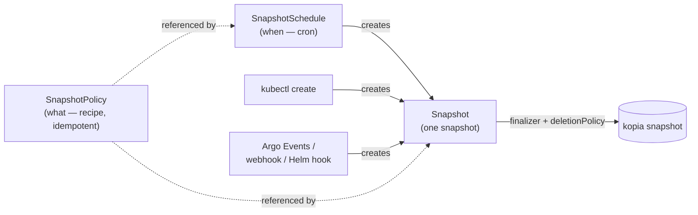

# Why Kopiur is designed this way

Kopiur makes a handful of deliberate choices that differ from other Kubernetes backup operators. This page explains the **why** behind the CRD surface, so the field-by-field references read as obvious.

It assumes you have met the Kopia primitives in [How Kopia works](how-kopia-works.md). This page is the readable version of the design rationale.

## Recipe, invocation, schedule — three resources, not one

The defining choice: Kopiur splits one backup job into **three** resources, each owning one question.

- **`SnapshotPolicy` is the recipe, the _what_.** It holds PVC sources, identity, retention, hooks and policy. It is **idempotent and runs nothing on its own**. Editing it changes future backups; it never fires one.
- **`Snapshot` is the invocation, the record _that it happened_.** It is one kopia snapshot, as a Kubernetes object, and it is the **universal trigger entry point**. A `Snapshot` can be created by a schedule, by `kubectl create`, by Argo Events, by a webhook, or by a Helm hook. The operator also creates `Snapshot` objects for snapshots it discovers in the repository but did not make.
- **`SnapshotSchedule` is the cron, the _when_.** It is a cron expression plus jitter and timezone. It is **just one source** of `Snapshot` objects: it creates them on a schedule, and nothing more.

Because the three are separate, pausing or deleting a `SnapshotSchedule` does not disturb backups already running or already taken, tuning retention on a `SnapshotPolicy` does not trigger a run, and any system that can `kubectl create` a `Snapshot` can trigger one. Operators that fold "what", "when" and "trigger" into a single field, as VolSync's `trigger` does, make every one of those an awkward special case.

/// tip | Why separate them

The split buys three things you would otherwise fight for: **edit the recipe without re-triggering**, **pause the schedule without affecting in-flight runs**, and **trigger a backup from anything** that can create an object, so GitOps, CI, an event bus, or a `kubectl` one-liner.

///

## The repository is a first-class resource

A kopia repository is not configuration buried inside a source object. It is its own resource: [`Repository`](../repositories.md), which is namespaced, or [`ClusterRepository`](../repositories.md#clusterrepository-a-shared-repository), which is cluster-scoped.

Lifecycle, credentials, encryption, maintenance and tenancy gating all hang off it, and **many `SnapshotPolicy` objects point at one repository**, each writing under its own identity.

Making the repository first-class is what lets Kopiur recommend [one shared repository](how-kopia-works.md#recommended-one-shared-repository). The repository is defined and operated once, and consumers reference it by name without restating the backend or holding its root credentials.

## Type-safety end-to-end

This is the main reason Kopiur is written in Rust.

Every "exactly one of" surface in the CRDs is a Rust `enum`, so which backend, which restore source, which deletion policy, which repository kind, and every reconciler `match`es it **exhaustively**. An invalid state, such as two backends at once or no backend at all, cannot be expressed, and a newly added variant **cannot compile** until every handler accounts for it.

/// abstract | The idea the whole design rests on

Backup software has more to lose from a silent wrong answer than almost any other kind of controller. A controller that quietly does nothing, because a new case slipped past a `switch`, can lose user data. Rust turns that whole class of bug into a compile error. Preserve this property in every change: prefer an `enum` plus an exhaustive `match` over a catch-all.

///

This is also why backends are **externally tagged**, so you write `backend.s3` rather than `backend.kind: S3`. The shape itself enforces "exactly one backend". See [API conventions](../dev/api-conventions.md).

## A Snapshot CR owns its snapshot's lifecycle

A `Snapshot` object **owns** its kopia snapshot through a finalizer. What happens to the snapshot when you delete the object is governed by `deletionPolicy`:

- **`Delete`**, the default for scheduled and manual backups, runs `kopia snapshot delete` when you delete the object. This is also how retention reclaims space: pruned `Snapshot` objects take their snapshots with them.
- **`Retain`** removes the object and keeps the snapshot. It is **forced** for _discovered_ backups, so the operator never deletes data it did not create.
- **`Orphan`** stops tracking the snapshot without deleting it.

/// warning | Deleting a Snapshot can delete its snapshot

With the default `deletionPolicy: Delete`, `kubectl delete snapshot` runs `kopia snapshot delete` through the finalizer. The snapshot is gone from the repository, not just from Kubernetes. Use `Retain` or `Orphan` to keep the snapshot. See [Backups → deletionPolicy](../backups.md#deletionpolicy--what-happens-to-the-snapshot).

///

Tying the snapshot's life to a Kubernetes object, instead of leaving snapshots floating in the repository disconnected from the resource that made them, is what makes retention, deletion and discovery legible from `kubectl`.

## Trade-offs we accepted

No design is free. Kopiur's choices come with costs we took on deliberately:

- **A larger blast radius for a deletion bug.** Because a `Snapshot` can delete its snapshot, a reconciler bug could delete data. Three things reduce that risk: the finalizer is attached only after status validates, discovered backups are forced to `Retain`, and `kopia maintenance` leaves a recoverability window before content is reclaimed.
- **A webhook in every write path.** Validation and identity resolution run at admission, so the admission webhook sits on the critical path. It fails closed.
- **More to learn up front.** The `username@hostname:path` identity model is explicit rather than hidden. That is more concepts than "just back up this PVC", in exchange for predictable shared repositories with no collisions.
- **One extra concept, `ClusterRepository`.** That is the price of safe multi-tenant repository sharing.

## See also

- [How Kopia works](how-kopia-works.md) covers the Kopia primitives these resources build on.
- [Backups & schedules](../backups.md) and [Repositories & backends](../repositories.md) are the field references.
- [API conventions](../dev/api-conventions.md) covers the externally-tagged-enum rule and the other type-safety conventions.
