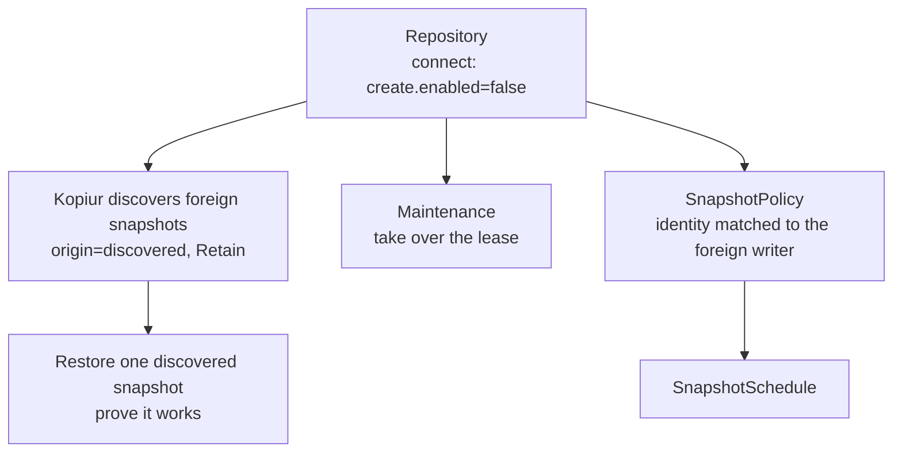
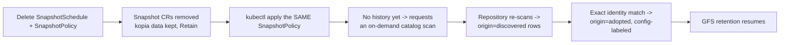

# Scenario 05 — Adopt an existing kopia repository

**You already have a kopia repo** — created by hand, by a cron job running the
kopia CLI, or by another tool — and you want Kopiur to take it over: see the old
snapshots, restore from them, run maintenance, and back up going forward
**without re-uploading data or stranding the existing snapshots**.

## What adoption does, step by step



/// info | Discovery is automatic, repeating — and Retain-forced

Once the `Repository` connects, Kopiur materializes snapshots it didn't create as
`Snapshot` CRs with `origin=discovered`, in the repository's namespace. Discovered
backups are **forced to `deletionPolicy: Retain`** — Kopiur never deletes data it
didn't create. The initial scan runs as soon as it connects; set
`catalog.periodicRefresh: true` (off by default) to keep re-scanning every
`catalog.refreshInterval` (default 1h) so snapshots the old tooling keeps writing
during the migration window show up too;
bound the rows with `catalog.retain` for very large histories (see
[The catalog](../repositories.md#the-catalog--discovered-snapshots)). List them:

```console
$ kubectl get snapshots -n adopt -l kopiur.home-operations.com/origin=discovered
```

///

The four deliberate moves in the bundle:

1. **Connect, don't create.** `create.enabled: false` — adopt the existing repo,
   never re-initialize it. The `KOPIA_PASSWORD` is the **existing** one.
2. **Take over maintenance.** A standalone `Maintenance` with an explicit
   `ownership` lease, so Kopiur and the old tooling don't both run
   `kopia maintenance`. We disable the `Repository`'s default-managed maintenance
   (`spec.maintenance.enabled: false`) so the takeover is deliberate, not
   automatic.
3. **Prove it.** Restore one discovered snapshot into a throwaway PVC.
4. **Back up going forward, matching identity.** Pin the new `SnapshotPolicy`'s
   `identity` to the foreign writer's `username@hostname:path` so new snapshots
   dedup against — and extend — the existing timeline.

/// warning | Taking the maintenance lease

`ownership.takeoverPolicy` is a closed enum: `Never` (default — refuses to touch
a lease another writer holds), `PromptCondition` (surfaces the conflict on
conditions and waits for you), or `Force` (seizes it immediately). The bundle uses
`PromptCondition`; switch to `Force` **only after** you've stopped the old
maintenance job, so two processes never compact the repo at once.

///

```yaml
--8<-- "deploy/examples/scenarios/05-adopt-existing-repo.yaml"
```

## Matching the foreign identity

This is the field most likely to trip you up. New backups only dedup against the
old data if Kopiur writes under the **same identity** the previous tool used.
Inspect a discovered `Snapshot`'s status (or `kopia snapshot list` against the repo)
to read the existing `username@hostname:path`, then set:

```yaml
identity:
    username: app-data # the existing snapshot's user
    hostname: legacy-host # the existing snapshot's host
```

If you _don't_ match it, backups still succeed — but they start a brand-new
lineage and re-upload a full copy instead of an incremental one.

/// tip | Adopting a perfectra1n/volsync **kopia** repo? Use `migrate volsync`, don't hand-write this

Kopiur's *default* identity (`<policyName>@<namespace>:/pvc/<pvc>`) does **not** match what the volsync fork records (`<sanitized-name>@<sanitized-namespace>:/data`) — even the source path differs. Hand-adopting a fork repo without pinning the exact identity silently forks the history. [`kubectl kopiur migrate volsync`](../cli/migrate-volsync.md) computes the fork's identity for you (a bug-for-bug port of its sanitizer) and pins it, so history continues seamlessly. Reach for the manual identity match here only for a non-volsync writer.

///

## Verify adoption

```console
$ kubectl get repository legacy-primary -n adopt
NAME             PHASE   AGE
legacy-primary   Ready   25s

$ kubectl get maintenance legacy-primary-maintenance -n adopt
NAME                         REPOSITORY       OWNED   AGE
legacy-primary-maintenance   legacy-primary   true    25s

$ kubectl get restore adopt-smoke-test -n adopt
NAME               PHASE       AGE
adopt-smoke-test   Completed   45s
```

A `Ready` repo, an `OWNED` maintenance lease, and a `Completed` smoke-test restore
mean the repository is fully adopted.

## Delete a policy, then recreate it

Adoption isn't only for a repository you're onboarding for the first time — it's
also how Kopiur heals itself after **you** delete a `SnapshotPolicy` and bring it
back. This is the scenario end-to-end, continuing from the `postgres-data`
recipe above once it's been backing up for a while:



1. **Delete the schedule, then the policy** (or let a GitOps prune remove both at
   once — either order drains to the same outcome; see
   [Backups → Retain-wins-ties](../backups.md#what-happens-when-the-policy-is-deleted)).
   With the default `onPolicyDelete: Retain`, the `policy-cleanup` finalizer
   removes every `Snapshot` CR carrying the policy's config label — but **every
   kopia snapshot stays in the repository**. Nothing is deleted kopia-side.

   ```console
   $ kubectl delete snapshotschedule postgres-data-nightly -n billing
   $ kubectl delete snapshotpolicy postgres-data -n billing
   ```

2. **Re-apply the same `SnapshotPolicy`** (same name, same `identity`/sources —
   shown below). A freshly-created policy has no
   `Snapshot` CRs carrying its config label yet — no history. Its first
   reconcile finds nothing to adopt (the old snapshots haven't been rediscovered
   yet) and, because it has no history and hasn't already asked for this exact
   identity, requests an **on-demand catalog scan** on the repository instead of
   waiting for a spec change or the (off-by-default) periodic-refresh timer. An
   `AdoptionScanRequested` Normal Event fires on the `SnapshotPolicy` naming the
   identity it's waiting on.
3. **The repository honors the scan request** and re-lists the backend, which
   re-materializes the kept kopia snapshots as `origin: discovered` rows —
   exactly like the very first adoption above, just triggered on demand instead
   of by the initial bootstrap.
4. **The policy adopts them on its next reconcile**: it matches discovered rows
   by **exact structured identity** — `username` AND `hostname` AND
   `sourcePath` must ALL match its own resolved identity, never a
   partial/fuzzy match — creates an `origin: adopted` `Snapshot` CR (carrying
   the config label) for each one, and removes the matching discovered rows. A
   `SnapshotsAdopted` Normal Event fires naming the count and identity.
5. **Retention resumes.** Adopted rows are GFS-governed exactly like produced
   ones — `spec.retention` starts pruning them the moment they age out of the
   window. If you recreated the policy with a **narrower** retention window
   than before, expect some of the just-adopted history to be pruned on the
   very next reconcile — that's [by design](../backups.md#retention--how-long-backups-are-kept-gfs),
   not a bug (see [Troubleshooting](../troubleshooting.md#my-old-snapshots-were-pruned-after-i-recreated-a-policy)
   if this surprises you).

```yaml
--8<-- "deploy/examples/36-policy-recreate-adoption.yaml"
```

/// note | Opting out, and the one case adoption never touches

Automatic adoption is on by default at both levels — turn it off with
`SnapshotPolicy.spec.adoption: Ignore` (this recipe only) or
`Repository`/`ClusterRepository` `spec.catalog.adoption: Ignore` (every policy
against this repository); the per-policy field wins when both are set. Either
way, `origin: discovered` rows keep accumulating and are never auto-attached —
you restore from them directly instead (as in the section above).

On a repository **shared across clusters** (`identityDefaults.cluster` set),
adoption never crosses cluster boundaries: a discovered row whose hostname
classifies as another cluster's is refused even on an otherwise-exact identity
match — the same [foreign-snapshot rule](../repositories.md#identitydefaultscluster--sharing-one-repository-across-clusters)
that keeps two clusters' maintenance leases from fighting also keeps one
cluster from silently absorbing another's backup history.

///

## See also

- [Restores → discovered snapshots](../restores.md#restoring-a-snapshot-kopiur-didnt-create) and [example 07](../examples.md#example-07--restore-a-discovered-backup) — the two ways to restore foreign snapshots.
- [Maintenance](../maintenance.md) and [example 08](../examples.md#example-08--maintenance) — ownership leases and takeover policy in full.
- [Backups → identity](../backups.md#identity--what-kopia-records-usernamehostnamepath) — matching the foreign writer's identity.
- [Backups → What happens when the policy is deleted](../backups.md#what-happens-when-the-policy-is-deleted) — the `onPolicyDelete` cascade this scenario relies on.
- [Repositories → The catalog](../repositories.md#the-catalog--discovered-snapshots) — the `catalog.adoption` knob and scan-request mechanics in full.
