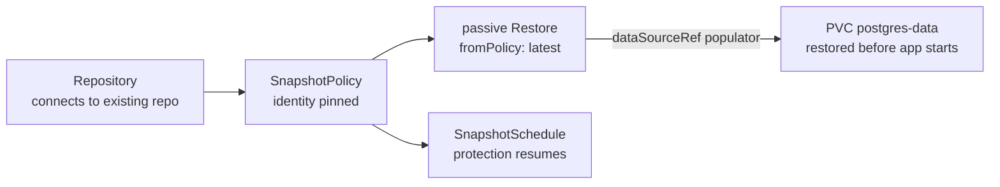

# Scenario 03 — Disaster recovery on a fresh cluster

**The cluster is gone.** A failed upgrade, a deleted namespace, a dead control plane. But the repository in object storage survived, which is the entire point of off-cluster backups. You stand up a new cluster, apply your GitOps repo, and the app's data comes back as part of that apply. There is **no "fresh install or recovery?" branch** to pick.

This is the headline [deploy-or-restore](../restores.md#deploy-or-restore-gitops) pattern, hardened for disaster recovery with two changes from a normal install.

/// info | What makes this a DR bundle (vs. example 05)

1. The `Repository` **connects** to the existing repository, with `create.enabled: false`. The repository must already exist; we are not initializing a new empty one. A typo in the bucket then shows up as a connect error, instead of quietly creating a second, empty repository at the wrong address.
2. A **passive `Restore`** is attached to the PVC's `dataSourceRef` as a volume populator. It uses `source.fromPolicy`, has no `target`, and sets `onMissingSnapshot: Continue`. The PVC therefore restores the latest snapshot **before the app starts**.

///

/// tip | If you were mirroring the repository off-site

This scenario **connects** to the surviving repository, so the rebuilt cluster keeps writing into it.

If what survived is an off-site *mirror* and you want the new cluster to have its own repository back, with the mirror left intact, seed a new one instead. See [Scenario 10: DR from a replicated repository](dr-with-replicated-repository.md).

///

/// warning | Identity must match the old cluster

kopia finds the surviving snapshots by `username@hostname:path`. The defaults are `username = SnapshotPolicy name` and `hostname = namespace`, so rebuilding with the **same name in the same namespace** resolves the same snapshots automatically.

This bundle pins `identity` explicitly anyway, so recovery still works even if you rebuild into a differently-named namespace.

The `KOPIA_PASSWORD` must also be the **original** one. kopia cannot decrypt the repository with a new password.

///

/// danger | Check retention before re-applying policies over surviving history

The `SnapshotPolicy` below adopts the repository's surviving snapshots. An adopted snapshot is then governed by GFS retention like any produced backup.

Under the default `deletionPolicy: Delete`, everything **outside** `spec.retention` is pruned from the repository immediately. Retention prunes deliberately bypass the [mass-deletion breaker](../repositories.md#deletionprotection--the-mass-deletion-circuit-breaker).

So a five-year history re-adopted under `keepDaily: 14` loses the rest. Widen `retention` to what you actually intend to keep, or set the policy's `defaultDeletionPolicy: Retain` so pruning a row deletes only the `Snapshot` CR.

///

## The values you must get right

| Field | Must equal | Why |
| --- | --- | --- |
| `KOPIA_PASSWORD` | the **original** repo password | kopia can't decrypt otherwise. |
| `backend.s3.bucket` / `prefix` | the surviving bucket/prefix | that's where the snapshots are. |
| `create.enabled` | `false` | connect, don't re-initialize. |
| `identity.username` / `hostname` | what the old cluster recorded | so `fromPolicy` resolves the old snapshots. |

```yaml
--8<-- "deploy/examples/scenarios/03-disaster-recovery.yaml"
```

## What happens on apply



On a cluster pointed at the **existing** repository, the PVC is provisioned by restoring the latest snapshot. On a genuinely **empty** repository, `onMissingSnapshot: Continue` lets the PVC come up blank and be backed up going forward. The _same manifests_ work either way.

## Verify the recovery

```console
$ kubectl get repository postgres-primary -n billing
NAME               PHASE   AGE
postgres-primary   Ready   20s

$ kubectl get pvc postgres-data -n billing
NAME            STATUS   VOLUME    CAPACITY   AGE
postgres-data   Bound    pvc-...   100Gi      35s

$ kubectl get restore postgres-data-restore -n billing
NAME                    PHASE       AGE
postgres-data-restore   Completed   40s
```

A `Bound` PVC and a `Completed` populator `Restore` mean the data is back. Start the app against it.

/// note | Kubernetes ≥ 1.24

The volume-populator handshake needs the `AnyVolumeDataSource` feature, which is GA from 1.24. The optional `volume-data-source-validator` surfaces a malformed `dataSourceRef` as an event instead of a PVC that silently never binds.

///

## See also

- [Restores → deploy-or-restore](../restores.md#deploy-or-restore-gitops) and [example 05](../examples.md#example-05--deploy-or-restore-gitops): the populator mechanism in detail.
- [Scenario 04, migrate across clusters](migrate-across-clusters.md): when the destination's name or namespace is _different_, and `fromPolicy` won't resolve the old snapshots.
- [Repositories & backends](../repositories.md): `create.enabled` and connection details.
- [Scenario 10, DR from a replicated repository](dr-with-replicated-repository.md): when the survivor is a mirror and you seed a *new* repository from it with `spec.seed`.
