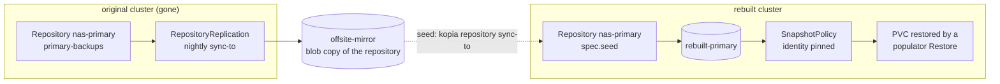

# Scenario 10 — Disaster recovery from a replicated repository

**The primary repository is gone, but the off-site mirror survived.** You have
been running a [`RepositoryReplication`](../replication.md) (or keeping a second
repository in sync) precisely for this day. The rebuilt cluster should get its
**own** repository back — pre-loaded with the mirror's history — rather than
adopting the mirror as its live store.

`spec.seed` on a `Repository`/`ClusterRepository` does that during the
repository's **very first bootstrap**: the seeding mover copies the replica in
*before* the repository is ever reported `Ready`.

/// info | `spec.seed` vs. the "seed job" in other examples

Several example bundles contain a one-shot Kubernetes `Job` named `seed-…` that
writes test data into a volume so there is something to back up. That is
unrelated. **`spec.seed` seeds a _repository_, from another repository.**

///

## Why not just point at the mirror?

Both are valid; they answer different questions.

| | Connect to the mirror ([scenario 03](disaster-recovery.md)) | Seed a new repository (this page) |
| --- | --- | --- |
| What the rebuilt cluster writes into | the mirror itself — it becomes the live repository | a **new** repository of its own |
| Time to first restore | immediate (no copy) | after the copy finishes (minutes to hours) |
| The mirror afterwards | is now production; you need a *new* off-site copy | stays a pristine, untouched replica |
| Blast radius of a mistake on day one | writes land in your last surviving copy | the surviving copy is read-only throughout |
| Reach for it when | you need data back *now*, or the mirror was always meant to be promoted | the mirror must stay a mirror, or the primary's storage/region/credentials are being rebuilt anyway |

Seeding never writes to its source in either mode — the source is connected
read-only — so a seed that fails leaves the replica exactly as it found it.

/// danger | The failure this exists to prevent

Without `spec.seed`, the obvious DR sequence is "apply the manifests and let the
new repository be created empty, then copy the history in afterwards". A
repository created empty reaches `Ready` **immediately**, and everything
downstream believes it: a populator `Restore` with the default
`onMissingSnapshot: Continue` resolves *nothing*, provisions a **blank PVC**, the
app starts on it, and the first scheduled backup writes that blank state as the
newest snapshot. The recovery looks green the whole way through.

Seeding inside the first bootstrap removes the window: the repository does not
go `Ready` until the copy has landed, and if the copy cannot complete the
repository stays `Initializing`/`Degraded` with an actionable reason instead. A seed
that copies **nothing** is refused outright (`allowEmptySource` is the one
explicit override).

///

## Topology



Every manifest below is pulled from one apply-ready bundle,
[`deploy/examples/scenarios/10-dr-seed-from-replica.yaml`](https://github.com/home-operations/kopiur/blob/main/deploy/examples/scenarios/10-dr-seed-from-replica.yaml)
— copy it whole, fill in the `REPLACE_ME` values, and apply the half that belongs
on the cluster you are standing in front of.

/// warning | Two clusters, one file

The `primary` + `mirror` documents belong on the **original** cluster; the seed
variants and the app's recovery belong on the **rebuilt** one. Pick exactly
**one** seed variant — they are two spellings of the same recovery. The rebuilt
`Repository` deliberately reuses the original's name and namespace; that is what
lets the recovered policies resolve their own old snapshots.

///

### What the original cluster had

The prerequisite, and the whole reason this scenario is possible — an ordinary
`Repository` with nothing special about it:

```yaml
--8<-- "deploy/examples/scenarios/10-dr-seed-from-replica.yaml:primary"
```

## The two modes

### Blob mode — `seed.from.backend`

Runs `kopia repository sync-to` from a **bare storage backend** holding a
byte-for-byte mirror of a kopia repository — exactly what a
`RepositoryReplication` writes.

```yaml
--8<-- "deploy/examples/scenarios/10-dr-seed-from-replica.yaml:seed-blob"
```

- The copy is at the storage layer, so the seeded repository **inherits the
  mirror's repository format and password verbatim**. `encryption.passwordSecretRef`
  must already hold the *mirror's* password.
- `create.{splitter,hash,encryption,ecc}` are **rejected at admission** next to a
  blob seed: the format comes from the mirror, so declaring one would be an inert
  field.
- The seed source's credential Secret must live in the namespace the bootstrap
  Job runs in — see [Where the seed source's Secret must live](#where-the-seed-sources-secret-must-live).
- Structurally safe against a mis-pointed source: `sync-to` refuses a destination
  whose format blob differs from the source's, so two unrelated repositories can
  never be mixed.

### Migrate mode — `seed.from.repository`

Runs `kopia snapshot migrate` from another `Repository`/`ClusterRepository` CR.
Source and destination are two **independent** repositories with their own
formats and passwords.

```yaml
--8<-- "deploy/examples/scenarios/10-dr-seed-from-replica.yaml:seed-migrate"
```

- Kopiur creates the local repository itself, honoring
  `create.{splitter,hash,encryption,ecc}` — you get a genuinely new repository
  with a password of your choosing.
- The source is resolved as a CR and gated on it being `Ready`; until then the
  repository parks visibly (`Seeded=False`, reason `WaitingForSeedSource`, phase
  `Pending`) and re-checks every 15 s.
- Seeding from a **`ClusterRepository`** makes this repository a *consumer* of
  it, so the source's `allowedNamespaces` must admit this namespace — the same
  fail-closed gate every other consumer reference goes through, and the webhook
  rejects the apply naming `spec.seed.from.repository` if it does not. The
  bundle's `ClusterRepository/offsite-archive` is assumed to exist already: it is
  the surviving replica.
- **Needs `features.credentialProjection.enabled`** whenever the source
  repository's Secrets are not readable from the seeding Job's namespace — see
  [the prerequisite below](#prerequisite-credential-projection-for-migrate-mode).

Either way, `kopia snapshot migrate` **preserves each snapshot's
`username@hostname:path` identity and its times**, so seeded history stays
restorable by `Restore.source.identity` and by `fromPolicy`. That is what lets a
rebuilt cluster's policies find their own old snapshots.

## The rest of the recovery bundle

The seeded repository is only half of it. The other half is what the rebuilt
cluster runs on top: the policy that reclaims the recovered history, the passive
populator `Restore`, and the PVC that consumes it.

```yaml
--8<-- "deploy/examples/scenarios/10-dr-seed-from-replica.yaml:app-recovery"
```

## Before you start: kick a final mirror sync

The mirror is only as current as its last replication run — this is the
`RepositoryReplication` that has been writing it:

```yaml
--8<-- "deploy/examples/scenarios/10-dr-seed-from-replica.yaml:mirror"
```

If the primary is still reachable at all, force one more sync before you seed:

```console
$ kubectl kopiur replication run nas-primary-offsite -n billing --wait
```

That is the on-demand [run-requested](../replication.md#run-it-now) path — it
stamps `kopiur.home-operations.com/run-requested` with an RFC3339 timestamp and
drives a Job through the normal gates, so `kubectl annotate` does the same thing
if you would rather not install the plugin. A manual run stamps `lastReplicated`
and re-anchors the next cron slot, which is what you want mid-incident.

## The drill

1. **Install the operator** on the rebuilt cluster, at a version that supports
   `spec.seed`. Enable `features.credentialProjection.enabled` if you are seeding
   in migrate mode from a source whose Secrets live elsewhere.
2. **Restore the Secrets first.** The repository password must be the *original*
   one for a blob seed (it is the mirror's format), and the seed source's storage
   credentials must be in the bootstrap Job's namespace.
3. **Apply the manifests** — repository, policies, schedules, populator restores,
   all in the same commit. Nothing needs a "recovery mode" branch.
4. **Watch the seed.** The repository stays out of `Ready` for the whole copy:

    ```console
    $ kubectl get repository nas-primary -n billing
    NAME          PHASE          BACKEND   AGE
    nas-primary   Initializing   S3        4m

    $ kubectl describe repository nas-primary -n billing | grep -A3 Seeded
      Type:     Seeded
      Status:   False
      Reason:   Seeding
      Message:  copying this repository's initial contents from S3; it does not become
                Ready until the copy finishes (phase Initializing, or Degraded while
                an earlier attempt is being retried)...
    ```

    A first seed transfers the whole repository, so hours is normal. The phase is
    `Initializing` while the copy runs — it flips to `Degraded` if an attempt
    fails and is being retried, and `Pending` is the *park*, meaning a migrate
    seed's source is not usable yet. The seeding Job's own logs are the progress
    view:

    ```console
    $ kubectl logs -n billing job/nas-primary-discovery -f
    ```

5. **Confirm the seed landed**, then let the rest of the recovery proceed:

    ```console
    $ kubectl get repository nas-primary -n billing -o jsonpath='{.status.seed}' | jq
    {
      "startedAt": "2026-08-17T09:12:04Z",
      "seededAt":  "2026-08-17T10:41:58Z",
      "mode":      "blob",
      "source":    "S3",
      "snapshotCount": 1284
    }

    $ kubectl get snapshots -n billing -l kopiur.home-operations.com/origin=discovered | head
    ```

6. **The app comes back on its own.** The populator `Restore` was parked the
   whole time waiting for the repository — and its `waitTimeout` window opens at
   that moment, not at creation, so a long seed does not spend it (see
   [Restores → `waitTimeout`](../restores.md#waittimeout--wait-before-giving-up)
   and `status.waitStartedAt`).

## Observability

| Surface | What it says |
| --- | --- |
| `status.seed.startedAt` | when a seed attempt was **launched** (the durable attempt marker; set before the Job exists, never cleared) |
| `status.seed.seededAt` | when the seed **finished**. Set once — a repository is seeded exactly once |
| `status.seed.mode` / `.source` | `blob`/`migrate`, and the rendered source (`S3`, `ClusterRepository/offsite-archive`) — never a credential or a bucket path |
| `status.seed.snapshotCount` | snapshots observed at the source when the seed ran |
| `status.seed.snapshotsCopied` | migrate mode only, and **cumulative**: what is present after the run, including anything an interrupted earlier attempt had already moved |
| `Seeded` condition | the state machine below |
| `RepositorySeeded` Event | Normal, published once on the transition, naming the source and the snapshot count |
| `kopiur_repository_seed_total{mode,outcome}` | counter; `outcome` is `seeded` / `already_initialized` / `failed` |
| `kubectl kopiur doctor` | explains every `Seeded=False` reason with the writer's full remediation text |

`Seeded` reasons, all of them:

| Status / reason | Meaning |
| --- | --- |
| `True` / `Seeded` | data was copied in |
| `True` / `AlreadyInitialized` | the standing no-op — the repository was already initialized, so nothing was copied |
| `False` / `Seeding` | the copy is running |
| `False` / `WaitingForSeedSource` | migrate mode: the source repository is missing, not `Ready`, or is a bare-path filesystem repository the mover cannot mount |
| `False` / `SeedSourceAuthConflict` | migrate mode: this repository's backend and the resolved source's disagree on workload identity, and one pod runs as one ServiceAccount — see [One pod, one ServiceAccount](#one-pod-one-serviceaccount) |
| `False` / `SeedSourceNotFound` | the source answered but holds no kopia repository (usually a wrong bucket **or prefix**) |
| `False` / `SeedSourceEmpty` | the source is a kopia repository with zero snapshots and `allowEmptySource` is `false` |
| `False` / `SeedIncomplete` | migrate post-verify found snapshots missing (kopia exits 0 even when a per-source migration fails, so the destination listing is the real success gate) |
| `False` / `SeedLeftEmpty` | a seed was armed and the repository ended up holding zero snapshots — an earlier attempt initialized the backend and then died |
| `False` / `MoverImageTooOldForSeed` | the mover image predates `spec.seed` and silently dropped it. **Terminal** |

## Retries, resume, and what is terminal

The four source/copy failures above are **retryable, and retried promptly**: the
failed Job is recycled and a fresh one — with a fresh 24 h deadline — is launched
roughly **every two minutes**. A mirror that is briefly unreachable, or a
replication that has not run yet, therefore heals by itself with no operator
action; that promptness is deliberate, because this is the flow you are in on the
worst day of the year.

An **interrupted seed resumes**. Kopiur stamps `status.seed.startedAt` *before*
creating the seeding Job, so a copy killed mid-flight (a deadline, an OOM, a node
loss) is recognizable as its own on the next pass, and the relaunch continues
rather than restarting: `sync-to` copies only the blobs the destination lacks,
and `snapshot migrate` is idempotent by `(identity, startTime)`.

/// warning | Do not delete the half-seeded repository at the backend

`SeedLeftEmpty`'s remedy is to let kopiur retry — it resumes the copy itself, so
nothing at the backend should be deleted. Clearing the backend by hand throws away
the partial copy the next attempt would have finished. If attempts keep being cut
short, read the seeding Job's pod logs and raise
`spec.seed.failurePolicy.activeDeadlineSeconds` (default **86400** = 24 h).

///

Two failures are **terminal** — the same inputs reproduce them forever, so
retrying would only hide them:

- **`MoverImageTooOldForSeed`** — the running mover image does not understand
  `spec.seed` and dropped it. Upgrade the mover image, *and* delete the finished
  bootstrap Job (`kubectl -n <ns> delete job <repository>-discovery`): nothing
  recycles a terminal Job before its TTL, so an upgrade alone looks like it
  changed nothing for up to an hour.
- **`BootstrapInternalInconsistency`** — a kopiur defect, not a repository
  problem. The message says so; please file it.

An `AuthFailure` against the seed source is terminal too, by the same rule that
governs every bootstrap: kopiur never creates or seeds over a backend it could not
authenticate to.

### Changing `spec.seed` while a seed is running

`spec.seed` is mutable. The in-flight Job is **not** killed; it runs to
completion and its result is discarded as stale (the edit bumped
`metadata.generation`), then the next pass launches a fresh seed for the live
spec. The attempt marker survives, so that relaunch **resumes — against the new
source**:

- **blob mode fails safe.** `sync-to` refuses a destination whose format blob
  differs from the source's, so a repoint to an unrelated mirror errors out
  instead of mixing two repositories.
- **migrate mode has no such backstop.** It will merge the new source's history
  into whatever the first attempt left behind, and `snapshotsCopied` then reports
  a mixed total across both sources.

So to *deliberately* repoint a migrate seed before it finishes: delete the
half-seeded repository at the backend first (this is the one case where that is
right), or let the seed finish and move the extra history with a
[`SnapshotReplication`](../snapshot-replication.md) instead.

`spec.suspend` mid-seed behaves the same way: the Job keeps running, and its
result is consumed when you resume.

## Hazards to review before you apply

/// danger | Identity must match the pre-disaster configuration byte for byte

Seeding preserves snapshot identities, but nothing makes your *new* policies
compute the same ones. Kopiur's identity-fork guards are update-gated — they
cannot fire on a freshly-created `SnapshotPolicy` — so a rebuilt policy whose
identity differs silently starts a **new** backup chain beside the history you
just recovered.

The one signal is a `NoAdoptableHistory` Warning Event: the repository holds
discovered snapshots and none match this policy's identity. Compare
`spec.identity` **and** the repository's `identityDefaults` (including
`identityDefaults.cluster`, which suffixes the default hostname) against the
pre-disaster manifests before re-applying, and pin `identity` explicitly in DR
manifests so a rebuild into a differently-named namespace still resolves.

///

/// danger | Re-applying policies can prune the history you just recovered

Adoption re-attaches matching `discovered` snapshots to a live `SnapshotPolicy`,
and an adopted snapshot is then GFS-governed like any produced backup. Under the
default `deletionPolicy: Delete`, everything **outside** `spec.retention` is
pruned from the repository — immediately, and retention prunes deliberately bypass
the [mass-deletion breaker](../repositories.md#deletionprotection--the-mass-deletion-circuit-breaker).
A five-year mirror re-adopted under `keepDaily: 7` loses the rest.

Before re-applying policies over seeded history, do one of:

- widen `spec.retention` to the window you actually intend to keep;
- set the policy's `defaultDeletionPolicy: Retain` (or `Orphan`) so pruning a row
  deletes only the `Snapshot` CR and never the kopia data — adoption then only
  takes candidates the window would keep anyway;
- `spec.pin` the snapshots you must not lose;
- or set `adoption: Ignore` and restore from the discovered rows directly.

///

/// warning | Bound the catalog on a large mirror

Every snapshot in a seeded repository is materialized as a `discovered`
`Snapshot` CR the moment the repository goes `Ready`. A multi-year mirror is
thousands of CRs in one burst. Set `catalog.retain` (`perIdentity`,
`maxAgeDays`) — it bounds the **CR rows only**; every snapshot stays restorable
[by identity](../restores.md#restoring-a-snapshot-kopiur-didnt-create).

///

### Prerequisite: credential projection for migrate mode

A migrate seed opens **two** repositories from one pod, and the source's Secrets
usually live in another namespace. `seed.credentialProjection.enabled: true` lets
the operator copy them into the seeding Job's namespace for the run — which needs
the operator's `features.credentialProjection.enabled` Helm flag (see
[Feature permissions](../feature-permissions.md)). Without it the bootstrap fails
closed with a message naming both the CR field and the install flag, rather than
launching a Job that cannot authenticate. The copies are reclaimed when the seed
finishes.

### Where the seed source's Secret must live

The seed source's credentials are loaded with `envFrom`, which is
namespace-local, so the Secret must be in **the namespace the bootstrap Job runs
in**:

- a namespaced **`Repository`** → its own namespace. Admission rejects a
  `seed.from.backend` `secretRef` that pins any other namespace.
- a **`ClusterRepository`** → the operator's namespace, *unless*
  `encryption.passwordSecretRef.namespace` pins one, in which case the Job runs
  there and the seed Secret must be there too. Admission rejects a seed
  `secretRef` that pins a namespace at all (a cluster-scoped spec cannot name the
  right one); put the Secret alongside the repository's other credentials.

### One pod, one ServiceAccount

A seeding bootstrap resolves its run identity against **both** backends, but a pod
runs as exactly one ServiceAccount: **the first backend that names a workload
identity wins** — and here that is this repository's own backend, not the seed
source's.

In **blob mode** admission catches the pairings that would misauthenticate,
because the seed backend is written inline where the validator can see it: a
both-workload-identity pair must name the **same** ServiceAccount, and a
*same-kind* pair (S3+S3, Azure+Azure) may not mix `workloadIdentity` on one side
with a static credential Secret on the other — the static side's keys sit on the
pod's environment and the workload-identity side would silently pick them up.
(A GCS static key travels as a `--credentials-file` path rather than ambient
environment, so that mixed pair is safe.) This is the same rule, and the same
validator, [`SnapshotReplication`](../snapshot-replication.md) uses.

/// note | Migrate mode is checked at reconcile, not at apply

A migrate seed's source backend arrives through a **repository reference**, which
admission cannot follow — so the *apply* is accepted. The operator applies the
same rule itself once it has resolved the source repository: if the two backends
disagree on workload identity, it **refuses to launch the seed** and parks the
repository on `Seeded=False` with reason `SeedSourceAuthConflict`, naming both
ServiceAccounts. It re-checks, so correcting either side clears it with no other
action. Give both repositories the same workload-identity ServiceAccount, or give
both sides static credentials this namespace can read.

///

The rejection message is the shared replication one, so it says *"the replication
mover's environment carries the static side's keys"* — it means the seeding mover;
the substance and the fix (`workloadIdentity` on both sides, or static Secrets on
both) are the same.

### Maintenance ownership after a blob seed

A blob copy carries the **source cluster's** `kopia.maintenance` blob, including
its owner. Kopiur restamps the maintenance owner unconditionally on a seeded
repository, precisely because the old cluster is by definition gone — without
that, a repository whose `identityDefaults.cluster` forces owner-scoped
maintenance would see the recovered repository as permanently foreign and yield
forever. Nothing to configure; it is worth knowing when you see the owner change
on a freshly-seeded repository.

## Verification checklist

```console
# 1. The seed actually copied something (and says what, from where):
$ kubectl get repository nas-primary -n billing -o jsonpath='{.status.seed}'

# 2. The repository is Ready and the Seeded condition is True:
$ kubectl get repository nas-primary -n billing \
    -o jsonpath='{range .status.conditions[?(@.type=="Seeded")]}{.status}{" "}{.reason}{"\n"}{end}'

# 3. doctor explains anything still blocked, in the operator's own words:
$ kubectl kopiur doctor -n billing

# 4. The recovered history is visible as discovered snapshots:
$ kubectl get snapshots -n billing -l kopiur.home-operations.com/origin=discovered

# 5. Your policies MATCH that history (no NoAdoptableHistory warnings):
$ kubectl get events -n billing --field-selector reason=NoAdoptableHistory

# 6. The app's PVC came back with data, not blank:
$ kubectl get pvc,restore -n billing
```

## See also

- [Repositories → `seed`](../repositories.md#seed--initialize-a-new-repository-from-a-replica) — the field-level reference.
- [Scenario 03 — disaster recovery on a fresh cluster](disaster-recovery.md) — the same rebuild, connecting to the surviving repository instead of seeding a new one.
- [Repository replication](../replication.md) — the mirror this scenario seeds from, and `kubectl kopiur replication run`.
- [Snapshot replication](../snapshot-replication.md) — the ongoing counterpart of migrate mode, for history you want copied on a schedule rather than once.
- [Troubleshooting → a seeding repository never reaches `Ready`](../troubleshooting.md#a-seeding-repository-never-reaches-ready).
- [Feature permissions](../feature-permissions.md) — the `credentialProjection` install flag.
