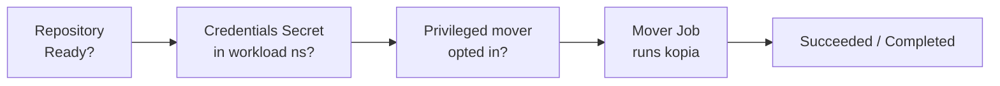

# Troubleshooting

Kopiur is built to **tell you why** something didn't happen rather than fail silently. Almost every problem shows up in two places you can read without touching operator logs:

- **Conditions** on the resource, from `kubectl describe <kind> <name> -n <ns>` or `-o yaml`, and
- **Events**, which `describe` also shows, as `Warning` and `Normal` lines.

So the first move for any stuck resource is always:

```console
$ kubectl describe repository <name> -n <ns>   # or snapshotpolicy / snapshot / restore / maintenance
```

Read the conditions and Events at the bottom. The messages are written to say **what** failed, **why**, and **how to fix it**.

This holds for **every** kopiur kind. Any reconcile failure is published as a `Warning` Event on the failing object with a machine-readable reason. That covers a missing referenced Repository, an invalid spec, an unparseable cron, and a backend rejection, with reasons such as `MissingDependency`, `InvalidSpec`, `InvalidSchedule`, or the kopia error class. Repeats of the same failure aggregate into one Event with a climbing count, so `kubectl get events -n <ns>` stays readable.

## A map of the pipeline

Most failures are one link in this chain not being green yet:



Work left to right. A `Snapshot` or `Restore` will not start until the `Repository` is `Ready`, the credential Secret is present, and, if the mover is elevated, the namespace has opted in.

## Repository never reaches `Ready`

```console
$ kubectl get repository -n <ns>
NAME      PHASE     BACKEND   AGE
primary   Failed    S3        2m
```

| Phase / symptom                | Likely cause                                                                               | Fix                                                                                                            |
| ------------------------------ | ------------------------------------------------------------------------------------------ | -------------------------------------------------------------------------------------------------------------- |
| `Failed`, connect error        | Wrong endpoint, region or bucket. Or the bucket doesn't exist and `create.enabled` is `false`. | Fix the backend identifiers. Set `create.enabled: true` for a genuinely new repo.                              |
| `Failed`, reason `RepositoryReinitializeBlocked` | The backend answers but holds **no** kopia repository, and this one was once `Ready` (it carries a pinned `status.uniqueId`). In other words the bucket or export was **wiped**. kopiur refuses to create an empty repository over it, whatever `create.enabled` says. | Verify the backend is genuinely empty and that no other `Repository` points at it. Then either restore the backend or [deliberately re-initialize](repository-health.md#deliberately-re-initialize-a-wiped-repository). The condition message carries the exact `kubectl annotate` command. Re-initializing **discards** the old repository's history. |
| `Failed`, reason `RepositoryReinitializeBlocked` after you annotated | The `allow-reinitialize` value does not equal the current `status.uniqueId`, so it is ignored. That is the fail-safe. A `Warning` event `InvalidReinitializeAck` names the value kopiur expects. | Re-run the annotate with `--overwrite` and the value from `kubectl get repository <name> -n <ns> -o jsonpath='{.status.uniqueId}'`. |
| Not `Ready`, a **valid** `allow-reinitialize` annotation present, but nothing happens; `Warning` event `ReinitializeAckDormant` | The annotation matches the pin, but the current `Ready` reason is not `RepositoryReinitializeBlocked`, and `BackendReachable` is not `RepositoryVanished`. It may be `BackendUnreachable`, `AuthFailure`, a deadline, or a missing mount or wrong prefix reported as a plain `NotFound`. kopiur only re-initializes on the verdict it has *itself* reached: backend reachable, repository absent. Everything else stays dormant on purpose, so an annotation left in Git cannot re-create over an unrelated outage. | Fix the cause the event names. If the repository then turns out to be genuinely gone, kopiur parks at `RepositoryReinitializeBlocked` and the standing annotation takes effect on its own. No re-annotate needed. See [Deliberately re-initialize](repository-health.md#deliberately-re-initialize-a-wiped-repository). |
| `Failed`, auth/"Access Denied" | Backend keys wrong, or stored under the wrong Secret keys.                                  | Check the [credential key names](repositories.md#credential-secret-keys-by-backend) and the access key/secret. |
| `Failed`, decryption error     | `KOPIA_PASSWORD` doesn't match an existing repository.                                     | Use the original password. There is no recovery for a lost one.                                                |
| `Failed`, TLS error (`x509: certificate signed by unknown authority`) | A private-CA or self-signed HTTPS endpoint, or an HTTP-only endpoint spoken to as HTTPS. | Point `tls.caBundleRef` at a ConfigMap holding the CA PEM. Its `key` defaults to `ca.crt`, and it is resolved in the `Repository`'s namespace, or the operator's namespace for a `ClusterRepository`. For a genuinely HTTP-only store, set `tls.disableTls: true`. See [Private-CA HTTPS](backends/s3.md#private-ca-https-trusting-your-own-ca). |
| `MissingCaBundle` condition    | The `tls.caBundleRef` ConfigMap, or its key (default `ca.crt`), doesn't exist where it's resolved. | Create the ConfigMap in the `Repository`'s namespace, or the operator's namespace for a `ClusterRepository`. It is **not** read from workload namespaces. `kubectl kopiur doctor` reports this as a structural gate, and the ConfigMap appearing re-triggers the reconcile. |
| `Degraded`, reason `BootstrapDeadlineExceeded` / `ProbeDeadlineExceeded` | The bootstrap or probe Job was killed by its `activeDeadlineSeconds` (default 120s) before `kopia repository connect` finished. The backend may be **reachable but slow**, for example a cold cache over a large repository's index blobs. It is not an outage, and not a credentials problem. | Usually self-heals: kopiur retries with a progressively longer deadline, doubling up to 30m, and maintenance keeps running so index compaction shrinks connect time. To speed it up, raise `spec.bootstrap.failurePolicy.activeDeadlineSeconds`. |
| Stuck `Pending`                | Operator not running, or not watching this scope.                                          | Check the controller is up. For `ClusterRepository`, confirm `installScope=cluster`.                          |
| Stuck `Pending`/`Initializing` for a long time, `Seeded=False` | The repository has [`spec.seed`](repositories.md#seed--initialize-a-new-repository-from-a-replica) and is copying a replica in. It deliberately does not go `Ready` until the copy lands. | Read the `Seeded` reason: see [a seeding repository never reaches `Ready`](#a-seeding-repository-never-reaches-ready). |

```console
$ kubectl describe repository primary -n <ns>   # the condition message names the exact cause
```

### `Ready`, but a recurring Warning event about `set-parameters`

The repository is healthy. Connect, backups and restores all work. But every reconcile emits a `Warning` event saying `kopia repository set-parameters failed`. Your `spec.parameters` is not landing, and `status.parameters` shows what the repository actually has, which disagrees with your manifest.

Applying parameters is deliberately best-effort: one bad parameter must not take an otherwise-healthy repository to `Failed`. But the warning repeats until you fix the cause.

| Message contains | Cause | Fix |
| --- | --- | --- |
| `blob-retention: unsupported put-blob option` | You set `spec.parameters.blobRetention` on a bucket that did **not** have object lock enabled at creation. Object lock cannot be added to an existing bucket. | Recreate the bucket with object lock (`aws s3api create-bucket --object-lock-enabled-for-bucket`, or `mc mb --with-lock`) and migrate, or remove `blobRetention`. See [Object lock](backends/s3.md#object-lock-ransomware-protection). |
| `storage is read-only` | The repository is connected `mode: ReadOnly`. | Declare `spec.parameters` on the cluster that owns the repository. Admission normally rejects this pairing, so seeing it means the mode changed after the fact. |

A backend that has no object lock at all (filesystem, sftp, webdav, rclone, b2, gdrive) is rejected at admission instead, so it never reaches this state.

## A seeding repository never reaches `Ready`

A `Repository` or `ClusterRepository` with [`spec.seed`](repositories.md#seed--initialize-a-new-repository-from-a-replica) deliberately stays out of `Ready` until the copy lands. So "stuck `Pending` for a long time" is often just a large seed in progress. The `Seeded` condition says which case you are in:

```console
$ kubectl describe repository nas-primary -n billing | grep -A4 'Type: *Seeded'
$ kubectl kopiur doctor -n billing        # explains any Seeded=False reason
```

| `Seeded` reason | Cause | Fix |
| --- | --- | --- |
| `Seeding` | The copy is running. A first seed transfers the whole repository, so hours is normal. The Job's deadline is 24 h by default. | Nothing to do. Watch it with `kubectl logs -n <ns> job/<repository>-discovery -f`. Raise `seed.failurePolicy.activeDeadlineSeconds` if attempts are being cut short. |
| `WaitingForSeedSource` | Migrate mode. The source `Repository` or `ClusterRepository` is missing, is not `Ready`, or is a bare-path `filesystem` repository the mover cannot mount. | Bring the source up (check its own conditions), fix the reference, or give a filesystem source a `backend.filesystem.volume`. Re-checked every 15 s, so no action is needed once it is usable. |
| `SeedSourceAuthConflict` | Migrate mode. This repository's backend and the resolved source repository's backend disagree on workload identity, and one bootstrap pod can only run as one ServiceAccount. Admission cannot see through a `seed.from.repository` reference, so the operator refuses the seed here instead. | Point both backends' `auth.workloadIdentity` at the **same** ServiceAccount, granted access to both stores. Or give both sides static credential Secrets in the namespace the bootstrap Job runs in. That is this `Repository`'s own namespace, or for a `ClusterRepository` the operator's namespace unless `encryption.passwordSecretRef.namespace` pins another. The message names both ServiceAccounts. It is re-checked every 15 s, so either edit clears it. |
| `SeedSourceNotFound` | The seed source answered but holds no kopia repository. Almost always a wrong bucket **or prefix**: a mirror is rooted at the replication destination's own prefix, not its parent. | Point `seed.from` at the exact bucket and prefix the repository lives under. Retried automatically every ~2 min. |
| `SeedSourceEmpty` | The source *is* a kopia repository but holds zero snapshots, and `allowEmptySource` is `false`. | Usually a mis-pointed source, or a replication that never ran. If the source really is meant to be empty, set `seed.allowEmptySource: true`. Retried automatically. |
| `SeedIncomplete` | Migrate mode. `kopia snapshot migrate` exited 0 but the post-verify found snapshots missing, because kopia only *logs* per-source failures. | Read the seeding Job's pod logs for kopia's per-source errors. The retry resumes and copies only what is still missing. |
| `SeedLeftEmpty` | A seed was armed and the repository ended up holding zero snapshots. An earlier attempt initialized the backend and then died, from a deadline, an OOM, or a copy that errored after `repository create`. | **Do not delete anything at the backend.** kopiur records that an attempt started and resumes the copy itself. If it recurs, the deadline is usually too short: raise `seed.failurePolicy.activeDeadlineSeconds`. |
| `MoverImageTooOldForSeed` | The running mover image predates `spec.seed` and silently dropped it. **Terminal.** | Upgrade the mover image, **and** delete the finished bootstrap Job (`kubectl -n <ns> delete job <repository>-discovery`). Nothing recycles a terminal Job before its TTL, so an upgrade alone looks like it changed nothing for up to an hour. |
| `Bootstrapped=False`, class `BootstrapInternalInconsistency` | A kopiur defect, not a repository problem. **Terminal.** | Please file it with the message and the mover Job's logs. |

Three more that look like seed failures but are not:

- **`Failed` with an auth error against the seed source.** kopiur never seeds, or creates, over a backend it could not authenticate to. Fix the source's credentials.
- **The apply is rejected naming `spec.seed.from.repository`.** A namespaced `Repository` seeding from a `ClusterRepository` is a consumer of it, so the source's `allowedNamespaces` must admit this namespace. The operator fails closed and denies rather than guesses if it cannot resolve the gate. Add the namespace to the source `ClusterRepository`'s [`allowedNamespaces`](repositories.md#allowednamespaces--who-may-use-it-clusterrepository-only).
- **The seeding Job never starts, or dies on `CreateContainerConfigError`.** Either the seed source's credential Secret is not in the namespace the bootstrap Job runs in, or, in migrate mode across namespaces, `seed.credentialProjection.enabled` is set without the operator's `features.credentialProjection.enabled` Helm flag. See [Feature permissions](feature-permissions.md) and [where the Secret must live](repositories.md#seed--initialize-a-new-repository-from-a-replica).

## Backup (or Restore) stuck in `Pending` with no Job

The mover is blocked on a precondition. The common ones all show up as conditions and `Warning` Events.

### `RepositoryNotReady` — the repository backend is unreachable

A `Snapshot` will not spawn a mover Job while its referenced `Repository` or `ClusterRepository` is not `Ready`, meaning its backend is unreachable. A NAS that did not come back after a power loss is the classic case. Rather than a storm of pods that each only fail on `kopia repository connect`, the backup is held in `Pending` with reason `RepositoryNotReady`, and it resumes automatically once the repository reconnects.

```console
$ kubectl get snapshots <name> -n <ns> \
    -o jsonpath='{.status.conditions[?(@.type=="Ready")].message}'
# → "waiting for repository `nas` to become `Ready` before launching the backup…"
$ kubectl get repository <repo> -n <ns>   # fix the backend; watch PHASE return to Ready
```

When a backup *does* fail because the backend went away mid-run, the operator nudges the repository to re-probe connectivity immediately instead of waiting for the next catalog refresh. So the gate engages within about 60s rather than up to an hour.

### `RepositorySlotAvailable=False` — queued behind the repository's concurrency cap

The run is **queued, not broken**. The repository's [`concurrency.maxConcurrentJobs`](repositories.md#concurrency--cap-the-mover-jobs-one-repository-runs-at-once) is full, or the cluster-wide [`maxConcurrentJobs`](install.md#runtime-tuning) backstop is. Nothing was created for this run. There is no mover Job, no credential copy, and no staged volume. It launches by itself when a slot frees.

```console
$ kubectl get snapshot <name> -n <ns> \
    -o jsonpath='{.status.conditions[?(@.type=="RepositorySlotAvailable")].message}{"\n"}'
waiting for a mover slot on Repository billing/nas: 3/3 jobs running; restores are never held
```

The message names the numbers: live pooled Jobs over the cap, plus a `(global n/N)` clause when a cluster-wide cap is also set. If the denominator reads `unlimited`, the repository itself has **no** cap and the global backstop is what is holding the run. Turn that knob, not the repository's.

The same condition appears on a `RepositoryReplication` or `SnapshotReplication` queued behind its **source** repository. A `Restore` never carries it, because restores are always admitted.

**When it is a real problem.** A queued run has no deadline. It waits indefinitely, so a queue that never drains looks identical to one that is merely long. Check the depth, and whether it is moving:

```console
$ kubectl get jobs -A \
    -l 'app.kubernetes.io/managed-by=kopiur,kopiur.home-operations.com/repo-pool' -o wide
```

Every Job that occupies a pool slot carries `kopiur.home-operations.com/repo-pool`. Its value is a hash of the repository, so the selector above lists the pooled Jobs across all repositories at once.

On `/metrics`, the equivalent is `sum by (repository) (kopiur_snapshot_waiting_for_slot)`. See [Observability](dev/observability.md#metrics), and note that its `namespace` label is the *Snapshot's*, not the repository's. The Grafana dashboard plots exactly that in its **Mover-slot queue depth** panel, and alerts on it: **`KopiurSnapshotWaitingForSlot`** fires when a single run has been queued for 30 minutes.

A depth that only grows means one of two things. Either the cap is below what your schedules actually need, or one pooled Job is wedged and never terminating. Find it with the `kubectl get jobs` command above, and treat it as a [stuck mover pod](#backup-or-restore-failed-with-moverpodwedged--the-pod-couldnt-start).

/// warning | A queued run plus a short `startingDeadlineSeconds` silently drops backups

While a schedule's previous run is queued, `concurrencyPolicy: Forbid`, the default, skips each new slot. Those skipped slots keep aging, and any that ages past `startingDeadlineSeconds` is **permanently skipped** with a `SkipExpiredSlot` event rather than deferred. If you see `SkipExpiredSlot` events on a schedule whose runs are queueing, that is the interaction. Lengthen the deadline well past your worst queue, or remove it and let queued runs simply run late.

///

### `ReplacementHeld=True` — a `Replace` schedule stopped firing

A `SnapshotSchedule` with `concurrencyPolicy: Replace` normally cancels its unfinished previous run and starts the new one. It refuses to when that previous run is itself **parked** behind the repository's concurrency cap. Cancelling a queued run frees no capacity, and the replacement would go straight to the back of the same line. So `Replace` degrades to `Forbid`-like waiting, and says so.

```console
$ kubectl get snapshotschedule <name> -n <ns> \
    -o jsonpath='{.status.conditions[?(@.type=="ReplacementHeld")]}{"\n"}'
{"type":"ReplacementHeld","status":"True","reason":"WaitingForRepositorySlot", ...}
```

There is also a one-off `WaitingForRepositorySlot` Normal event on the schedule when it enters the hold, so a schedule that has quietly stopped firing always tells you why.

**This clears itself** the moment a slot frees. It is not a wedge and needs no human, which is why it is not a structural gate. If it keeps recurring, the repository's cap is below what its schedules need. Raise `concurrency.maxConcurrentJobs`, or spread the schedules with [`scheduleDefaults.jitter`](repositories.md#scheduledefaults--set-the-cron-timezone-and-jitter-once). The one thing to watch while it holds is the `startingDeadlineSeconds` interaction in the warning above: held slots expire like any other.

/// note | Not to be confused with `BlockedOnUnreadableRun`

`Replace` also declines to cancel a run whose `status.phase` this operator version does not recognize. That is nearly always a partial upgrade, where a newer Kopiur wrote the phase. This one raises `ScheduleRunnable=False` with reason `BlockedOnUnreadableRun`, and it **does** need you: finish the upgrade, or delete that `Snapshot` if the run is really over.

///

### `CredentialsAvailable=False` — Secret missing in the workload namespace

The mover loads credentials with `envFrom`, and `envFrom` is **namespace-local**. So the credential Secret must exist in the namespace where the data and the mover Job live, not just where the repository is defined.

```console
$ kubectl get snapshots <name> -n <ns> \
    -o jsonpath='{.status.conditions[?(@.type=="CredentialsAvailable")].message}'
```

- For a namespaced `Repository`, the repo and Secret are already together. Nothing extra to do.
- For a `ClusterRepository`, the credential Secret must reach each workload namespace. The easy fix is to set [`credentialProjection.enabled: true`](movers.md#let-kopiur-project-the-credentials-secret-recommended-for-shared-repos) on the `SnapshotPolicy`, `Restore` or `Maintenance` that uses it, so Kopiur copies it for you. It is off by default. Otherwise replicate it yourself. See [Movers → the credentials Secret](movers.md#the-credentials-secret).

### `SourcePvcAvailable=False` — the source PVC is gone

The backup's **direct source PVC** doesn't exist, because it was deleted or never created. Rather than retrying forever, the `Snapshot` parks in `Pending` with the `SourcePvcAvailable=False` condition, reason `SourcePvcMissing`, one `Warning` Event naming the PVC, and a slow re-check every ~5 minutes. `kubectl kopiur doctor` reports it as a structural gate.

```console
$ kubectl get snapshots <name> -n <ns> \
    -o jsonpath='{.status.conditions[?(@.type=="SourcePvcAvailable")].message}'
# → names the exact PVC namespace/name the backup is waiting for
```

- **The PVC is coming back** (reprovisioning, GitOps ordering): recreate it, and the next re-check resumes the backup automatically.
- **The PVC is gone for good**: update the `SnapshotPolicy`'s `sources`, or delete the orphaned `Snapshot`.

After a deadline, default **30 minutes**, the parked `Snapshot` flips to terminal `Failed`. That releases a `concurrencyPolicy: Forbid` schedule and lets `failedJobsHistoryLimit` bound the leftovers. Operators can tune the deadline with the controller env var `KOPIUR_SOURCE_PVC_DEADLINE_SECONDS`, where `0` parks indefinitely. Each new scheduled slot re-probes the PVC fresh, exactly the CronJob model.

/// note | Staged clones are not affected

This gate fires only for the PVC you named in the policy. A staging PVC that vanishes mid-run under `copyMethod: Snapshot` or `Clone` is an internal race, and is retried as a transient error instead.

///

### A feature works in the CR but status shows `HTTP 403` (missing RBAC)

Two features need the operator to **write Secrets**, and that RBAC is **off by default**. If you enable the feature in a CR but not the matching Helm flag, the resource's `.status` shows an actionable `403` naming the exact flag. The operator degrades cleanly and heals as soon as you grant it.

| Status message mentions… | Set this Helm flag |
| --- | --- |
| a *projected credentials Secret* (`...-creds-N`) | `features.credentialProjection.enabled: true` |
| a *kopia web-UI Secret* (`...-kopia-ui-auth` / `...-kopia-ui-repo-creds`) | `features.kopiaUi.enabled: true` |

```console
$ kubectl describe snapshotpolicy <name> -n <ns>   # or repository, for the kopia UI
```

Full guide: **[Feature permissions](feature-permissions.md)**.

### `MoverPermitted=False` — privileged mover not opted in

The mover asks for an elevated context but the namespace has not been granted it. This gate guards **`SnapshotPolicy`, `Restore`, and `Maintenance` alike**. It checks the *effective* (resolved) context, so it also fires for an elevated context **inherited** from a workload pod. The detector trips on any of these, at **either** the container level (`mover.securityContext`) or the pod level (`mover.podSecurityContext`): `runAsUser: 0`, `privileged: true`, `allowPrivilegeEscalation: true`, added Linux capabilities, `runAsNonRoot: false`, or `privilegedMode: true`.

```console
# see the exact, actionable message (names the object + the annotation):
$ kubectl get restore <name> -n <ns> \
    -o jsonpath='{.status.conditions[?(@.type=="MoverPermitted")].message}'
```

Opting the namespace in is a cluster-admin decision. Do it by applying a `Namespace` carrying the opt-in annotation:

```yaml
--8<-- "deploy/examples/privileged-mover-namespace.yaml"
```

```console
$ kubectl apply -f privileged-mover-namespace.yaml
```

Or do it imperatively: `kubectl annotate namespace <ns> kopiur.home-operations.com/privileged-movers=true`.

Or drop the elevated `securityContext`, `podSecurityContext` or `privilegedMode` from `spec.mover`. Either way the condition clears to `MoverPermitted=True` on the next reconcile, within about 30s. Full detail in [Movers → Privileged movers](movers.md#privileged-movers).

### `inheritSecurityContextFrom` can't resolve a workload pod

When `mover.inheritSecurityContextFrom` is set, the controller reads the live workload pod's container **and** pod security contexts onto the mover. If it cannot, the Backup or Restore is held with a `MissingDependency`-style condition and Event whose message names exactly what is wrong:

| Message contains… | Cause | Fix |
| --- | --- | --- |
| `no pod matches` | The `workloadSelector` label selector matches no pod in the namespace. The workload is scaled to zero, or the labels are wrong. | Scale the workload up so its identity can be read, or fix `podSelector.matchLabels`. |
| `no running workload pod mounts the backup source PVC` | `pvcConsumer` is set but no pod outside kopiur currently mounts the source PVC, so there is no consumer to derive the identity from. | Scale up the workload that mounts the PVC, or switch to `workloadSelector` or an explicit `mover.securityContext`. |
| `has no container` | `inheritSecurityContextFrom…container` names a container the pod doesn't have. | Fix the `container` name, or omit it to take the pod's first container. |
| `sets no securityContext … to inherit` | The matched pod sets **neither** a container nor a pod-level `securityContext`. | Set one on the workload, or use an explicit `mover.securityContext` or `mover.podSecurityContext` instead. |
| `pvcConsumer … is only valid for a backup source` | `pvcConsumer` was set on a `Restore` or `Maintenance`, which admission rejects. | Use `workloadSelector` on a Restore, or an explicit `mover.securityContext`. |

`securityContext` (or `podSecurityContext`) and `inheritSecurityContextFrom` **combine**, so setting both is fine. The explicit context is the higher merge layer. Each field you set overrides the inherited one, fields you omit are inherited, and the whole thing stands in alone when no workload pod can be resolved. Earlier versions rejected the pair at admission.

### The backup says `SecurityContextCompatible` but fails with `permission denied`

Symptom: a Snapshot using `inheritSecurityContextFrom` reports `SecurityContextCompatible=True`, yet the mover fails with `permission denied` reading the source.

**This was a bug in Kopiur ≤ 0.7.4** and is fixed. `pvcConsumer` asserted the condition `True` simply because it had taken the inherit code path, without ever comparing the resolved UIDs. The condition is now derived from the real comparison, so it can no longer claim a match it has not verified.

The misconfiguration it was hiding is almost always this: **inheriting copies pod-spec fields, and your workload pins no `runAsUser`.** The workload's UID comes from its image's `USER` line, which is invisible in the spec. So there is nothing to inherit, and the mover runs as its own image's UID `65532`. Check:

```console
$ kubectl -n app get pod <consumer> \
    -o jsonpath='{.spec.securityContext}{"\n"}{range .spec.containers[*]}{.name}{" "}{.securityContext}{"\n"}{end}'
```

| What you see | Cause | Fix |
| --- | --- | --- |
| No `runAsUser` at either level | Nothing to inherit; mover ran as `65532` | Set `runAsUser` on the workload, or set `mover.securityContext.runAsUser` to the image's UID (it merges with, and overrides, inherit) |
| The first container is a sidecar (e.g. `istio-proxy`) | Inherit took the *first* container's context | Name the right one: `pvcConsumer: { container: app }` |
| A `runAsUser` is pinned and matches the mover | The files are owned by a *third* UID (root-written data, `lost+found`, an old init container) | Use a [root mover](security-context.md#3-go-root-privileged-mover) |
| A `runAsUser` is pinned and matches the mover | The `permission denied` is on the **repository**, not the source (e.g. an NFS filesystem repo owned by another UID) | See [NFS filesystem repositories](security-context.md#nfs-filesystem-repositories) and use `supplementalGroups` |

The first two cases now report themselves. Check the `SecurityContextInherited` condition before digging:

```console
$ kubectl get snapshot <name> -o jsonpath='{.status.conditions[?(@.type=="SecurityContextInherited")]}'
```

| `status` / `reason` | Meaning |
| --- | --- |
| `True` / `InheritApplied` | Inheritance resolved and stuck. The message names the pod and the uid the mover runs as. |
| `False` / `InheritPinnedNoUid` | The resolved workload pins no identity beyond the mover's own defaults, so inheriting copied nothing. The message names the uid the mover actually runs as, which is `65532` unless `moverDefaults` supplied one. |
| `False` / `InheritFallback` | No workload pod resolved. The run proceeded on your explicit `mover.securityContext` instead of being held. |
| `False` / `InheritOverridden` | Inherit resolved a UID, but this recipe's explicit `runAsUser` overrode it. Inherit is a no-op for that field and won't follow the workload. The message names the exact field that won. Only the recipe can displace an inherited UID, never the repository's `moverDefaults`. |

### Admission warning: securityContext likely can't read the source

At `kubectl apply` time the webhook may attach a **non-blocking warning**. The apply still succeeds:

```
Warning: securityContext: the mover's UID likely cannot read the source PVC `app-data`
(no shared UID or group with the workload that mounts it) — the backup may fail with
permission denied or silently skip unreadable files.
```

It fires only when the recipe **explicitly pins** a `runAsUser` that shares no UID or group with the workload mounting `source.pvc`. It is **best-effort**: the webhook cannot see file modes, so the data may be world-readable, and it cannot see `moverDefaults`. It therefore stays silent when the UID is image-determined. The authoritative checks come later, from the `SecurityContextCompatible` condition at reconcile and from kopia's own output at runtime, both below. A `Restore` gets the same kind of warning about its *target* PVC's future consumer. The fix is always the same: match the mover to the workload with `inheritSecurityContextFrom.pvcConsumer: {}`, or a matching `runAsUser` and `fsGroup`.

## `SnapshotPolicy` rejected at admission: identity

| Symptom (at `kubectl apply`) | Cause | Fix |
| --- | --- | --- |
| `… is not a valid kopia identity component … (kopia parses username@hostname:path on the first @ and first :)` | A `spec.identity.username` or `hostname`, or an `identityDefaults` CEL expression's result, is empty or contains `@`, `:`, whitespace, or a control character. | Use a value that round-trips through kopia's `username@hostname:path` form, so no `@`, `:` or whitespace. Dots, dashes, slashes, and unicode letters are fine. |
| `… is not a valid kopia source path …` | A `sourcePathOverride` is empty or contains a newline or control character. | Set a non-empty path without control characters. Spaces and `:` are allowed. |
| `this edit changes the policy's resolved kopia identity from … to …, but the policy already has snapshot history` | You edited `identity`, or a source's `sourcePathOverride`, on a `SnapshotPolicy` that has already produced snapshots. The change would orphan the old kopia history. | If unintentional, revert the identity. If you really mean to re-identify, set `kopiur.home-operations.com/allow-identity-change` to any non-empty value on the policy. See [Backups → identity](backups.md#identity--what-kopia-records-usernamehostnamepath). |

## Backup runs but `Failed`

The mover Job ran and exhausted its retries (`failurePolicy.backoffLimit`). The error tail is on the `Snapshot`:

```console
$ kubectl get snapshots <name> -n <ns> -o jsonpath='{.status.logTail}'
# the structured failure block has the kopia error class + a retry hint:
$ kubectl get snapshots <name> -n <ns> -o jsonpath='{.status.failure.kopiaErrorClass}'
# full logs live in the mover Job's pod (the Job name is on the Snapshot):
$ JOB=$(kubectl get snapshot <name> -n <ns> -o jsonpath='{.status.job.name}')
$ kubectl logs -n <ns> --selector=job-name="$JOB"
```

`status.failure.retryRecommended: false` means retrying unchanged will not help. Fix the cause and re-create the Snapshot. `kopiaErrorClass` names the cause: `AuthFailure` means a wrong password, `PermissionDenied` means filesystem or bucket ACLs, and so on.

The same `logTail` and `failure` fields appear on a failed **direct** `Restore`, meaning one with `target.pvc` or `target.pvcRef`. A **populator** `Restore` records them **per claim**, under `status.claims.<pvc>.failure` and `status.claims.<pvc>.logTail`, because it runs one mover per claiming PVC. The top-level pair stays empty:

```console
$ kubectl get restore <name> -n <ns> -o jsonpath='{range .status.claims}{@}{end}' | jq
# or per claim:
$ kubectl get restore <name> -n <ns> -o jsonpath='{.status.claims.<pvc>.failure}'
```

`kubectl kopiur restore --wait` prints the failed claim's own failure and tail, as a per-claim list when several PVCs claim the restore. `kubectl kopiur logs restore <name>` falls back to each claim's recorded `logTail` once the mover Jobs are gone.

Common causes: the source PVC's `VolumeSnapshotClass` is wrong or missing under `copyMethod: Snapshot`, a `beforeSnapshot` hook failed and aborted the backup because `continueOnFailure` was not `true`, or the repository became unreachable mid-run.

/// note | The run is one object: the Job
A finished run's mover **Job**, and its pod logs as above, sticks around until its `ttlSecondsAfterFinished`, 1h by default. The instructions the controller handed the mover travel on the Job itself: `kubectl get job <name> -o yaml` shows them in the pod env as `KOPIUR_WORK_SPEC`. If you do not see per-run work-spec ConfigMaps anymore, that is because they no longer exist. Removing them is the fix for the leak where one accumulated per run, forever (#224). See [Movers → Run artifacts & cleanup](movers.md#run-artifacts--cleanup).
///

## Backup `Succeeded` but is **incomplete** (`filesFailed > 0`)

By default an unreadable file is **fatal**: the backup fails loudly with `PermissionDenied`, covered above, so nothing is silent. But if you set an `errorHandling.ignoreFileErrors` or `ignoreDirErrors` policy, kopia **completes** the snapshot while *skipping* the files it could not read. Kopiur surfaces that so it is not silent. The excluded count lands on `status.stats.filesFailed`, and the controller sets `SecurityContextCompatible=False` plus a Warning Event.

```console
$ kubectl get snapshot <name> -n <ns> -o jsonpath='{.status.stats.filesFailed}'
42
$ kubectl get snapshot <name> -n <ns> \
    -o jsonpath='{.status.conditions[?(@.type=="SecurityContextCompatible")].message}'
the backup completed but 42 source entries could not be read and were EXCLUDED from the
snapshot — it is INCOMPLETE. This is usually a UID/GID mismatch: match the mover to the
workload via mover.inheritSecurityContextFrom.pvcConsumer or a matching runAsUser…
```

This is the **certain** signal. It comes from kopia's own output, not a heuristic. The fix is the same as for a permission mismatch: match the mover to the workload with `inheritSecurityContextFrom.pvcConsumer: {}`, or a matching `runAsUser` and `fsGroup`, then re-run. See [Security context → Catching permission mismatches early](security-context.md#catching-permission-mismatches-early).

## Backup (or Restore) `Failed` with `MoverPodWedged` — the pod couldn't start

The mover **Job** was created but its **pod never reached `Running`**. It sat in `CreateContainerConfigError`, `ImagePullBackOff`, or `Unschedulable`. A pod in those states never reaches a terminal phase, so `failurePolicy.backoffLimit` never trips. Kopiur watches for this. After [`failurePolicy.podStartupDeadlineSeconds`](backups.md#failurepolicy--retry--deadline-for-the-mover-job), default **5 minutes**, it fails the run with reason `MoverPodWedged` and an actionable message, then deletes the wedged Job so it stops retrying:

```console
$ kubectl get snapshot <name> -n <ns> \
    -o jsonpath='{.status.conditions[?(@.type=="Ready")].reason}{"\n"}{.status.conditions[?(@.type=="Ready")].message}'
MoverPodWedged
the backup mover pod has been stuck (CreateContainerConfigError) for over 300s and cannot start: …
```

The message names the underlying reason. The usual causes and fixes:

| Pod reason | Cause | Fix |
| --- | --- | --- |
| `CreateContainerConfigError` (*"container's runAsUser breaks non-root policy"*) | A securityContext that asks for **root** (`runAsUser: 0`) while also setting `runAsNonRoot: true`. Kopiur normalizes this for *resolved* contexts, so you will only see it from a hand-written contradiction. | Don't pair `runAsUser: 0` with `runAsNonRoot: true`. For a root mover use `runAsUser: 0` + `runAsNonRoot: false`, and opt the namespace in as described below. See [Security context](security-context.md#privileged-and-root-movers). |
| `ImagePullBackOff` / `ErrImagePull` / `InvalidImageName` | The mover image can't be pulled: wrong registry, missing pull secret, or an air-gapped node. | Fix the image or pull secret. On a slow first pull, raise `podStartupDeadlineSeconds`. |
| `Unschedulable` | No node satisfies the pod. Either a bad `moverDefaults.nodeSelector` or affinity, or an RWO volume still attached elsewhere (see the [Multi-Attach](#mover-pod-stuck-with-multi-attach-error-rwo-pvc) section below). | Fix the placement constraint. If a contended RWO volume just needs time to detach, raise `podStartupDeadlineSeconds`. |

/// tip | Backing up root-owned data is the common trigger
Apps like Synapse, MSSQL, or anything writing files as **root** need a **root mover** to read them. That is an *elevated* context, so two things must both be true. The namespace is opted into privileged movers (`kubectl annotate namespace <ns> kopiur.home-operations.com/privileged-movers=true`), **and** the mover resolves to root. For the second, either set `runAsUser: 0` + `runAsNonRoot: false` explicitly, or use [`inheritSecurityContextFrom`](security-context.md#2-inherit-it-from-the-workload) pointed at the root workload. In the inherit case Kopiur produces a valid root context for you, and you do **not** also set `runAsNonRoot`. Without the opt-in you get `MoverPermitted=False`, described above, not a wedge.
///

If a mover legitimately needs **longer than 5 minutes just to start**, from a huge image pull or a slow RWO detach, raise the window rather than letting it fail:

```yaml
spec:
  failurePolicy:
    podStartupDeadlineSeconds: 900 # tolerate up to 15m to start
```

## Mover pod stuck with `Multi-Attach error` (RWO PVC)

The mover **Job** exists but its **pod** never starts. `kubectl describe pod` shows:

```
Warning  FailedAttachVolume  ...  Multi-Attach error for volume "pvc-..."
                                   Volume is already exclusively attached to one node
```

A `ReadWriteOnce` (RWO) PVC can only be attached to one node at a time. The app pod holding it is on node A, and the mover got scheduled to node B.

Kopiur avoids this by default: it pins an RWO source or destination mover to the node its PVC is attached to, via `moverDefaults.sourceColocation.mode: Auto`. If you still hit this:

| Symptom | Likely cause | Fix |
| --- | --- | --- |
| Multi-Attach despite default `Auto` | `sourceColocation.mode: Disabled` is set, or co-location couldn't find the node (no running consumer pod; trimmed RBAC missing `persistentvolumes`/`volumeattachments` read). | Leave or restore `mode: Auto`; make sure the workload pod is running; grant the RBAC (see [Repositories → `sourceColocation`](repositories.md#sourcecolocation-avoid-the-rwo-multi-attach-error)). |
| Backup `Failed`: *"is ReadWriteOncePod and is currently held by a running pod"* | A `ReadWriteOncePod` volume can't be co-mounted by a second pod **at all**, even on the same node. | Use `copyMethod: Snapshot` (no downtime), scale the workload down for the backup window, or set `mode: Disabled` and manage placement yourself. See [PVC access modes & RWOP](access-modes.md). |
| Backup `Failed` (mode `Required`): *"could not determine which node it is attached to"* | `mode: Required` refuses to guess when no consumer pod, PV `nodeAffinity` or `VolumeAttachment` reveals the node. | Start the workload that uses the PVC, switch to `ReadWriteMany`, or relax to `mode: Auto` or `Disabled`. |

See [Repositories → `sourceColocation`](repositories.md#sourcecolocation-avoid-the-rwo-multi-attach-error) for the full behavior.

## Backup `Failed`: source staging (`copyMethod: Snapshot`/`Clone`)

`copyMethod: Snapshot`, the default, and `Clone`, which is opt-in, capture a CSI snapshot or clone of the source PVC before backing it up. When that capture cannot happen, the `Snapshot` is `Failed` with a `SourceStaged=False` condition naming exactly why. Kopiur never quietly falls back to reading the live volume. If you never set `copyMethod` and have no CSI snapshot stack, this is the failure you will hit. Set `copyMethod: Direct` on the `SnapshotPolicy` to opt out of CSI staging.

```console
$ kubectl get snapshot <name> -n <ns> -o jsonpath='{.status.conditions[?(@.type=="SourceStaged")]}'
```

| Reason | Cause | Fix |
| --- | --- | --- |
| `SnapshotStackMissing` | The cluster has no `VolumeSnapshotClass` API, because the external-snapshotter (snapshot-controller plus CRDs) isn't installed. | Install the CSI snapshot stack and a `VolumeSnapshotClass` ([Copy methods → What it requires](copy-methods.md#what-it-requires) has the `snapshot-controller` chart command), or set `copyMethod: Direct`. |
| `NoVolumeSnapshotClass` | No `VolumeSnapshotClass` matches the source PVC's driver, several match with no single default, or an explicit `volumeSnapshotClassName` doesn't exist. An **empty** `volumeSnapshotClassName` never causes this; it is treated as unset. | Create or annotate a class for the driver, set `volumeSnapshotClassName` explicitly, or use `Direct`. |
| `VolumeSnapshotFailed` | The VolumeSnapshot was still reporting an error when the staging deadline passed (`spec.staging.timeout`, default `10m`). Transient snapshot-controller errors during the wait, such as a benign 409 conflict, are retried and never fatal on their own. | Fix the class or driver issue named in the message, or raise `spec.staging.timeout` if the backend is just slow. The next scheduled run, or a new `Snapshot`, retries. |
| `StagingTimedOut` | The VolumeSnapshot never became `readyToUse` within the staging deadline and reported no error. The driver or snapshot-controller is stuck or very slow. | Check the CSI driver and snapshot-controller. Raise `spec.staging.timeout` (`"0"` waits indefinitely) for slow backends. |
| `SourceNotCSIProvisioned` | The source PVC has no `StorageClass` (static or hostPath), so there is nothing to snapshot. | Use a CSI-provisioned PVC, or `copyMethod: Direct`. |

A staged backup that stays `Pending` with a `Pending` staged PVC (`<name>-src`) is usually a `WaitForFirstConsumer` class, which is normal because it binds when the mover starts. For `Clone`, it can be a driver that cannot clone the volume, and `kubectl describe pvc <name>-src` shows the driver event. Staged objects are auto-cleaned when the backup finishes. Full guide: **[Copy methods](copy-methods.md)**.

## `Snapshot` stuck `Terminating` on the cleanup finalizer

The CR won't go away, and `metadata.finalizers` still lists `kopiur.home-operations.com/snapshot-cleanup`:

```console
$ kubectl get snapshot <name> -n <ns> -o jsonpath='{.metadata.finalizers}{"\n"}'
$ kubectl describe snapshot <name> -n <ns> | tail -20
```

This is `deletionPolicy: Delete` doing its job. It holds the CR until the kopia snapshot is really deleted, rather than dropping the finalizer and leaving an orphan behind. So it is **blocked on something it needs**, and the reconcile error says which. It retries every 30s, so it recovers on its own the moment you fix the cause.

| Symptom                                                                          | Cause                                                                                                                          | Fix                                                                                                                                                                                                                                                                          |
| -------------------------------------------------------------------------------- | ------------------------------------------------------------------------------------------------------------------------------ | ---------------------------------------------------------------------------------------------------------------------------------------------------------------------------------------------------------------------------------------------------------------------------- |
| `missing dependency: credentials Secret … does not exist in namespace …`, and the repository is a `ClusterRepository` whose Secret lives elsewhere | Projection is not permitted for this deletion. Either the repo owner set `credentialProjection.allowed: false` or removed it, or the run itself never used projection and you have since removed the Secret you were managing yourself. | Restore whichever one applies: set `credentialProjection.allowed: true` on the `ClusterRepository`, or re-create the Secret in the workload namespace. On ≤ 0.7.5 this also happened when the `SnapshotPolicy` was deleted **before** the `Snapshot`. That is fixed: the opt-in is now recorded into `status.resolved.credentialProjection` at run time. |
| `has no pinned identity … and its SnapshotPolicy is gone`                        | The `Snapshot` never completed a run, so nothing was recorded, **and** its recipe is gone, so the delete Job can't be built.    | Re-create the `SnapshotPolicy`, or use the escape hatch below. There is likely no kopia snapshot to delete anyway.                                                                                                                                                           |
| The `ClusterRepository`/`Repository` itself was deleted                          | The deletion path resolves the repository live. It needs the backend config to connect at all, and that is not recorded.        | Re-create the repository CR pointing at the same backend, or use the escape hatch.                                                                                                                                                                                           |
| The bucket/NAS is genuinely gone, or you're tearing everything down              | Nothing to delete, and nothing to delete it with.                                                                              | Escape hatch.                                                                                                                                                                                                                                                                |
| A `<snapshot>-delete` Job exists and is failing                                  | The delete Job itself is erroring. Read its logs, not the CR.                                                                   | `kubectl logs job/<snapshot>-delete -n <ns>`. Treat as a normal mover failure ([above](#backup-runs-but-failed)).                                                                                                                                                            |

/// tip | The escape hatch: release the CR, keep the snapshot

```console
$ kubectl annotate snapshot <name> -n <ns> kopiur.home-operations.com/skip-snapshot-cleanup=true
```

The finalizer drops immediately without contacting the repository. The kopia snapshot **survives**, and the catalog can rediscover it later. Only the annotation's presence matters; its value is ignored. See [Backups → what `Delete` needs to succeed](backups.md#what-delete-needs-to-succeed).

///

/// warning | A whole terminating namespace behaves differently

If the namespace itself is being deleted, the repository's `onNamespaceDelete` policy decides what happens, and it **defaults to `Orphan`**. So a `kubectl delete ns` keeps your backup history rather than cascading into the repository. That is deliberate. See [Repositories → onNamespaceDelete](repositories.md#onnamespacedelete--what-kubectl-delete-ns-does-to-snapshots).

///

## Restore won't complete

```console
$ kubectl describe restore <name> -n <ns>
```

| Symptom                                 | Cause                                                         | Fix                                                                                                                                                             |
| --------------------------------------- | ------------------------------------------------------------- | --------------------------------------------------------------------------------------------------------------------------------------------------------------- |
| `Failed`, "no matching snapshot"        | The source resolved to nothing and `onMissingSnapshot: Fail`. | Verify the `snapshotRef` or identity. For deploy-or-restore use `fromPolicy`, which defaults to `Continue`.                                                       |
| Stuck `Pending`, `Resolved=False reason=WaitingForSnapshot` | Waiting for the source snapshot to appear, within `waitTimeout`. This is the controller-side wait for a `snapshotRef`. A `fromPolicy` or `identity` source waits **inside the Job** instead and shows `Restoring`. | Confirm the snapshot exists. Raise `policy.waitTimeout` if a schedule is about to produce it. The window runs from `status.waitStartedAt`, when the restore could first proceed, not from creation. |
| `Continue` came up **empty** although `waitTimeout` was set | 0.10.2 and earlier anchored the window at `metadata.creationTimestamp`. So a Restore applied before its repository was `Ready`, or a populator applied before anything claimed it, reached resolution with the window already spent. | Upgrade. The window now opens when the restore can first proceed, stamped into `status.waitStartedAt`. The empty decision is recorded once, so re-create the `Restore` to pick up the snapshot. |
| PVC stuck `Pending` (populator)         | The volume-populator handshake is not completing.             | You need Kubernetes ≥ 1.24. Install `volume-data-source-validator` to see the real event. Then read that claim's own record: `kubectl get restore <name> -o jsonpath='{.status.claims}'` says where **this** PVC is stuck. `Pending/AwaitingPodSchedule` means a `WaitForFirstConsumer` class with no pod scheduling it yet; `Populating` means its mover is running; `Failed` means read the `reason`. See [Restores → deploy-or-restore](restores.md#deploy-or-restore-gitops). |
| One PVC of a multi-PVC app populated, the others stuck `Pending` forever | On ≤ 0.10.x a populator `Restore` filled only the **first** claiming PVC it found, and reported `Completed` over the rest. | Upgrade. Every claiming PVC is now populated, each with its own record in `status.claims.<pvc>`. Nothing to change in your manifests. |
| A restored PVC came back holding **another volume's data** | On ≤ 0.10.x a `fromPolicy` restore of a `pvcSelector` policy resolved no source path. An empty path matches every member of the policy, so it restored whichever member was newest. | Upgrade. The path is now derived per PVC from the policy's `sourcePathStrategy`. Re-run the restore, either by deleting the claiming PVC and letting it be re-created or by creating a new `Restore`, then check that `status.claims.<pvc>.sourcePath` names the volume you expect. |
| `Restore` is `Failed`/`Stalled=True` but some PVCs bound fine | Working as intended. The Restore phase summarizes all its claims, and one failed claim stalls it while the others continue. | `kubectl get restore <name> -o jsonpath='{.status.claims}'` names the failed claim and its reason. Fix the cause, then delete and re-create **that** PVC, keeping its `dataSourceRef`, to make it run again. The healthy claims are untouched. |
| Claim `Failed`, `reason=SourcePathAmbiguous` | The `SnapshotPolicy` names no single volume for this PVC. Either its selector sources disagree on `sourcePathStrategy`/`sourcePathOverride`, or they share one `sourcePathOverride` so no derivation can tell the members apart. Kopiur fails closed rather than restoring an arbitrary member. | Set `source.fromPolicy.sourcePath` on the `Restore` to the member you want, for example `/pvc/postgres-data`. Or make the policy's selector sources agree. Then delete and re-create **that** PVC to make the claim run again. See [Restores → `sourcePath`](restores.md#sourcepath--which-volume-of-a-multi-pvc-policy-to-read). |
| Direct `target.pvc`/`pvcRef` restore `Failed`, `reason=SourcePathAmbiguous` | Same cause as the claim row, on a direct-target `Restore`. A direct restore is **one-shot**: `Failed` is terminal and the spec is not re-read, so editing this `Restore` does nothing. | Create a **new** `Restore` with `source.fromPolicy.sourcePath` set to the member you want. The condition message spells out exactly that. `kubectl kopiur restore --from-policy <p> --source-path /pvc/<member> …` sets it from the CLI. |
| Claim `Failed`, `reason=PopulateHijacked`, prime PVC left behind | A provisioner bound the claiming PVC to some other volume while the restore was still writing its prime, so the restored data can never reach the claim. The prime is kept **on purpose**, because it holds the half-written data. | Check that the StorageClass provisioner actually supports populators (`AnyVolumeDataSource` plus a populator-aware external-provisioner). Recover from the prime PVC if you need it, delete it when done, then delete and re-create the claiming PVC to make the claim run again. |
| A `prime-<uid>` PVC is never collected; the claim record has **no** `reason`, or one this operator does not recognize | Kopiur only cleans up populate artifacts for a reason it can read and that permits it. An absent reason (a half-written or hand-edited record) or an unknown one (written by a newer operator, possibly its own "keep the prime" case) **fails closed**. Deleting a prime is irreversible, so it is never done on a guess. The operator logs which prime it is keeping and why. | Inspect the prime with `kubectl get pvc prime-<uid>`, recover anything you need, then delete it by hand: `kubectl delete pvc prime-<uid> -n <ns>`. Re-creating the claiming PVC starts the claim over under a fresh uid and does not touch the old prime. |
| A restore of a **cross-namespace** `pvcRef` says `SnapshotNotFound` (or comes up empty) | The per-PVC path is derived from the TARGET's namespace, which under `sourcePathStrategy: PvcNamespacedName` is not the namespace the backup wrote under. | Set `source.fromPolicy.sourcePath` to the path the backup actually used, for example `/pvc/billing/postgres-data`. See the cross-namespace caveat in [Restores → `sourcePath`](restores.md#sourcepath--which-volume-of-a-multi-pvc-policy-to-read). |
| `prime-*` PVCs piling up, `Bound`, mounted by nothing | On ≤ 0.7.x a populator `Restore` re-created over an **already-bound** claim restored into a prime PVC that could never be adopted, and leaked it. That is one full copy of the data per re-created `Restore`. | Upgrade. Kopiur now completes that case as a no-op (`Ready=True reason=TargetAlreadyBound`) and cleans up the orphans, emitting an `OrphanedPrimePvcReaped` event. List them with `kubectl get pvc -A -l kopiur.home-operations.com/op=restore-populate`. Any whose claiming PVC is gone are collected with their `Restore`. |
| Populator `Restore` says `TargetAlreadyBound` and restores nothing | Working as intended. Its claiming PVC is already **Bound**, and a volume populator can only fill an **unbound** claim. | To really restore into it, delete the **PVC**, keeping its `dataSourceRef`, and let it be re-created. Deleting the `Restore` just re-triggers the no-op. |
| Stuck `Pending`, `ReferentAvailable=False reason=RestoreReferentMissing` | The object Kopiur reads the restore's repository from doesn't exist: either the referenced `Repository`/`ClusterRepository`, or the `SnapshotPolicy` a `fromPolicy` source names. Kopiur can't verify the backend, so it parks and deliberately does **not** start the `waitTimeout` window. `status.waitStartedAt` stays unset. | Create the object named in the condition message, or repoint the `Restore`. The park re-checks every 15 s and clears itself. A `snapshotRef` whose `Snapshot` row is missing is a *different* case and does not park: it waits out `waitTimeout` and then applies `onMissingSnapshot`. |
| `identity` source rejected at admission | `source.identity` requires an explicit `spec.repository`.     | Add `spec.repository`.                                                                                                                                          |
| Stuck `Pending`, `MoverPermitted=False` | The restore mover asks for an elevated context: root or `privilegedMode`, at container or pod level, possibly inherited. | Annotate the namespace as described above, or drop the elevation from `spec.mover`. |
| Restored files **owned by `65532`** / unreadable by the app | The mover wrote them as its own UID, because no `mover.securityContext` was set. | Set `Restore.spec.mover.securityContext.runAsUser` and `runAsGroup` to the app's UID, or use `inheritSecurityContextFrom`. |
| Mover pod `Pending`: **can't write the target volume** | A non-root mover can't write a freshly-provisioned PVC whose mount point is root-owned `0755`. | Add `Restore.spec.mover.podSecurityContext.fsGroup`, set to the app's GID, so the volume is group-writable. See [Restores → mover](restores.md#mover-cache--failure-policy). |
| Mover pod `Pending`: cache PVC **unbound** | `mover.cache.mode: Persistent`, or a sized `Ephemeral` cache, asked for a `storageClassName` the cluster can't provision. Or there is `ReadWriteOnce` contention with an overlapping run. | Use a valid `cache.storageClassName`, or drop `mover.cache` to fall back to an `emptyDir`. A persistent cache assumes non-overlapping runs per owner. |
| Mover `Failed`: `mkdir /var/cache/kopia/logs: permission denied` (any op, incl. maintenance) | The PVC-backed cache is owned `root:root` and the mover's default `fsGroup: 65532` couldn't chown it. This is almost always an **NFS** cache StorageClass with **root-squash**, for example TrueNAS or democratic-csi, where the kubelet's `fsGroup` chown is denied. | Don't put a kopia cache on NFS. Drop `moverDefaults.cache` for a node-local `emptyDir`, which is always writable, or set `cache.storageClass` to a block class such as Ceph RBD that honors `fsGroup`. See [Security context → default](security-context.md#the-default-hardened-context). |

## A `pvcSelector` policy failed with "invariant violated ... likely a bug in kopiur"

Fixed in 0.10.0. On older versions, any `SnapshotPolicy` using a `pvcSelector` source failed with:

```text
invariant violated: backup mover path requires exactly one of source.pvc or
source.nfs. This is likely a bug in kopiur — please report it together with
this object's YAML.
```

It **was** a bug in kopiur, and the message was right to say so. `pvcSelector` was documented and accepted at admission but had no implementation at all, so every use of it hit that path. There was no workaround short of listing one `pvc:` source per volume.

From 0.10.0 a selector expands to one `Snapshot` per matched PVC. If you are on an older version and cannot upgrade yet, replace the selector with explicit sources:

```yaml
sources:
    - pvc: { name: data-a }
    - pvc: { name: data-b }
```

Note that only `sources[0]` is backed up on those versions, so this needs one `SnapshotPolicy` per PVC.

## A backup failed with `no JSON output found on stdout`

Fixed in 0.10.0. On older versions a `Snapshot` could fail terminally with:

```text
snapshot create failed (class Unknown): no JSON output found on stdout for `snapshot create result`
```

This was **not** a real failure. `kopia snapshot create` exits 0 and writes nothing to stdout when its retention policy has `ignoreIdenticalSnapshots` enabled and nothing has changed since the previous snapshot. It says so only on stderr, which the operator discarded on a successful exit. Any repository whose *global* kopia policy had that knob set hit this, whether or not the `SnapshotPolicy` asked for it.

That case is now the [`Unchanged`](reference/crds/snapshot.md#status) phase, and the knob is reachable only through [`files.ignoreIdenticalSnapshots`](reference/crds/snapshot-policy.md#files). The mover pins it off otherwise. To confirm which you are seeing:

```bash
kubectl get snapshot -n <ns> <name> -o jsonpath='{.status.phase}{"\n"}'
```

`Unchanged` means the source has not changed and the previous snapshot is still your restore point. A genuine empty-output failure now carries kopia's stderr in `status.failure.stderrTail`, so there is something to read either way.

## Schedule isn't firing

```console
$ kubectl get snapshotschedule <name> -n <ns> \
    -o jsonpath='{.spec.schedule.suspend}{"  next="}{.status.nextSchedule.at}{"\n"}'
```

- `suspend: true` pauses all future firings.
- `runOnCreate: false`, the default, means applying the schedule does **not** fire immediately. Wait for `status.nextSchedule.at`, or set `runOnCreate: true`.
- If the operator was down across a slot and `startingDeadlineSeconds` elapsed, that slot is skipped on purpose, so you do not get a late stampede.
- Repeated failures show up as `status.consecutiveFailures`. The failing `Snapshot` CRs, bounded by `failedJobsHistoryLimit`, carry the reason.

## My old snapshots were pruned after I recreated a policy

You deleted a `SnapshotPolicy`, or GitOps deleted and recreated it, and some of the backup history you expected to keep is now gone.

**What happened.** This is [automatic adoption](repositories.md#catalogadoption--automatically-re-attaching-discovered-snapshots) plus GFS retention working exactly as designed, not a bug. With `onPolicyDelete: Retain`, the default, deleting the policy kept every kopia snapshot in the repository, so nothing was lost at that point. Re-applying the policy triggered a catalog scan, which rediscovered them, which triggered adoption, which re-attached them as `origin: adopted` `Snapshot` CRs governed by the SAME `spec.retention` window as any produced backup. If that window is narrower than the effective age of the history you just got back, or narrower than the window the OLD policy used, some of the newly-adopted rows are outside it on the very first reconcile. GFS then prunes them immediately, exactly as it would any other out-of-window snapshot.

This whole path only applies when the policy's effective `defaultDeletionPolicy` is `Delete`, the default. Under `Retain` or `Orphan`, out-of-window history is never adopted in the first place. It stays `discovered` and is counted in `status.adoption.skippedByRetention`, because prune-then-rediscover would otherwise loop forever.

**The paper trail.** A `SnapshotsAdopted` Normal Event on the `SnapshotPolicy` names exactly how many rows were adopted and under which identity, right before retention's own prune events show what went out the other side:

```console
$ kubectl describe snapshotpolicy <name> -n <ns> | grep -A3 SnapshotsAdopted
```

**Fix.** Widen `spec.retention` on the recreated policy to cover the history you want kept. Retention decisions are made fresh on every reconcile, so a wider window applied even after the fact stops future prunes from taking the remaining rows. It does not undo already-deleted CRs: if `Delete` already ran, the kopia snapshot is really gone. If you don't want a recreated policy to inherit history at all, opt out as below **before** re-applying it.

**Both opt-outs**, if this isn't the behavior you want going forward:

- `SnapshotPolicy.spec.adoption: Ignore`: this recipe never adopts, regardless of the repository's setting.
- `Repository`/`ClusterRepository` `spec.catalog.adoption: Ignore`: no policy against this repository adopts.

## Adoption didn't happen

You expected a recreated, or brand-new, `SnapshotPolicy` to pick up matching `origin: discovered` snapshots, and it didn't.

| Check                                                                                                    | How                                                                                                                                                                                                                                     |
| --------------------------------------------------------------------------------------------------------- | ----------------------------------------------------------------------------------------------------------------------------------------------------------------------------------------------------------------------------------- |
| **Adoption is actually on.** The effective mode is `SnapshotPolicy.spec.adoption` if set, else the repository's `spec.catalog.adoption`, else `Adopt`. | `kubectl get snapshotpolicy <name> -n <ns> -o jsonpath='{.spec.adoption}'`, and the same on the `Repository`/`ClusterRepository`. Either one explicitly set to `Ignore` is a full stop.                                                 |
| **The identity really matches, exactly.** Adoption never partial-matches: `username` AND `hostname` AND `sourcePath` on the discovered row must ALL equal the policy's resolved identity. | Compare `status.resolved.identity` on the `SnapshotPolicy` against `status.snapshot.identity` on the `Snapshot` you expected adopted. A multi-repository policy resolves one identity per target, so read `status.resolved.repositories[].identity`. Any one field differing, such as a typo'd `identity.hostname` or a different `sourcePathOverride`, is a silent non-match. There is no error; it is simply not a candidate. To see what the repository holds that you're *not* matching: `kubectl kopiur snapshots list -n <ns> --origin discovered --repository <repo>`. `status.adoption.lastScanMatched` and `lastScanUnmatched` record what the last adoption pass saw, and both absent means no pass has run yet. This bites hardest **after a disaster recovery**: the identity-fork guard only fires on updates, so it cannot challenge a rebuilt policy that arrives as a fresh CREATE, and a drifted identity just starts a new chain beside the recovered history. See [Scenario 10 → verification checklist](scenarios/dr-with-replicated-repository.md#verification-checklist). |
| **It isn't a foreign-cluster row.** On a repository with [`identityDefaults.cluster`](repositories.md#identitydefaultscluster--sharing-one-repository-across-clusters) set, a discovered row whose hostname classifies as another cluster's is refused even on an otherwise-exact identity match. That is by design. | Check the repository's `identityDefaults.cluster`, and whether the discovered row's hostname belongs to a different cluster. |
| **The scan request isn't stuck pending against an unreachable repo.** A brand-new or recreated policy with nothing to adopt yet stamps `kopiur.home-operations.com/catalog-scan-requested-at` on the repository and waits for it to be honored. | `kubectl get repository <name> -n <ns> -o jsonpath='{.metadata.annotations.kopiur\.home-operations\.com/catalog-scan-requested-at}{"  honored="}{.status.catalog.scanRequestHonored}{"\n"}'`. If the annotation value and `scanRequestHonored` **differ**, the scan hasn't completed yet: the repository is not `Ready`, or there is a launch backoff against a flaky backend (see [Repository never reaches Ready](#repository-never-reaches-ready)). If they're **equal**, the scan already ran, and the discovered row genuinely wasn't there or didn't match. |
| **Enough time has passed for the next reconcile.** Adoption runs on the `SnapshotPolicy`'s own reconcile loop, which fires again once the scan is honored. It isn't instantaneous with the scan completing. | Give it the same ~30s window a normal reconcile takes, then re-check for a `SnapshotsAdopted` Event. |
| **Retention isn't deliberately withholding it.** With an effective `defaultDeletionPolicy` of `Retain` or `Orphan`, a matching snapshot that `spec.retention` would immediately prune is **left discovered on purpose**, because adopting it would be an endless CR create/delete loop that never touches kopia. | `kubectl get snapshotpolicy <name> -n <ns> -o jsonpath='{.status.adoption.skippedByRetention}'`. Non-zero means the gate withheld that many matches, and the `AdoptionSkippedByRetention` Event on the policy names the levers: widen `spec.retention`, set `defaultDeletionPolicy: Delete`, use `pin`, or set `adoption: Ignore`. |

If every row above checks out and adoption still didn't fire, the discovered `Snapshot` may simply not exist yet. Confirm it with `kubectl get snapshots -n <ns> -l kopiur.home-operations.com/origin=discovered` before assuming adoption is broken.

## CRDs or CRs disappeared after upgrading to 0.6.0

Upgrading **from 0.5.x to 0.6.0** moves the CRDs into Helm's `crds/` directory. On that one crossing Helm prunes the old release-owned CRDs and cascade-deletes every `kopiur.home-operations.com` object. This is expected, not a bug in the operator.

```console
$ kubectl get crd | grep kopiur.home-operations.com   # gone or fewer than 8?
```

Pin the CRDs **before** upgrading to avoid it, or recover from Git afterwards. Both are in [Upgrading → 0.5.x → 0.6.0](upgrade.md#upgrading-05x--060-one-time-crd-migration). Your kopia snapshots are untouched; only the Kubernetes CR objects are affected.

## Maintenance isn't running

Maintenance waits for the repository and coordinates a single owner. Check the `Maintenance` resource:

```console
$ kubectl get maintenance -A
$ kubectl describe maintenance <name> -n <ns>
```

| `LeaseOwned=False` reason | Meaning                                                                                                                        |
| ------------------------- | ------------------------------------------------------------------------------------------------------------------------------ |
| `WaitingForRepository`    | The repository can't accept maintenance yet. It has never bootstrapped, its backend is confirmed unreachable, the repository vanished, or it is in a terminal or unknown state. Fix that first. A repository that is merely `Degraded` because connects keep exceeding the bootstrap deadline still gets maintenance, and never shows this reason. |
| lease held elsewhere      | Another owner holds the maintenance lease, which happens on a shared repo. Adjust `takeoverPolicy` only if you're sure no one else maintains it. |

The repository's own `MaintenanceConfigured` condition says whether anything is maintaining it at all:

| `MaintenanceConfigured` reason | Meaning                                                                                                                                                  |
| ------------------------------ | ---------------------------------------------------------------------------------------------------------------------------------------------------------- |
| `MaintenanceConfigured` (True) | A `Maintenance` covers the repo, either the operator-managed one or one you authored yourself.                                                               |
| `MaintenanceDisabled`          | You set `spec.maintenance.enabled: false` and nothing else references the repo. **Storage is never reclaimed.** This is a deliberate opt-out, so no warning is raised. |
| `MaintenanceApplyFailed`       | Maintenance is **enabled**, but the operator could not apply its managed `Maintenance`. The message names the namespace and the error, usually missing RBAC or a namespace that doesn't exist. It retries every reconcile. |
| `MaintenanceNamespaceUnresolved` | A `ClusterRepository`'s managed `Maintenance` has nowhere to live. Set `spec.maintenance.namespace`, or the operator's `KOPIUR_NAMESPACE`.                  |

/// note | Upgrading from ≤ 0.7.x

On object-store repositories this condition could get **stuck** at `MaintenanceDisabled`, even with maintenance enabled and the managed `Maintenance` present, owned, and running on schedule. It was only ever evaluated at the tail of a bootstrap. It is now re-checked on every reconcile, so a stale value corrects itself shortly after upgrade, and a failed apply no longer masquerades as "you disabled maintenance".

///

If **every** run yields, showing `Ready=False` with reason `MaintenanceYielding`, then kopia GC and compaction are not running at all. This is typically a repository whose kopia-side maintenance owner is a stale or foreign identity, such as one created by an old kopiur bootstrap or a workstation. Set `spec.ownership.takeoverPolicy: Force` once so the operator claims the lease, then revert to `Never`.

`status.full.lastRunAt` shows the last full pass. `status.<mode>.lastHandledAt` additionally records slots that were handled by *yielding*. See the [Maintenance guide](maintenance.md) for ownership and the schedule model.

### `LeaseHeldByOther` on a repository shared across clusters — expected, or stale?

On a repository with [`identityDefaults.cluster`](repositories.md#identitydefaultscluster--sharing-one-repository-across-clusters) set, seeing `LeaseOwned=False, reason=LeaseHeldByOther` on every cluster **except one** is the expected steady state, not a symptom. See [Maintenance → pick ONE owner](maintenance.md#sharing-one-repositorys-maintenance-across-clusters-pick-one-owner). Tell expected apart from genuinely stale by reading `status.ownership.owner`, which names the holder this run yielded to:

| `status.ownership.owner` names… | Meaning | Fix |
| --- | --- | --- |
| Another cluster's lease-derived owner (`kopiur@kopiur.<cluster>.<namespace-or-clusterrepository>.<name>`) | Expected. That cluster owns maintenance for this repository, and this one is correctly yielding. | Nothing is broken. Prefer `spec.maintenance.enabled: false` on this non-owner cluster's repository to silence the recurring yield, rather than leaving it noisy every cron slot. |
| An owner that matches no cluster's current lease format: an ephemeral bootstrap identity, a workstation `kopia` CLI, or a pre-multi-cluster stamp the [self-heal](maintenance.md#self-healing-a-stale-owner) doesn't recognize | Genuinely stale. | Set `spec.ownership.takeoverPolicy: Force` **once**, on the ONE cluster meant to own it, then revert to `Never`. Never leave `Force` set on more than one cluster sharing the repository, or they will fight over the lease every reconcile. |

## kopia web UI ([`spec.server`](server.md)) won't come up or can't be reached

The server is a `Deployment` plus a `Service` named `<repo>-kopia-ui`, created once the repository is `Ready`. Start at the Deployment and the repository's `status.server`:

```console
$ kubectl get deploy,svc,pods -n <ns> \
    -l app.kubernetes.io/name=kopiur-server,app.kubernetes.io/instance=<repo>
$ kubectl get repository <repo> -n <ns> -o jsonpath='{.status.server}'   # endpoint/authMode/...
```

| Symptom | Cause | Fix |
| --- | --- | --- |
| No Deployment/Service ever appears | The repository isn't `Ready`, and the server waits for it. Or `spec.server` isn't actually set. | Run `kubectl describe repository <repo>` and fix the repository first. Confirm the `spec.server` block is present. |
| Repository `Failed`: *"requires PVC … to be ReadWriteMany"* | A **filesystem** backend can't run a long-lived server on a `ReadWriteOnce` repo PVC, because it would block movers. | Use an RWX StorageClass, or inline NFS, for the repo volume. Or run the UI on an object-store repository. |
| Server pod `CrashLoopBackOff` / not Ready | Repository credentials are wrong, or the repo became unreachable. | Check the pod logs (`kubectl logs deploy/<repo>-kopia-ui -n <ns>`); the kopia connect error is actionable. |
| Can't log in | Wrong credentials, or the wrong auth mode. | For `generate`, read the minted password: `kubectl get secret <repo>-kopia-ui-auth -n <ns> -o jsonpath='{.data.password}' \| base64 -d`. For `secretRef`, verify the keys exist. |
| Creating the Repository fails at admission: *"acknowledgeInsecure"* | `auth.insecure` was chosen without `acknowledgeInsecure: true`. | Set `insecure: { acknowledgeInsecure: true }`, or use `generate`/`secretRef` instead. |
| UI unreachable from outside the cluster | `service.type: ClusterIP`, the default, is in-cluster only, and Kopiur never creates an Ingress or HTTPRoute. Or a `NetworkPolicy` blocks it. | Use `kubectl port-forward svc/<repo>-kopia-ui` for a quick look. For ongoing access, attach your own Ingress or HTTPRoute to the Service (see [Web UI → Exposing the Service](server.md#exposing-the-service)). |

Full feature guide, including the security model: **[Web UI (kopia server)](server.md)**.

## Webhook admission fails or the webhook won't start

The admission webhook validates `kopiur.home-operations.com` objects and serves TLS. With the default `webhook.tls.mode: self`, the **controller** mints the serving certificate into the `webhook.tls.secretName` Secret and injects the CA into the two webhook configurations' `caBundle`. The most common symptoms:

| Symptom | Cause | Fix |
| ------- | ----- | --- |
| `kopiur-webhook` pod stuck `ContainerCreating` | The serving Secret doesn't exist yet. The controller mints it shortly after it becomes ready. | Wait a few seconds. If it persists, check the controller is `Ready` and its logs for `webhook TLS`. Confirm `KOPIUR_NAMESPACE` is set; the chart sets it. |
| Creating any kopiur CR fails: `failed calling webhook ... no endpoints available` / `connection refused` | The webhook pod isn't `Ready`, for example still waiting on the Secret, and `failurePolicy: Fail`. | Wait for the webhook rollout: `kubectl -n kopiur-system rollout status deploy/<release>-webhook`. |
| Creating a CR fails: `x509: certificate signed by unknown authority` | The `caBundle` on the webhook config doesn't match the served cert. | In `self` mode the controller self-heals this within about 30s. Check the controller logs for `webhook TLS reconcile failed`. Verify the operator has the `admissionregistration … patch` RBAC, which `tls.mode: self` grants. |
| `caBundle` empty on the webhook config | The controller couldn't patch it, from missing RBAC or because the config didn't exist at boot. | Confirm `tls.mode: self`, so the chart grants the RBAC and sets the controller env. The controller retries injection every ~30s until it succeeds. |

Inspect the moving parts:

```console
# the serving Secret the controller mints (self mode):
$ kubectl -n kopiur-system get secret <webhook.tls.secretName> -o jsonpath='{.data.tls\.crt}' | head -c 20

# the caBundle the controller injected (should be non-empty in self mode):
$ kubectl get validatingwebhookconfiguration <release>-validating \
    -o jsonpath='{.webhooks[0].clientConfig.caBundle}' | head -c 20
```

Using cert-manager instead (`tls.mode: cert-manager`)? Then cert-manager issues the cert and its ca-injector populates `caBundle`. Check the `Certificate` resource and the cert-manager logs, not the controller. See [Installation → Webhook TLS](install.md#webhook-tls).

## Where to look — quick reference

```console
# conditions + events in one place (start here for anything):
$ kubectl describe <kind> <name> -n <ns>

# a Snapshot names its mover Job in status; a Restore's mover Job is named after the Restore.
$ kubectl get snapshot <name> -n <ns> -o jsonpath='{.status.job.name}'   # Snapshot only
$ kubectl get pods -n <ns> --selector=job-name=<job-name>                # job-name = above, or the Restore name
# or list every mover Job/pod for a policy at once:
$ kubectl get jobs,pods -n <ns> -l kopiur.home-operations.com/config=<policy-name>

# every mover Job currently occupying a repository concurrency slot, cluster-wide:
$ kubectl get jobs -A \
    -l 'app.kubernetes.io/managed-by=kopiur,kopiur.home-operations.com/repo-pool'

# confirm the mover RBAC was minted in the workload namespace:
$ kubectl get serviceaccount,rolebinding -n <ns> -l app.kubernetes.io/component=mover

# operator logs (last resort) and health:
$ kubectl logs -n kopiur-system deploy/kopiur-controller
$ kubectl -n kopiur-system get deploy kopiur-controller kopiur-webhook
```

The controller and webhook also expose `kopiur_*` metrics on `/metrics`, plus `/healthz` and `/readyz`. If you've enabled the chart's `ServiceMonitor` or `PrometheusRule`, the kopiur alerts fire on stuck phases, consecutive failures, and failed backups. The backup-failure alerts are recovery-aware. `KopiurLastBackupFailed` fires when a `SnapshotPolicy`'s most recent completed backup failed, and the per-`Snapshot` `KopiurSnapshotFailed` fires for that Snapshot. Both clear once the policy completes a newer successful backup, so a retained Failed `Snapshot` won't page indefinitely. See [Installation → Observability](install.md#observability) and [Observability](dev/observability.md).

## See also

- [Movers, RBAC & credentials](movers.md): the credential + privilege preconditions in depth (with its own troubleshooting table).
- [Maintenance](maintenance.md): maintenance ownership and scheduling.
- [Getting started](getting-started.md): the happy-path walkthrough each step here mirrors.
