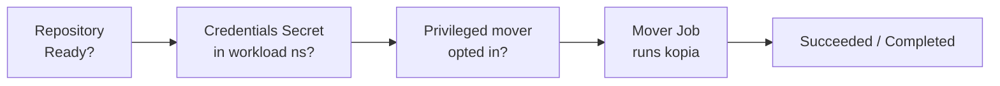

# Troubleshooting

Kopiur is built to **tell you why** something didn't happen rather than fail silently. Almost every problem surfaces in two places you can read without operator logs:

- **Conditions** on the resource — `kubectl describe <kind> <name> -n <ns>` (or `-o yaml`), and
- **Events** — also shown by `describe`, as `Warning`/`Normal` lines.

So the universal first move for any stuck resource is:

```console
$ kubectl describe repository <name> -n <ns>   # or snapshotpolicy / snapshot / restore / maintenance
```

Read the conditions and Events at the bottom. The messages are written to say **what** failed, **why**, and **how to fix it**.

This holds for **every** kopiur kind: any reconcile failure — a missing referenced Repository, an invalid spec, an unparseable cron, a backend rejection — is published as a `Warning` Event on the failing object with a machine-readable reason (`MissingDependency`, `InvalidSpec`, `InvalidSchedule`, or the kopia error class). Repeats of the same failure aggregate into one Event with a climbing count, so `kubectl get events -n <ns>` stays readable.

## A map of the pipeline

Most failures are one link in this chain not being green yet:



Work left to right: a `Snapshot`/`Restore` won't start until the `Repository` is `Ready`, the credential Secret is present, and (if elevated) the namespace has opted in.

## Repository never reaches `Ready`

```console
$ kubectl get repository -n <ns>
NAME      PHASE     BACKEND   AGE
primary   Failed    S3        2m
```

| Phase / symptom                | Likely cause                                                                               | Fix                                                                                                            |
| ------------------------------ | ------------------------------------------------------------------------------------------ | -------------------------------------------------------------------------------------------------------------- |
| `Failed`, connect error        | Wrong endpoint/region/bucket, or the bucket doesn't exist and `create.enabled` is `false`. | Fix the backend identifiers; set `create.enabled: true` for a genuinely new repo.                              |
| `Failed`, auth/"Access Denied" | Backend keys wrong or under the wrong Secret keys.                                         | Check the [credential key names](repositories.md#credential-secret-keys-by-backend) and the access key/secret. |
| `Failed`, decryption error     | `KOPIA_PASSWORD` doesn't match an existing repository.                                     | Use the original password — there is no recovery for a lost one.                                               |
| `Failed`, TLS error            | Self-signed or HTTP-only endpoint.                                                         | Set `backend.s3.tls.disableTls: true` (HTTP) or point `tls.caBundleRef` at the CA.                             |
| Stuck `Pending`                | Operator not running, or not watching this scope.                                          | Check the controller is up; for `ClusterRepository`, confirm `installScope=cluster`.                           |

```console
$ kubectl describe repository primary -n <ns>   # the condition message names the exact cause
```

## Backup (or Restore) stuck in `Pending` with no Job

The mover is blocked on a precondition. The common ones, all surfaced as conditions and `Warning` Events:

### `RepositoryNotReady` — the repository backend is unreachable

A `Snapshot` won't spawn a mover Job while its referenced `Repository`/`ClusterRepository` is not `Ready` (its backend is unreachable — e.g. a NAS that didn't come back after a power loss). Instead of a storm of pods that each only fail on `kopia repository connect`, the backup is held in `Pending` with reason `RepositoryNotReady` and resumes automatically once the repository reconnects.

```console
$ kubectl get snapshots <name> -n <ns> \
    -o jsonpath='{.status.conditions[?(@.type=="Ready")].message}'
# → "waiting for repository `nas` to become `Ready` before launching the backup…"
$ kubectl get repository <repo> -n <ns>   # fix the backend; watch PHASE return to Ready
```

When a backup *does* fail because the backend went away mid-run, the operator nudges the repository to re-probe connectivity immediately (rather than waiting for the next catalog refresh), so the gate engages within ~60s instead of up to an hour.

### `CredentialsAvailable=False` — Secret missing in the workload namespace

The mover loads credentials with `envFrom`, which is **namespace-local**, so the credential Secret must exist in the namespace where the data (and the mover Job) live — not just where the repository is defined.

```console
$ kubectl get snapshots <name> -n <ns> \
    -o jsonpath='{.status.conditions[?(@.type=="CredentialsAvailable")].message}'
```

- For a namespaced `Repository`, the repo and Secret are already together — nothing extra.
- For a `ClusterRepository`, the credential Secret must reach each workload namespace. The easy fix: set [`credentialProjection.enabled: true`](movers.md#let-kopiur-project-the-credentials-secret-recommended-for-shared-repos) on the `SnapshotPolicy`/`Restore`/`Maintenance` that uses it, so Kopiur copies it for you (off by default). Otherwise replicate it yourself. See [Movers → the credentials Secret](movers.md#the-credentials-secret).

### A feature works in the CR but status shows `HTTP 403` (missing RBAC)

Two features need the operator to **write Secrets**, and that RBAC is **off by default**. If you enable the feature in a CR but not the matching Helm flag, the resource's `.status` shows an actionable `403` naming the exact flag — the operator degrades cleanly and heals as soon as you grant it.

| Status message mentions… | Set this Helm flag |
| --- | --- |
| a *projected credentials Secret* (`...-creds-N`) | `features.credentialProjection.enabled: true` |
| a *kopia web-UI Secret* (`...-kopia-ui-auth` / `...-kopia-ui-repo-creds`) | `features.kopiaUi.enabled: true` |

```console
$ kubectl describe snapshotpolicy <name> -n <ns>   # or repository, for the kopia UI
```

Full guide: **[Feature permissions](feature-permissions.md)**.

### `MoverPermitted=False` — privileged mover not opted in

The mover requests an elevated context but the namespace hasn't been granted it. This guards **`SnapshotPolicy`, `Restore`, and `Maintenance` alike** — and the *effective* (resolved) context is what's checked, so it also fires for an elevated context **inherited** from a workload pod. The detector trips on any of: `runAsUser: 0`, `privileged: true`, `allowPrivilegeEscalation: true`, added Linux capabilities, `runAsNonRoot: false`, or `privilegedMode: true` — at **either** the container (`mover.securityContext`) **or** pod (`mover.podSecurityContext`) level.

```console
# see the exact, actionable message (names the object + the annotation):
$ kubectl get restore <name> -n <ns> \
    -o jsonpath='{.status.conditions[?(@.type=="MoverPermitted")].message}'
```

Opt the namespace in (a cluster-admin decision) by applying a `Namespace` carrying the opt-in annotation:

```yaml
--8<-- "deploy/examples/privileged-mover-namespace.yaml"
```

```console
$ kubectl apply -f privileged-mover-namespace.yaml
```

…or imperatively: `kubectl annotate namespace <ns> kopiur.home-operations.com/privileged-movers=true`.

…or drop the elevated `securityContext` / `podSecurityContext` / `privilegedMode` from the `spec.mover`. It clears to `MoverPermitted=True` on the next reconcile (~30s). Full detail in [Movers → Privileged movers](movers.md#privileged-movers).

### `inheritSecurityContextFrom` can't resolve a workload pod

When `mover.inheritSecurityContextFrom` is set, the controller reads the live workload pod's container **and** pod security contexts onto the mover. If it can't, the Backup/Restore is held (a `MissingDependency`-style condition + Event) with a message naming exactly what's wrong:

| Message contains… | Cause | Fix |
| --- | --- | --- |
| `no pod matches` | The `workloadSelector` label selector matches no pod in the namespace (the workload is scaled to zero, or the labels are wrong). | Scale the workload up so its identity can be read, or fix `podSelector.matchLabels`. |
| `no running workload pod mounts the backup source PVC` | `pvcConsumer` is set but no (non-kopiur) pod currently mounts the source PVC, so there's no consumer to derive the identity from. | Scale the workload that mounts the PVC up, or switch to `workloadSelector` / an explicit `mover.securityContext`. |
| `has no container` | `inheritSecurityContextFrom…container` names a container the pod doesn't have. | Fix the `container` name (omit it to take the pod's first container). |
| `sets no securityContext … to inherit` | The matched pod sets **neither** a container nor a pod-level `securityContext`. | Set one on the workload, or use an explicit `mover.securityContext` / `mover.podSecurityContext` instead. |
| `pvcConsumer … is only valid for a backup source` | `pvcConsumer` was set on a `Restore` or `Maintenance` (rejected at admission). | Use `workloadSelector` (Restore) or an explicit `mover.securityContext`. |

`securityContext` (or `podSecurityContext`) and `inheritSecurityContextFrom` **combine** — setting both is fine. The explicit context is the higher merge layer: each field you set overrides the inherited one, fields you omit are inherited, and the whole thing stands in alone when no workload pod can be resolved. (Earlier versions rejected the pair at admission.)

### The backup says `SecurityContextCompatible` but fails with `permission denied`

Symptom: a Snapshot using `inheritSecurityContextFrom` reports `SecurityContextCompatible=True`, yet the mover fails with `permission denied` reading the source.

**This was a bug in Kopiur ≤ 0.7.4** and is fixed: `pvcConsumer` asserted the condition `True` ("matches the workload by construction") from the fact that it had taken the inherit code path, without ever comparing the resolved UIDs. The condition is now derived from the real comparison and can no longer claim a match it hasn't verified.

The underlying misconfiguration it was hiding is almost always this: **inheriting copies pod-spec fields, and your workload pins no `runAsUser`.** Its UID comes from its image's `USER` line, which is invisible in the spec — so there is nothing to inherit and the mover runs as its own image's UID `65532`. Check:

```console
$ kubectl -n app get pod <consumer> \
    -o jsonpath='{.spec.securityContext}{"\n"}{range .spec.containers[*]}{.name}{" "}{.securityContext}{"\n"}{end}'
```

| What you see | Cause | Fix |
| --- | --- | --- |
| No `runAsUser` at either level | Nothing to inherit; mover ran as `65532` | Set `runAsUser` on the workload, or set `mover.securityContext.runAsUser` to the image's UID (it merges with, and overrides, inherit) |
| The first container is a sidecar (e.g. `istio-proxy`) | Inherit took the *first* container's context | Name the right one: `pvcConsumer: { container: app }` |
| A `runAsUser` is pinned and matches the mover | The files are owned by a *third* UID (root-written data, `lost+found`, an old init container) | Use a [root mover](security-context.md#3-go-root-privileged-mover) |
| A `runAsUser` is pinned and matches the mover | The `permission denied` is on the **repository**, not the source (e.g. an NFS filesystem repo owned by another UID) | See [NFS filesystem repositories](security-context.md#nfs-filesystem-repositories) — use `supplementalGroups` |

The first two now report themselves — check the `SecurityContextInherited` condition before digging:

```console
$ kubectl get snapshot <name> -o jsonpath='{.status.conditions[?(@.type=="SecurityContextInherited")]}'
```

| `status` / `reason` | Meaning |
| --- | --- |
| `True` / `InheritApplied` | Inheritance resolved and stuck. The message names the pod and the uid the mover runs as. |
| `False` / `InheritPinnedNoUid` | The resolved workload pins no identity beyond the mover's own defaults — inheriting copied nothing. The message names the uid the mover actually runs as (`65532` unless `moverDefaults` supplied one). |
| `False` / `InheritFallback` | No workload pod resolved; the run proceeded on your explicit `mover.securityContext` instead of being held. |
| `False` / `InheritOverridden` | Inherit resolved a UID but a higher layer overrode it — inherit is a no-op for that field and won't follow the workload. The message names which layer won: the recipe, or the repository's `moverDefaults`. |

### Admission warning: securityContext likely can't read the source

At `kubectl apply` time the webhook may attach a **non-blocking warning** (the apply still succeeds):

```
Warning: securityContext: the mover's UID likely cannot read the source PVC `app-data`
(no shared UID or group with the workload that mounts it) — the backup may fail with
permission denied or silently skip unreadable files.
```

It fires only when the recipe **explicitly pins** a `runAsUser` that shares no UID or group with the workload mounting `source.pvc`. It's **best-effort** — the webhook can't see file modes (the data may be world-readable) or `moverDefaults`, so it stays silent when the UID is image-determined. The authoritative checks come later: the `SecurityContextCompatible` condition at reconcile and kopia's own output at runtime (below). A `Restore` gets the analogous warning about its *target* PVC's future consumer. The fix is always the same — match the mover to the workload via `inheritSecurityContextFrom.pvcConsumer: {}` or a matching `runAsUser`/`fsGroup`.

## `SnapshotPolicy` rejected at admission: identity

| Symptom (at `kubectl apply`) | Cause | Fix |
| --- | --- | --- |
| `… is not a valid kopia identity component … (kopia parses username@hostname:path on the first @ and first :)` | A `spec.identity.username`/`hostname` (or an `identityDefaults` CEL expression's result) is empty or contains `@`, `:`, whitespace, or a control character. | Use a value that round-trips through kopia's `username@hostname:path` form — no `@`/`:`/whitespace. Dots, dashes, slashes, and unicode letters are fine. |
| `… is not a valid kopia source path …` | A `sourcePathOverride` is empty or contains a newline / control character. | Set a non-empty path without control characters (spaces and `:` are allowed). |
| `this edit changes the policy's resolved kopia identity from … to …, but the policy already has snapshot history` | You edited `identity` (or a source's `sourcePathOverride`) on a `SnapshotPolicy` that has already produced snapshots — the change would orphan the old kopia history. | If unintentional, revert the identity. If you really mean to re-identify, set `kopiur.home-operations.com/allow-identity-change` (any non-empty value) on the policy. See [Backups → identity](backups.md#identity--what-kopia-records-usernamehostnamepath). |

## Backup runs but `Failed`

The mover Job ran and exhausted its retries (`failurePolicy.backoffLimit`). The error tail is on the `Snapshot`:

```console
$ kubectl get snapshots <name> -n <ns> -o jsonpath='{.status.logTail}'
# the structured failure block has the kopia error class + a retry hint:
$ kubectl get snapshots <name> -n <ns> -o jsonpath='{.status.failure.kopiaErrorClass}'
# full logs live in the mover Job's pod (the Job name is on the Snapshot):
$ JOB=$(kubectl get snapshot <name> -n <ns> -o jsonpath='{.status.job.name}')
$ kubectl logs -n <ns> --selector=job-name="$JOB"
```

`status.failure.retryRecommended: false` means retrying unchanged won't help —
fix the cause (`kopiaErrorClass` names it: `AuthFailure` = wrong password,
`PermissionDenied` = filesystem/bucket ACLs, …) and re-create the Snapshot. The
same `logTail`/`failure` fields appear on a failed `Restore`.

Common causes: the source PVC's `VolumeSnapshotClass` is wrong/missing (for `copyMethod: Snapshot`), a `beforeSnapshot` hook failed (it aborts the backup unless `continueOnFailure: true`), or the repository became unreachable mid-run.

/// note | The run is one object — the Job
A finished run's mover **Job** (and its pod logs, as above) sticks around until its `ttlSecondsAfterFinished` (default 1h). The instructions the controller handed the mover ride the Job itself — `kubectl get job <name> -o yaml` shows them in the pod env as `KOPIUR_WORK_SPEC`. If you don't see per-run work-spec ConfigMaps anymore: they no longer exist — that's the fix for the leak where one accumulated per run, forever (#224). See [Movers → Run artifacts & cleanup](movers.md#run-artifacts--cleanup).
///

## Backup `Succeeded` but is **incomplete** (`filesFailed > 0`)

By default an unreadable file is **fatal** — the backup fails loudly with `PermissionDenied` (above), so nothing is silent. But if you set an `errorHandling.ignoreFileErrors`/`ignoreDirErrors` policy, kopia **completes** the snapshot while *skipping* the files it couldn't read. Kopiur surfaces that so it isn't silent: the excluded count rides on `status.stats.filesFailed`, and the controller sets `SecurityContextCompatible=False` + a Warning Event.

```console
$ kubectl get snapshot <name> -n <ns> -o jsonpath='{.status.stats.filesFailed}'
42
$ kubectl get snapshot <name> -n <ns> \
    -o jsonpath='{.status.conditions[?(@.type=="SecurityContextCompatible")].message}'
the backup completed but 42 source entries could not be read and were EXCLUDED from the
snapshot — it is INCOMPLETE. This is usually a UID/GID mismatch: match the mover to the
workload via mover.inheritSecurityContextFrom.pvcConsumer or a matching runAsUser…
```

This is the **certain** signal (kopia's own output, not a heuristic). The fix is the same as a permission mismatch — match the mover to the workload (`inheritSecurityContextFrom.pvcConsumer: {}`, or a matching `runAsUser`/`fsGroup`), then re-run. See [Security context → Catching permission mismatches early](security-context.md#catching-permission-mismatches-early).

## Backup (or Restore) `Failed` with `MoverPodWedged` — the pod couldn't start

The mover **Job** was created but its **pod never reached `Running`** — it sat in `CreateContainerConfigError`, `ImagePullBackOff`, or `Unschedulable`. A pod in those states never reaches a terminal phase, so `failurePolicy.backoffLimit` never trips. Kopiur watches for this and, after [`failurePolicy.podStartupDeadlineSeconds`](backups.md#failurepolicy--retry--deadline-for-the-mover-job) (default **5 minutes**), fails the run with reason `MoverPodWedged` and an actionable message, then deletes the wedged Job so it stops retrying:

```console
$ kubectl get snapshot <name> -n <ns> \
    -o jsonpath='{.status.conditions[?(@.type=="Ready")].reason}{"\n"}{.status.conditions[?(@.type=="Ready")].message}'
MoverPodWedged
the backup mover pod has been stuck (CreateContainerConfigError) for over 300s and cannot start: …
```

The message names the underlying reason. The usual causes and fixes:

| Pod reason | Cause | Fix |
| --- | --- | --- |
| `CreateContainerConfigError` (*"container's runAsUser breaks non-root policy"*) | A securityContext that asks for **root** (`runAsUser: 0`) while also `runAsNonRoot: true`. Kopiur normalizes this for *resolved* contexts, so you'll only see it from a hand-written contradiction. | Don't pair `runAsUser: 0` with `runAsNonRoot: true`. For a root mover use `runAsUser: 0` + `runAsNonRoot: false` (and opt the namespace in — below). See [Security context](security-context.md#privileged-and-root-movers). |
| `ImagePullBackOff` / `ErrImagePull` / `InvalidImageName` | The mover image can't be pulled (wrong registry, missing pull secret, air-gapped node). | Fix the image/pull secret; on a slow first pull, raise `podStartupDeadlineSeconds`. |
| `Unschedulable` | No node satisfies the pod — a bad `moverDefaults.nodeSelector`/affinity, or an RWO volume still attached elsewhere (see the [Multi-Attach](#mover-pod-stuck-with-multi-attach-error-rwo-pvc) section below). | Fix the placement constraint; if a contended RWO volume just needs time to detach, raise `podStartupDeadlineSeconds`. |

/// tip | Backing up root-owned data is the common trigger
Apps like Synapse, MSSQL, or anything writing files as **root** need a **root mover** to read them. That's an *elevated* context, so two things must both be true: the namespace is opted into privileged movers (`kubectl annotate namespace <ns> kopiur.home-operations.com/privileged-movers=true`), **and** the mover resolves to root — either set `runAsUser: 0` + `runAsNonRoot: false` explicitly, or use [`inheritSecurityContextFrom`](security-context.md#2-inherit-it-from-the-workload) pointed at the root workload (Kopiur then produces a valid root context for you — you do **not** also set `runAsNonRoot`). Without the opt-in you get `MoverPermitted=False` (above), not a wedge.
///

If a mover legitimately needs **longer than 5 minutes just to start** (huge image pull, slow RWO detach), raise the window rather than letting it fail:

```yaml
spec:
  failurePolicy:
    podStartupDeadlineSeconds: 900 # tolerate up to 15m to start
```

## Mover pod stuck with `Multi-Attach error` (RWO PVC)

The mover **Job** exists but its **pod** never starts; `kubectl describe pod` shows:

```
Warning  FailedAttachVolume  ...  Multi-Attach error for volume "pvc-..."
                                   Volume is already exclusively attached to one node
```

A `ReadWriteOnce` (RWO) PVC can only be attached to one node at a time. The app pod holding it is on node A; the mover got scheduled to node B.

Kopiur avoids this **by default**: it pins an RWO source/destination mover to the node its PVC is attached to (`moverDefaults.sourceColocation.mode: Auto`). If you still hit this:

| Symptom | Likely cause | Fix |
| --- | --- | --- |
| Multi-Attach despite default `Auto` | `sourceColocation.mode: Disabled` is set, or co-location couldn't find the node (no running consumer pod; trimmed RBAC missing `persistentvolumes`/`volumeattachments` read). | Leave/restore `mode: Auto`; ensure the workload pod is running; grant the RBAC (see [Repositories → `sourceColocation`](repositories.md#sourcecolocation-avoid-the-rwo-multi-attach-error)). |
| Backup `Failed`: *"is ReadWriteOncePod and is currently held by a running pod"* | A `ReadWriteOncePod` volume can't be co-mounted by a second pod **at all** — even on the same node. | Use `copyMethod: Snapshot` (no downtime), scale the workload down for the backup window, or set `mode: Disabled` and manage placement yourself. See [PVC access modes & RWOP](access-modes.md). |
| Backup `Failed` (mode `Required`): *"could not determine which node it is attached to"* | `mode: Required` refuses to guess when no consumer pod / PV `nodeAffinity` / `VolumeAttachment` reveals the node. | Start the workload that uses the PVC, switch to `ReadWriteMany`, or relax to `mode: Auto`/`Disabled`. |

See [Repositories → `sourceColocation`](repositories.md#sourcecolocation-avoid-the-rwo-multi-attach-error) for the full behavior.

## Backup `Failed`: source staging (`copyMethod: Snapshot`/`Clone`)

`copyMethod: Snapshot` (the default) and `Clone` (opt-in) capture a CSI snapshot/clone of the source PVC before backing it up. When that capture can't happen, the `Snapshot` is `Failed` with a `SourceStaged=False` condition naming exactly why — Kopiur never silently falls back to reading the live volume. If you never set `copyMethod` and have no CSI snapshot stack, this is the failure you'll hit — set `copyMethod: Direct` on the `SnapshotPolicy` to opt out of CSI staging.

```console
$ kubectl get snapshot <name> -n <ns> -o jsonpath='{.status.conditions[?(@.type=="SourceStaged")]}'
```

| Reason | Cause | Fix |
| --- | --- | --- |
| `SnapshotStackMissing` | The cluster has no `VolumeSnapshotClass` API — the external-snapshotter (snapshot-controller + CRDs) isn't installed. | Install the CSI snapshot stack + a `VolumeSnapshotClass` ([Copy methods → What it requires](copy-methods.md#what-it-requires) has the `snapshot-controller` chart command), or set `copyMethod: Direct`. |
| `NoVolumeSnapshotClass` | No `VolumeSnapshotClass` matches the source PVC's driver, several match with no single default, or an explicit `volumeSnapshotClassName` doesn't exist. | Create/annotate a class for the driver, set `volumeSnapshotClassName` explicitly, or use `Direct`. |
| `VolumeSnapshotFailed` | The VolumeSnapshot was still reporting an error when the staging deadline passed (`spec.staging.timeout`, default `10m`); transient snapshot-controller errors (e.g. a benign 409 conflict) during the wait are retried, never fatal on their own. | Fix the class/driver issue named in the message, or raise `spec.staging.timeout` if the backend is just slow. The next scheduled run (or a new `Snapshot`) retries. |
| `StagingTimedOut` | The VolumeSnapshot never became `readyToUse` within the staging deadline and reported no error — the driver/snapshot-controller is stuck or very slow. | Check the CSI driver and snapshot-controller; raise `spec.staging.timeout` (`"0"` waits indefinitely) for slow backends. |
| `SourceNotCSIProvisioned` | The source PVC has no `StorageClass` (static/hostPath) — nothing to snapshot. | Use a CSI-provisioned PVC, or `copyMethod: Direct`. |

A staged backup that stays `Pending` with a `Pending` staged PVC (`<name>-src`) is usually a `WaitForFirstConsumer` class (normal — it binds when the mover starts) or, for `Clone`, a driver that can't clone the volume (`kubectl describe pvc <name>-src` shows the driver event). Staged objects are auto-cleaned when the backup finishes. Full guide: **[Copy methods](copy-methods.md)**.

## `Snapshot` stuck `Terminating` on the cleanup finalizer

The CR won't go away and `metadata.finalizers` still lists `kopiur.home-operations.com/snapshot-cleanup`:

```console
$ kubectl get snapshot <name> -n <ns> -o jsonpath='{.metadata.finalizers}{"\n"}'
$ kubectl describe snapshot <name> -n <ns> | tail -20
```

This is `deletionPolicy: Delete` doing its job: it holds the CR until the kopia snapshot is really deleted, rather than dropping the finalizer and leaving an orphan behind. So it is **blocked on something it needs**, and the reconcile error says which. It retries every 30s, so it recovers on its own the moment you fix the cause.

| Symptom                                                                          | Cause                                                                                                                          | Fix                                                                                                                                                                                                                                                                          |
| -------------------------------------------------------------------------------- | ------------------------------------------------------------------------------------------------------------------------------ | ---------------------------------------------------------------------------------------------------------------------------------------------------------------------------------------------------------------------------------------------------------------------------- |
| `missing dependency: credentials Secret … does not exist in namespace …`, and the repository is a `ClusterRepository` whose Secret lives elsewhere | Projection is not permitted for this deletion. Either the repo owner set `credentialProjection.allowed: false` (or removed it), or the run itself never used projection and you have since removed the Secret you were managing yourself. | Restore whichever one applies: set `credentialProjection.allowed: true` on the `ClusterRepository`, or re-create the Secret in the workload namespace. On ≤ 0.7.5 this also happened when the `SnapshotPolicy` was deleted **before** the `Snapshot` — fixed; the opt-in is now pinned into `status.resolved.credentialProjection` at run time. |
| `has no pinned identity … and its SnapshotPolicy is gone`                        | The `Snapshot` never completed a run (so nothing was pinned) **and** its recipe is gone, so the delete Job can't be built.      | Re-create the `SnapshotPolicy`, or use the escape hatch below — there is likely no kopia snapshot to delete anyway.                                                                                                                                                          |
| The `ClusterRepository`/`Repository` itself was deleted                          | The deletion path resolves the repository live — it needs the backend config to connect at all, and that is not pinned.        | Re-create the repository CR (pointing at the same backend), or use the escape hatch.                                                                                                                                                                                          |
| The bucket/NAS is genuinely gone, or you're tearing everything down              | Nothing to delete, and nothing to delete it with.                                                                              | Escape hatch.                                                                                                                                                                                                                                                                |
| A `<snapshot>-delete` Job exists and is failing                                  | The delete Job itself is erroring — read its logs, not the CR.                                                                 | `kubectl logs job/<snapshot>-delete -n <ns>`. Treat as a normal mover failure ([above](#backup-runs-but-failed)).                                                                                                                                                            |

/// tip | The escape hatch: release the CR, keep the snapshot

```console
$ kubectl annotate snapshot <name> -n <ns> kopiur.home-operations.com/skip-snapshot-cleanup=true
```

The finalizer drops immediately without contacting the repository. The kopia snapshot **survives** and the catalog can rediscover it later. Presence-only — the value is ignored. See [Backups → what `Delete` needs to succeed](backups.md#what-delete-needs-to-succeed).

///

/// warning | A whole terminating namespace behaves differently

If the namespace itself is being deleted, the repository's `onNamespaceDelete` policy decides — and it **defaults to `Orphan`**, so a `kubectl delete ns` keeps your backup history rather than cascading into the repository. That is deliberate. See [Repositories → onNamespaceDelete](repositories.md#onnamespacedelete--what-kubectl-delete-ns-does-to-snapshots).

///

## Restore won't complete

```console
$ kubectl describe restore <name> -n <ns>
```

| Symptom                                 | Cause                                                         | Fix                                                                                                                                                             |
| --------------------------------------- | ------------------------------------------------------------- | --------------------------------------------------------------------------------------------------------------------------------------------------------------- |
| `Failed`, "no matching snapshot"        | The source resolved to nothing and `onMissingSnapshot: Fail`. | Verify the `snapshotRef`/identity; for deploy-or-restore use `fromPolicy` (which defaults to `Continue`).                                                         |
| Stuck `Resolving`                       | Waiting for the source snapshot to appear (`waitTimeout`).    | Confirm the snapshot exists; raise `policy.waitTimeout` if a schedule is about to produce it.                                                                   |
| PVC stuck `Pending` (populator)         | Volume-populator handshake not completing.                    | Need Kubernetes ≥ 1.24; install `volume-data-source-validator` to see the real event. See [Restores → deploy-or-restore](restores.md#deploy-or-restore-gitops). |
| `prime-*` PVCs piling up, `Bound`, mounted by nothing | ≤ 0.7.x: a populator `Restore` re-created over an **already-bound** claim restored into a prime PVC that could never be adopted, and leaked it — one full copy of the data per re-created `Restore`. | Upgrade: Kopiur now completes that case as a no-op (`Ready=True reason=TargetAlreadyBound`) and reaps the orphans (`OrphanedPrimePvcReaped` event). List them with `kubectl get pvc -A -l kopiur.home-operations.com/op=restore-populate`; any whose claiming PVC is gone are collected with their `Restore`. |
| Populator `Restore` says `TargetAlreadyBound` and restores nothing | Working as intended: its claiming PVC is already **Bound**, and a volume populator can only fill an **unbound** claim. | To really restore into it, delete the **PVC** (keep its `dataSourceRef`) and let it be re-created. Deleting the `Restore` just re-triggers the no-op. |
| `identity` source rejected at admission | `source.identity` requires an explicit `spec.repository`.     | Add `spec.repository`.                                                                                                                                          |
| Stuck `Pending`, `MoverPermitted=False` | The restore mover requests an elevated context (root / `privilegedMode`, container- or pod-level, possibly inherited). | Annotate the namespace (above), or drop the elevation from `spec.mover`. |
| Restored files **owned by `65532`** / unreadable by the app | The mover wrote them as its own UID (no `mover.securityContext`). | Set `Restore.spec.mover.securityContext.runAsUser/Group` to the app's UID (or `inheritSecurityContextFrom`). |
| Mover pod `Pending`: **can't write the target volume** | A non-root mover can't write a freshly-provisioned PVC whose mount point is root-owned `0755`. | Add `Restore.spec.mover.podSecurityContext.fsGroup` (the app's GID) so the volume is group-writable; see [Restores → mover](restores.md#mover-cache--failure-policy). |
| Mover pod `Pending`: cache PVC **unbound** | `mover.cache.mode: Persistent` (or a sized `Ephemeral` cache) requested a `storageClassName` the cluster can't provision (or `ReadWriteOnce` contention with an overlapping run). | Use a valid `cache.storageClassName`, or drop `mover.cache` to fall back to an `emptyDir`. Persistent cache assumes non-overlapping runs per owner. |
| Mover `Failed`: `mkdir /var/cache/kopia/logs: permission denied` (any op, incl. maintenance) | The PVC-backed cache is owned `root:root` and the mover's default `fsGroup: 65532` couldn't chown it — almost always an **NFS** cache StorageClass with **root-squash** (e.g. TrueNAS / democratic-csi), where the kubelet's `fsGroup` chown is denied. | Don't put a kopia cache on NFS: drop `moverDefaults.cache` for a node-local `emptyDir` (always writable), or set `cache.storageClass` to a block class (e.g. Ceph RBD) that honors `fsGroup`. See [Security context → default](security-context.md#the-default-hardened-context). |

## Schedule isn't firing

```console
$ kubectl get snapshotschedule <name> -n <ns> \
    -o jsonpath='{.spec.schedule.suspend}{"  next="}{.status.nextSchedule.at}{"\n"}'
```

- `suspend: true` pauses all future firings.
- `runOnCreate: false` (the default) means applying the schedule does **not** fire immediately — wait for `status.nextSchedule.at`, or set `runOnCreate: true`.
- If the operator was down across a slot and `startingDeadlineSeconds` elapsed, that slot is skipped on purpose (no late stampede).
- Repeated failures show up as `status.consecutiveFailures`; the failing `Snapshot` CRs (bounded by `failedJobsHistoryLimit`) carry the reason.

## My old snapshots were pruned after I recreated a policy

You deleted a `SnapshotPolicy` (or it was deleted-and-recreated by GitOps), and
some of the backup history you expected to keep is now gone.

**What happened**: this is [automatic adoption](repositories.md#catalogadoption--automatically-re-attaching-discovered-snapshots) plus GFS retention working exactly as designed, not a bug. With `onPolicyDelete: Retain` (the default), deleting the policy kept every kopia snapshot in the repository — nothing was lost at that point. Re-applying the policy triggered a catalog scan, which rediscovered them, which triggered adoption, which re-attached them as `origin: adopted` `Snapshot` CRs governed by the SAME `spec.retention` window as any produced backup. If that window is narrower than the effective age of the history you just got back (or narrower than the window the OLD policy used), some of the newly-adopted rows are outside it on the very first reconcile — and GFS prunes them immediately, same as it would any other out-of-window snapshot. (This whole path only applies when the policy's effective `defaultDeletionPolicy` is `Delete`, the default. Under `Retain`/`Orphan` the out-of-window history is never adopted in the first place — it stays `discovered`, counted in `status.adoption.skippedByRetention` — because prune-then-rediscover would otherwise loop forever.)

**The paper trail**: a `SnapshotsAdopted` Normal Event on the `SnapshotPolicy` names exactly how many rows were adopted and under which identity, right before retention's own prune events show what went out the other side:

```console
$ kubectl describe snapshotpolicy <name> -n <ns> | grep -A3 SnapshotsAdopted
```

**Fix**: widen `spec.retention` on the recreated policy to cover the history you want kept — retention decisions are made fresh on every reconcile, so a wider window applied even after the fact stops future prunes from taking the remaining rows (it does not undo already-deleted CRs; if `Delete` already ran, the kopia snapshot is really gone). If you don't want a recreated policy to inherit history at all, opt out (see below) **before** re-applying it.

**Both opt-outs**, if this isn't the behavior you want going forward:

- `SnapshotPolicy.spec.adoption: Ignore` — this recipe never adopts, regardless of the repository's setting.
- `Repository`/`ClusterRepository` `spec.catalog.adoption: Ignore` — no policy against this repository adopts.

## Adoption didn't happen

You expected a recreated (or brand-new) `SnapshotPolicy` to pick up matching
`origin: discovered` snapshots, and it didn't.

| Check                                                                                                    | How                                                                                                                                                                                                                                     |
| --------------------------------------------------------------------------------------------------------- | ----------------------------------------------------------------------------------------------------------------------------------------------------------------------------------------------------------------------------------- |
| **Adoption is actually on.** The effective mode is `SnapshotPolicy.spec.adoption` if set, else the repository's `spec.catalog.adoption`, else `Adopt`. | `kubectl get snapshotpolicy <name> -n <ns> -o jsonpath='{.spec.adoption}'` and the same on the `Repository`/`ClusterRepository` — either explicitly `Ignore` is a full stop.                                                            |
| **The identity really matches — exactly.** Adoption never partial-matches: `username` AND `hostname` AND `sourcePath` on the discovered row must ALL equal the policy's resolved identity. | Compare `status.resolved.identity` on the `SnapshotPolicy` against `status.snapshot.identity` on the `Snapshot` you expected adopted. Any one field differing (a typo'd `identity.hostname`, a different `sourcePathOverride`) is a silent non-match — no error, it's simply not a candidate. |
| **It isn't a foreign-cluster row.** On a repository with [`identityDefaults.cluster`](repositories.md#identitydefaultscluster--sharing-one-repository-across-clusters) set, a discovered row whose hostname classifies as another cluster's is refused even on an otherwise-exact identity match — by design. | Check the repository's `identityDefaults.cluster` and whether the discovered row's hostname belongs to a different cluster. |
| **The scan request isn't stuck pending against an unreachable repo.** A brand-new/recreated policy with nothing to adopt yet stamps `kopiur.home-operations.com/catalog-scan-requested-at` on the repository and waits for it to be honored. | `kubectl get repository <name> -n <ns> -o jsonpath='{.metadata.annotations.kopiur\.home-operations\.com/catalog-scan-requested-at}{"  honored="}{.status.catalog.scanRequestHonored}{"\n"}'` — if the annotation value and `scanRequestHonored` **differ**, the scan hasn't completed yet (repository not `Ready`, or a launch backoff against a flaky backend — see [Repository never reaches Ready](#repository-never-reaches-ready)). If they're **equal**, the scan already ran; the discovered row genuinely wasn't there or didn't match. |
| **Enough time has passed for the next reconcile.** Adoption runs on the `SnapshotPolicy`'s own reconcile loop, which fires again once the scan is honored — it isn't instantaneous with the scan completing. | Give it the same ~30s window a normal reconcile takes, then re-check for a `SnapshotsAdopted` Event. |
| **Retention isn't deliberately withholding it.** With an effective `defaultDeletionPolicy` of `Retain`/`Orphan`, a matching snapshot that `spec.retention` would immediately prune is **left discovered on purpose** (adopting it would be an endless CR create/delete loop that never touches kopia). | `kubectl get snapshotpolicy <name> -n <ns> -o jsonpath='{.status.adoption.skippedByRetention}'` — non-zero means the gate withheld that many matches; the `AdoptionSkippedByRetention` Event on the policy names the levers (widen `spec.retention`, `defaultDeletionPolicy: Delete`, `pin`, or `adoption: Ignore`). |

If every row above checks out and adoption still didn't fire, the discovered
`Snapshot` may simply not exist yet — confirm it with
`kubectl get snapshots -n <ns> -l kopiur.home-operations.com/origin=discovered`
before assuming adoption is broken.

## CRDs or CRs disappeared after upgrading to 0.6.0

Upgrading **from 0.5.x to 0.6.0** moves the CRDs into Helm's `crds/` directory. On
that one crossing Helm prunes the old release-owned CRDs and cascade-deletes every
`kopiur.home-operations.com` object — this is expected, not a bug in the operator.

```console
$ kubectl get crd | grep kopiur.home-operations.com   # gone or fewer than 8?
```

Pin the CRDs **before** upgrading to avoid it, or recover from Git afterwards — both
are in [Upgrading → 0.5.x → 0.6.0](upgrade.md#upgrading-05x--060-one-time-crd-migration).
Your kopia snapshots are untouched; only the Kubernetes CR objects are affected.

## Maintenance isn't running

Maintenance waits for the repository and coordinates a single owner. Check the `Maintenance` resource:

```console
$ kubectl get maintenance -A
$ kubectl describe maintenance <name> -n <ns>
```

| `LeaseOwned=False` reason | Meaning                                                                                                                        |
| ------------------------- | ------------------------------------------------------------------------------------------------------------------------------ |
| `WaitingForRepository`    | The repository isn't `Ready` yet — fix that first.                                                                             |
| lease held elsewhere      | Another owner holds the maintenance lease (shared repo). Adjust `takeoverPolicy` only if you're sure no one else maintains it. |

The repository's own `MaintenanceConfigured` condition says whether anything is maintaining it at all:

| `MaintenanceConfigured` reason | Meaning                                                                                                                                                  |
| ------------------------------ | ---------------------------------------------------------------------------------------------------------------------------------------------------------- |
| `MaintenanceConfigured` (True) | A `Maintenance` covers the repo — either the operator-managed one, or one you authored yourself.                                                             |
| `MaintenanceDisabled`          | You set `spec.maintenance.enabled: false` and nothing else references the repo. **Storage is never reclaimed.** A deliberate opt-out, so no warning is raised. |
| `MaintenanceApplyFailed`       | Maintenance is **enabled**, but the operator could not apply its managed `Maintenance`. The message names the namespace and the error — usually missing RBAC, or a namespace that doesn't exist. It retries every reconcile. |
| `MaintenanceNamespaceUnresolved` | A `ClusterRepository`'s managed `Maintenance` has nowhere to live: set `spec.maintenance.namespace`, or the operator's `KOPIUR_NAMESPACE`.                  |

/// note | Upgrading from ≤ 0.7.x

On object-store repositories this condition could get **stuck** at `MaintenanceDisabled` — even with maintenance enabled and the managed `Maintenance` present, owned, and running on schedule — because it was only ever evaluated at the tail of a bootstrap. It is now re-checked on every reconcile, so a stale value corrects itself shortly after upgrade, and a failed apply no longer masquerades as "you disabled maintenance".

///

If **every** run yields (`Ready=False`, reason `MaintenanceYielding`), kopia
GC/compaction is not running at all — typically a repository whose kopia-side
maintenance owner is a stale/foreign identity (e.g. created by an old kopiur
bootstrap or a workstation). Set `spec.ownership.takeoverPolicy: Force` once so
the operator claims the lease, then revert to `Never`.

`status.full.lastRunAt` shows the last full pass (`status.<mode>.lastHandledAt`
additionally records slots that were handled by *yielding*). See the
[Maintenance guide](maintenance.md) for ownership and the schedule model.

### `LeaseHeldByOther` on a repository shared across clusters — expected, or stale?

On a repository with [`identityDefaults.cluster`](repositories.md#identitydefaultscluster--sharing-one-repository-across-clusters)
set, `LeaseOwned=False, reason=LeaseHeldByOther` on every cluster **except one**
is the expected steady state, not a symptom — see
[Maintenance → pick ONE owner](maintenance.md#sharing-one-repositorys-maintenance-across-clusters-pick-one-owner).
Tell expected apart from genuinely stale by reading `status.ownership.owner` —
the holder this run yielded to:

| `status.ownership.owner` names… | Meaning | Fix |
| --- | --- | --- |
| Another cluster's lease-derived owner (`kopiur@kopiur.<cluster>.<namespace-or-clusterrepository>.<name>`) | Expected — that cluster owns maintenance for this repository and this one is correctly yielding. | Nothing broken. Prefer `spec.maintenance.enabled: false` on this (non-owner) cluster's repository to silence the recurring yield instead of leaving it noisy every cron slot. |
| An owner that matches no cluster's current lease format (an ephemeral bootstrap identity, a workstation `kopia` CLI, or a pre-multi-cluster stamp the [self-heal](maintenance.md#self-healing-a-stale-owner) doesn't recognize) | Genuinely stale. | Set `spec.ownership.takeoverPolicy: Force` **once**, on the ONE cluster meant to own it, then revert to `Never`. Never leave `Force` set on more than one cluster sharing the repository — they'll fight over the lease every reconcile. |

## kopia web UI ([`spec.server`](server.md)) won't come up or can't be reached

The server is a `Deployment` + `Service` named `<repo>-kopia-ui`, created once the
repository is `Ready`. Start at the Deployment and the repository's
`status.server`:

```console
$ kubectl get deploy,svc,pods -n <ns> \
    -l app.kubernetes.io/name=kopiur-server,app.kubernetes.io/instance=<repo>
$ kubectl get repository <repo> -n <ns> -o jsonpath='{.status.server}'   # endpoint/authMode/...
```

| Symptom | Cause | Fix |
| --- | --- | --- |
| No Deployment/Service ever appears | The repository isn't `Ready` (the server waits for it), or `spec.server` isn't actually set. | `kubectl describe repository <repo>` and fix the repository first; confirm the `spec.server` block is present. |
| Repository `Failed`: *"requires PVC … to be ReadWriteMany"* | A **filesystem** backend can't run a long-lived server on a `ReadWriteOnce` repo PVC (it would block movers). | Use an RWX StorageClass (or inline NFS) for the repo volume, or run the UI on an object-store repository. |
| Server pod `CrashLoopBackOff` / not Ready | Repository credentials wrong, or the repo became unreachable. | Check the pod logs (`kubectl logs deploy/<repo>-kopia-ui -n <ns>`); the kopia connect error is actionable. |
| Can't log in | Wrong credentials, or the wrong auth mode. | For `generate`, read the minted password: `kubectl get secret <repo>-kopia-ui-auth -n <ns> -o jsonpath='{.data.password}' \| base64 -d`. For `secretRef`, verify the keys exist. |
| Creating the Repository fails at admission: *"acknowledgeInsecure"* | `auth.insecure` was chosen without `acknowledgeInsecure: true`. | Set `insecure: { acknowledgeInsecure: true }`, or use `generate`/`secretRef` instead. |
| UI unreachable from outside the cluster | `service.type: ClusterIP` (the default) is in-cluster only, and Kopiur never creates an Ingress/HTTPRoute; or a `NetworkPolicy` blocks it. | `kubectl port-forward svc/<repo>-kopia-ui` for a quick look; for ongoing access wire your own Ingress/HTTPRoute at the Service (see [Web UI → Exposing the Service](server.md#exposing-the-service)). |

Full feature guide, including the security model: **[Web UI (kopia server)](server.md)**.

## Webhook admission fails or the webhook won't start

The admission webhook validates `kopiur.home-operations.com` objects and serves
TLS. With the default `webhook.tls.mode: self`, the **controller** mints the
serving certificate into the `webhook.tls.secretName` Secret and injects the CA
into the two webhook configurations' `caBundle`. The most common symptoms:

| Symptom | Cause | Fix |
| ------- | ----- | --- |
| `kopiur-webhook` pod stuck `ContainerCreating` | The serving Secret doesn't exist yet — the controller mints it shortly after it becomes ready. | Wait a few seconds. If it persists, check the controller is `Ready` and its logs for `webhook TLS`; confirm `KOPIUR_NAMESPACE` is set (the chart sets it). |
| Creating any kopiur CR fails: `failed calling webhook ... no endpoints available` / `connection refused` | The webhook pod isn't `Ready` (e.g. still waiting on the Secret), and `failurePolicy: Fail`. | Wait for the webhook rollout; `kubectl -n kopiur-system rollout status deploy/<release>-webhook`. |
| Creating a CR fails: `x509: certificate signed by unknown authority` | The `caBundle` on the webhook config doesn't match the served cert. | In `self` mode the controller self-heals this within ~30s; check the controller logs for `webhook TLS reconcile failed`. Verify the operator has the `admissionregistration … patch` RBAC (`tls.mode: self` grants it). |
| `caBundle` empty on the webhook config | The controller couldn't patch it (RBAC, or the config didn't exist at boot). | Confirm `tls.mode: self` (so the chart grants the RBAC and sets the controller env); the controller retries injection every ~30s until it succeeds. |

Inspect the moving parts:

```console
# the serving Secret the controller mints (self mode):
$ kubectl -n kopiur-system get secret <webhook.tls.secretName> -o jsonpath='{.data.tls\.crt}' | head -c 20

# the caBundle the controller injected (should be non-empty in self mode):
$ kubectl get validatingwebhookconfiguration <release>-validating \
    -o jsonpath='{.webhooks[0].clientConfig.caBundle}' | head -c 20
```

Using cert-manager instead (`tls.mode: cert-manager`)? Then cert-manager issues
the cert and its ca-injector populates `caBundle` — check the `Certificate`
resource and the cert-manager logs, not the controller. See
[Installation → Webhook TLS](install.md#webhook-tls).

## Where to look — quick reference

```console
# conditions + events in one place (start here for anything):
$ kubectl describe <kind> <name> -n <ns>

# a Snapshot names its mover Job in status; a Restore's mover Job is named after the Restore.
$ kubectl get snapshot <name> -n <ns> -o jsonpath='{.status.job.name}'   # Snapshot only
$ kubectl get pods -n <ns> --selector=job-name=<job-name>                # job-name = above, or the Restore name
# or list every mover Job/pod for a policy at once:
$ kubectl get jobs,pods -n <ns> -l kopiur.home-operations.com/config=<policy-name>

# confirm the mover RBAC was minted in the workload namespace:
$ kubectl get serviceaccount,rolebinding -n <ns> -l app.kubernetes.io/component=mover

# operator logs (last resort) and health:
$ kubectl logs -n kopiur-system deploy/kopiur-controller
$ kubectl -n kopiur-system get deploy kopiur-controller kopiur-webhook
```

The controller and webhook also expose `kopiur_*` metrics on `/metrics` (and `/healthz`, `/readyz`). If you've enabled the chart's `ServiceMonitor`/`PrometheusRule`, the kopiur alerts fire on stuck phases, consecutive failures, and failed backups. The backup-failure alerts are recovery-aware: `KopiurLastBackupFailed` (a `SnapshotPolicy`'s most recent completed backup failed) and the per-`Snapshot` `KopiurSnapshotFailed` both clear once the policy completes a newer successful backup, so a retained Failed `Snapshot` won't page indefinitely. See [Installation → Observability](install.md#observability) and [Observability](dev/observability.md).

## See also

- [Movers, RBAC & credentials](movers.md) — the credential + privilege preconditions in depth (with its own troubleshooting table).
- [Maintenance](maintenance.md) — maintenance ownership and scheduling.
- [Getting started](getting-started.md) — the happy-path walkthrough each step here mirrors.
