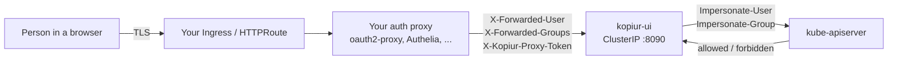

# Web console (kopiur-ui)

`kopiur-ui` is an optional in-cluster web console for Kopiur: a fleet view of
your repositories, policies, schedules, snapshots, restores, maintenance and
replication, plus the actions you would otherwise run with `kubectl kopiur` —
take a snapshot now, start a restore, suspend a schedule, request maintenance,
browse the files inside a snapshot.

It is **off by default**. Turn it on with `ui.enabled: true`.

/// info | Not the same thing as `spec.server`

This page is about **Kopiur's own console**, which reads and writes Kopiur's
CRDs. It is not kopia's built-in web UI, which a `Repository` can run through
[`spec.server`](server.md) to serve a repository to kopia clients. The two solve
different problems and can coexist.

///

## What it is, and what it is not

**It is** a view onto Kopiur's Kubernetes objects, rendered for people who would
rather not read YAML, and a small set of actions that create or patch those same
objects.

**It is not** an authentication system. It has no login page, no user database,
no password, no session cookie of its own. It learns who you are from a header
that **your** authenticating proxy sets, and then it asks Kubernetes what you are
allowed to do. Everything it shows you and everything it does on your behalf is a
request the apiserver authorized *as you*.

**It is not** a second permission model, either. There is no admin flag, no
role dropdown, no per-user config inside the console. Access is Kubernetes RBAC
and nothing else, so the same bindings that govern `kubectl` govern the console.

## The trust model, in plain words

Three sentences, and every other rule on this page follows from them.

1. **Your proxy is the trust boundary.** It authenticates the person and tells
   the console who they are, in a header.
2. **The console impersonates that person.** Every apiserver call it makes on
   your behalf carries `Impersonate-User` and `Impersonate-Group` for you — it
   never reads the cluster "as itself" on your behalf.
3. **Kubernetes decides.** The apiserver authorizes the impersonated request. If
   you are not bound to a role, you get a refusal; the console cannot overrule it
   and does not try.

The consequence is worth stating on its own, because it is the thing people get
wrong: **anything that can reach the console's port and set the identity header
is whoever that header says.** That is why the console requires a shared secret
from the proxy, why the chart renders no Ingress, and why the Service is
`ClusterIP`.



## Enabling it grants nobody anything

This is the first surprise, and it is deliberate.

Installing the console creates the roles; it creates **no bindings**. Who may
operate your backups is not a chart decision. So the first person to sign in
sees a console that loads and then reports **Forbidden on every screen**.

That is the correct first experience, not a broken install. Fix it by binding a
role — see below. A console that worked for the first person through the door
would be a console that worked for everyone who could reach the proxy.

## The four roles

The chart renders four roles while `ui.enabled` and `ui.rbac.userRoles` are both
true. Bind them yourself.

| Role | What it grants | Bind it |
|---|---|---|
| `kopiur-ui-viewer` | `get`/`list`/`watch` on the nine Kopiur CRDs, `get`/`list` on CRDs, `list` on events. Read-only. | ClusterRoleBinding |
| `kopiur-ui-editor` | The action buttons: create/delete `Snapshot`, create `Restore`, `patch` on the seven patched kinds, `list` PVCs. | ClusterRoleBinding |
| `kopiur-ui-user` | **Both of the above**, by aggregation. This is the one to bind for an operator. | ClusterRoleBinding |
| `kopiur-ui-browse` | The in-snapshot file browser. **Not** aggregated into `kopiur-ui-user` — see the warning below. | **RoleBinding, per namespace** |

There is also a small namespaced `kopiur-ui-doctor` Role in the operator's own
namespace, which lets doctor's "controller running" check list the operator
Deployment. Without it that one check degrades to a warning; nothing else
changes.

Bind `kopiur-ui-user` cluster-wide, not per namespace: the console is a fleet
view, and a viewer scoped to one namespace would report a healthy cluster while
another namespace burned.

```yaml
--8<-- "deploy/examples/45-web-ui.yaml:bindings"
```

### Granting browse grants that namespace's repository credentials

/// danger | Read this before setting `ui.rbac.browseRole: true`

Browsing the files inside a snapshot runs a **session pod** — a mover Job — and
`pods/exec`s kopia into it. That pod loads the repository's credentials from its
own environment, and Kubernetes RBAC **cannot narrow `pods/exec create` to one
pod**.

So anyone you bind `kopiur-ui-browse` to in a namespace can exec into that
session pod and run `env` to print the repository password and backend keys.
**Granting browse in a namespace grants that namespace's repository
credentials.**

(The role grants **both** `create` and `get` on `pods/exec`, because Kubernetes
authorizes a subresource by HTTP method and an exec over WebSocket is a `GET`
upgrade. Neither verb narrows the grant — both are the same power.)

Bind it per namespace, with a `RoleBinding`, to people you would hand those
credentials to anyway. Never with a `ClusterRoleBinding` — that is every
namespace's credentials at once.

///

This is why the role is shipped separately instead of being folded into
`kopiur-ui-user`: a grant with that consequence has to be a deliberate act, not
something that arrives with the read-only role.

The same is true of `kubectl kopiur ls`/`cat`/`download` — see
[Inspecting & browsing snapshots](cli/browse.md#the-security-model). It is the
same session-pod mechanism and the same blast radius.

#### The one mitigation RBAC cannot express

`ui.rbac.execPolicy.enabled: true` renders a `ValidatingAdmissionPolicy` that
narrows `pods/exec` CONNECT, for the subjects you list, to pods named
`kopiur-browse-*` running `/usr/local/bin/kopia`. That turns the console's closed
command set into one the **apiserver** enforces.

It stops `env` and a shell. It does not stop someone from running kopia commands
against that repository, and it does not un-grant anything above. Treat it as a
useful narrowing, not as permission to bind browse more widely.

/// warning | Not yet exercised against a live apiserver

The policy is off by default and its CEL expression has never been evaluated by a
real apiserver in our test suite. It **fails closed** — a wrong expression breaks
browsing rather than exposing anything — but that is the only reassurance we can
give it today. Enable it in a non-production cluster first and confirm browsing
still works.

///

## The proxy shared secret

In header mode the console additionally requires a shared token, sent by the
proxy as `X-Kopiur-Proxy-Token` and compared in constant time against
`ui.auth.proxySecret`.

The reason is the trust model's consequence again. Identity headers are only
trustworthy if nothing *else* can set them, and in a cluster plenty of things
can: any pod that can reach the Service, and anyone who can use the apiserver's
`services/proxy` subresource. Without a token, such a caller sends
`X-Forwarded-User: alice` and is authorized as Alice — including as an Alice
bound to `kopiur-ui-editor`.

You create the Secret and configure the proxy to send it; the chart only mounts
it.

```yaml
--8<-- "deploy/examples/45-web-ui.yaml:proxy-secret"
```

### The five configurations the chart refuses

Each of these renders a console that *works*, and quietly lets the wrong person
act as someone else. So the chart `fail`s at render time rather than shipping
them, and each message names the value to set:

1. **`ui.auth.userHeader` set, `ui.auth.proxySecret.existingSecret` empty** —
   header mode with nothing proving the headers came from your proxy. Override
   with `ui.auth.acknowledgeNoProxySecret: true` only when something else (a mesh
   with mTLS, a `NetworkPolicy`) genuinely closes that hole.
2. **No identity source at all** — neither a header nor an anonymous identity.
   Every request would then run as the console's own ServiceAccount, which can
   impersonate anyone.
3. **`ui.auth.anonymous.enabled` with no `ui.auth.anonymous.user`** — anonymous
   mode with nobody to be.
4. **`ui.auth.anonymous.fallback` with no anonymous identity configured** — a
   header-less request would have nobody to fall back to.
5. **A published Service plus the acknowledgement** — `ui.service.type` is not
   `ClusterIP` while `ui.auth.acknowledgeNoProxySecret` is true and a user header
   is configured. That is an identity-header console on the network with nothing
   to prove a request came from your proxy.

/// warning | The fifth refusal only sees the one route the chart controls

`ui.service.type` is the only publication route the chart can observe. Keep
`ui.service.type: ClusterIP` and point your **own** Ingress, Gateway
`HTTPRoute`, or even a `kubectl port-forward` at the Service, and you have
exactly the same open console — by a route the chart cannot see and will not
refuse.

So read `ui.auth.acknowledgeNoProxySecret: true` as a statement: *"I have closed
this another way."* If you have not, the acknowledgement protects nothing. The
honest closures are a proxy shared secret (best — and it makes the
acknowledgement unnecessary), or a `NetworkPolicy` / service-mesh policy that
genuinely admits only your proxy. `ui.networkPolicy.enabled` renders the latter
for you.

///

The chart also refuses three configurations that would be *inert* rather than
unsafe: `ui.enabled` with `installScope: namespaced` (impersonation and the
console's cluster-wide reads cannot be expressed in a namespaced Role, so it
would 403 on its first request), `ui.networkPolicy.enabled` with an empty
`proxySelector` (a policy admitting no peer), and `ui.rbac.execPolicy.enabled`
with no `subjects` (a policy matching nobody while appearing to restrict exec).

## Anonymous mode

Set `ui.auth.anonymous.enabled: true` with a `user` (and optionally `groups`) and
every request runs as that one fixed identity, with no header read at all. The
console's impersonate rule is then pinned by name to exactly that identity, so it
cannot become anyone else even if header parsing were fooled.

This is legitimate in two situations:

- **An outer layer has already authenticated everyone identically** — a
  single-user homelab behind an authenticating reverse proxy that does not
  forward identity, say. Everyone who gets through is the same person anyway.
- **A read-only demo or kiosk**, where the fixed identity is bound only to
  `kopiur-ui-viewer`.

It is not legitimate as a shortcut past configuring your proxy: bind that
identity to `kopiur-ui-editor` and everyone who reaches the console can delete
snapshots as one anonymous user, with nothing in the audit trail to tell them
apart.

`ui.auth.anonymous.fallback: true` is the third mode: header mode that serves a
*header-less* request as the anonymous identity instead of answering 401. It is
off by default and never implicit, because a silent downgrade from "the proxy
said who you are" to "everyone is this fixed user" is precisely the failure the
flag exists to make deliberate. The
`kopiur_ui_requests_total{identity_source=...}` metric makes downgrades visible.

## How a browse session works, and what it costs

1. You open a snapshot's file browser and press **start session**. That is a
   `POST`, because it writes to your cluster.
2. The console creates a `Job` named `kopiur-browse-<repo>-<hash>` in the
   snapshot's namespace, running the same mover image the operator uses, which
   connects to the repository **read-only** and idles.
3. Listing a directory or downloading a file `pods/exec`s kopia inside that pod —
   as you, not as the console.
4. The session is keyed by repository and **shared**: a second browser tab, or
   another person browsing the same repository, attaches to the same pod rather
   than starting a second one.
5. It expires after `ui.session.ttl` (default `15m`) idle, and the cluster
   garbage-collects the finished Job shortly after. **Stop session** ends it
   immediately.

The costs, so nothing is a surprise: one pod and one repository connection per
repository being browsed, for as long as someone is browsing plus the TTL; a
`Job` object in the snapshot's namespace; and a first-request delay of a few
seconds while the pod schedules and connects (`ui.session.readyTimeout`, default
`300s`, bounds that wait).

Reads never start a session. `GET …/tree` on a snapshot with no session answers
`409` and tells you to start one — creating a pod is a real cost and takes a
deliberate action.

## Caps, and what a user sees when they hit one

The console is bounded everywhere it fans out, so one person cannot exhaust it
for everyone. Each cap answers with a specific problem document rather than a
timeout or a crash.

| Value | Default | What happens at the limit |
|---|---|---|
| `ui.session.maxExecPerIdentity` | 4 | `429` `too-many-requests` naming the per-identity cap. |
| `ui.session.maxExecGlobal` | 64 | `429` `too-many-requests` naming the process-wide cap. |
| `ui.session.maxStarts` | 4 | Concurrent session *creations*; further starts queue. |
| `ui.download.maxBytes` | 1 GiB | `413` `download-too-large`, checked **before** streaming starts. |
| `ui.download.chunkTimeout` | `60s` | A transfer that makes no progress for this long is abandoned. Not a total-transfer budget — a real restore outlives any fixed deadline. |
| `ui.limits.maxManifestBytes` | 64 MiB | `422` `directory-too-large` (one directory) or `catalog-too-large` (the snapshot's catalog). A million-entry directory must fail as a refusal, not an OOM kill. |
| `ui.limits.snapshotListCap` | 5000 | `422` `list-too-large` when a listing's **filter** matched more rows than this. A cap rather than a silent truncation — a snapshots table that quietly dropped rows would be read as "these are all my backups". |

`ui.limits.sarTtl` (default `60s`) is how long a `SubjectAccessReview` answer is
reused. Short by design: a revoked binding must stop hiding behind the cache
quickly.

## What the console never does

- **It never reads Secrets.** Its ClusterRole has no `secrets` rule at all. That
  is the point of impersonation: credentials reach a session pod through the
  Job's environment, never through the console.
- **It never execs outside a session pod.** `pods/exec` is not in the console's
  own ClusterRole; the exec is performed *as you*, under `kopiur-ui-browse`.
- **It never creates an Ingress**, in any mode. Your edge is yours.
- **It never reads inbound `Impersonate-*` headers.** A caller cannot ask to be
  impersonated as someone else; only the configured identity headers are read.
- **It never impersonates a `system:` principal.** `system:masters` is refused
  unconditionally, and every other `system:` user or group is rejected except
  `system:authenticated`.
- **It never logs credentials.** Identity middleware strips `Cookie`,
  `Authorization` and `X-Forwarded-Access-Token` before any handler sees them,
  request tracing records no headers, and pod log tails quoted in error responses
  are redacted of `AWS_`/`KEY`-like tokens.

## Deploying it

The full worked example — values, the shared-token Secret, an oauth2-proxy that
injects the headers, both an Ingress and an `HTTPRoute` variant, and the role
bindings — is `deploy/examples/45-web-ui.yaml`.

The Helm values half:

```yaml
--8<-- "deploy/examples/45-web-ui.yaml:values"
```

The proxy is **your** wiring. Kopiur owns the console Deployment, its
`ClusterIP` Service, the console's ServiceAccount and impersonation ClusterRole,
and the four human roles. You own the proxy, the token Secret, the edge, the TLS
certificate, and the decision about who gets which role.

```yaml
--8<-- "deploy/examples/45-web-ui.yaml:oauth2-proxy"
```

Point your edge at the **proxy**, never at the console Service:

```yaml
--8<-- "deploy/examples/45-web-ui.yaml:ingress"
```

or, with Gateway API:

```yaml
--8<-- "deploy/examples/45-web-ui.yaml:httproute"
```

/// warning | The console image is published separately, and starts out private

`kopiur-ui` ships as its own container image, `ghcr.io/home-operations/kopiur-ui`.
A container registry creates a new package **private** on its first publish, so
the first release that ships the console needs a human to make that package
public and link it to the repository.

The symptom if that step is missed is misleading: the release pipeline is green —
it pushed the image successfully — and installs fail at image pull with an
**authorization error**, which reads like a problem with *your* credentials
rather than with the package's visibility. If `ui.enabled: true` gives you
`ImagePullBackOff` with an auth error on a fresh release, check the package's
visibility before you check your pull secrets.

///

## Which values you will actually change

Most of `ui.*` you can leave alone. These are the ones that matter:

| Value | Why you would change it |
|---|---|
| `ui.enabled` | Turn the console on. Requires `installScope: cluster`. |
| `ui.auth.userHeader` / `groupsHeader` | Match what your proxy emits. oauth2-proxy emits `X-Forwarded-User` / `X-Forwarded-Groups`. |
| `ui.auth.groupsSeparator` | `,` for oauth2-proxy; some proxies use `|`. |
| `ui.auth.proxySecret.existingSecret` | The Secret holding your shared token. Required in header mode. |
| `ui.auth.allowedGroups` | Restrict which groups may be impersonated at all. Enforced twice — the console filters, and the same list is pinned as `resourceNames` on the impersonate rule. |
| `ui.rbac.browseRole` | The file browser. Read the warning above first. |
| `ui.networkPolicy.enabled` + `proxySelector` | Make "only the proxy can reach it" true at the network layer. |
| `ui.session.ttl` | How long an idle browse session pod lives. |
| `ui.download.maxBytes` | Raise it if people legitimately download large files through the console. |
| `ui.cache.enabled` | Leave on. Off means every read is an impersonated `LIST`, and removes the console's read grants from its ClusterRole entirely. |

## Troubleshooting, by problem type

Every refusal the console produces is an RFC 7807 document with a stable
`type` URN, and that URN is the thing a user can actually read off a failed
request — the browser shows it, and the SPA surfaces it. Find yours here.

| `type` | Status | What it means, and what to do |
|---|---|---|
| `urn:kopiur:problem:no-identity` | 401 | No identity header reached the console. The proxy is not setting `ui.auth.userHeader`, or something is reaching the console without going through the proxy. |
| `urn:kopiur:problem:proxy-secret` | 401 | The identity headers arrived but the shared token was missing or wrong. Check that the proxy sends `X-Kopiur-Proxy-Token`, and that its value matches the Secret named by `ui.auth.proxySecret`. |
| `urn:kopiur:problem:forbidden-principal` | 403 | The header named a `system:` principal (or `system:masters`). The console refuses these unconditionally. Your proxy is asserting an identity it should not. |
| `urn:kopiur:problem:too-many-groups` | 400 | More than 64 groups in the groups header. Narrow what the proxy forwards, or set `ui.auth.allowedGroups`. |
| `urn:kopiur:problem:invalid-header-value` | 400 | A header carried non-visible-ASCII bytes or exceeded 512 bytes. |
| `urn:kopiur:problem:forbidden` | 403 | **The apiserver refused the impersonated request.** This is normal RBAC: bind `kopiur-ui-user` (or `-viewer`/`-editor`) to the user or group. The `why` field carries the apiserver's own words, naming the verb and resource. |
| `urn:kopiur:problem:csrf` | 403 | A mutating request arrived without the `X-Kopiur-Request: 1` marker, without a JSON `Content-Type`, or from another site. If you are scripting against the API, send the header — or use `kubectl kopiur`, which writes the same CRs. |
| `urn:kopiur:problem:session-required` | 409 | You asked to read inside a snapshot with no browse session running. Start one — reads never create pods. |
| `urn:kopiur:problem:too-many-requests` | 429 | A concurrency cap; the message names which. Retry, or raise `ui.session.maxExecPerIdentity` / `maxExecGlobal`. |
| `urn:kopiur:problem:list-too-large` | 422 | The filter matched more rows than `ui.limits.snapshotListCap`. Narrow by repository or policy, or raise the cap. Nothing was truncated — that is the point. |
| `urn:kopiur:problem:invalid-query` | 400 | A query parameter this endpoint does not accept, usually a typo. Named in the message. A silently-ignored filter would hand you the unnarrowed answer as if it were narrowed. |
| `urn:kopiur:problem:directory-too-large` / `catalog-too-large` | 422 | The directory listing or snapshot catalog exceeded `ui.limits.maxManifestBytes`. Raise it, or browse a narrower path. |
| `urn:kopiur:problem:download-too-large` | 413 | The file is larger than `ui.download.maxBytes`. Raise it, or restore with a `Restore` CR instead. |
| `urn:kopiur:problem:download-size-unknown` | 422 | kopia reported no size for the entry, so the cap cannot be checked. Not the same as a zero-byte file. |
| `urn:kopiur:problem:kind-not-installed` | 501 | The Kopiur CRDs are missing or outdated on this cluster. |
| `urn:kopiur:problem:timeout` | 504 | A bounded wait expired — most often a browse session pod that was not ready within `ui.session.readyTimeout`. The work may still be running; retry. |
| `urn:kopiur:problem:upstream` | 502 | The apiserver, the session pod, or kopia failed or was unreachable. Usually retryable. If the `why` says `cannot get resource "pods/exec"`, it is not retryable and not a missing binding: the bound role grants `create` on `pods/exec` but not `get`, and an exec over WebSocket is a `GET` upgrade. Use the chart's `kopiur-ui-browse`, or add `get` to your hand-written role. |
| `urn:kopiur:problem:not-wired` | 500 | A kopiur-ui bug: a handler ran without the state it needs. Please report it. |

### The console pod will not become Ready

`/readyz` on the ops port (`ui.opsPort`, default `8091`) names the subsystem
holding it back rather than just failing:

The body is `ok` when it is ready, or `not ready: <reason>[, <reason>]` when it is
not — plus any non-blocking notes in parentheses (`(web: placeholder)` means the
pod is serving a placeholder SPA bundle, which is worth knowing and never worth
refusing traffic over).

| Reason | Meaning |
|---|---|
| `impersonation-unavailable` | The console's ServiceAccount may not `impersonate` on `users`/`groups`, so every request would 403 with something the caller cannot fix. Check that `ui.rbac` rendered the console's ClusterRole and that nothing trimmed the `impersonate` rule. |
| `cache-not-ready` | The reflector stores are still filling. Normal for a few seconds after start, longer on a large cluster. |
| `cache-sync-timed-out` | The stores did not fill within the startup budget. The pod recovers without a restart if the sync lands later; if it never does, the ServiceAccount probably cannot `list`/`watch` the Kopiur kinds. |
| `cache-watch-ended` | A watch stopped and nothing is refreshing the stores. Restart the pod. |

/// note | Everyone is forbidden and nothing is wrong

If `/readyz` says `ok`, the pod is Ready, and every screen says Forbidden —
that is the expected state of a freshly-enabled console with no bindings. See
[Enabling it grants nobody anything](#enabling-it-grants-nobody-anything).

///

## See also

- [RBAC reference](rbac.md) — every rule the console's ServiceAccount and the
  four human roles carry.
- [Helm chart values](configuration.md) — the full `ui.*` surface.
- [Inspecting & browsing snapshots](cli/browse.md) — the same session-pod
  mechanism from the CLI, including `--local`.
- [Web UI (kopia server)](server.md) — kopia's own UI, a different thing.
